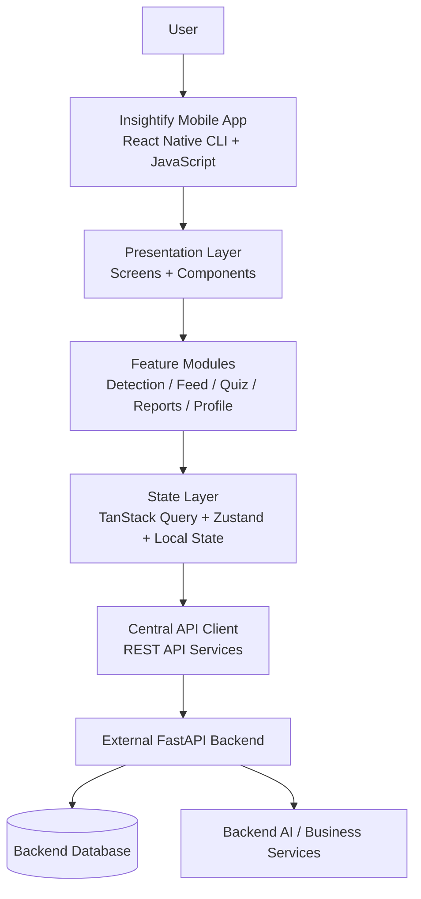
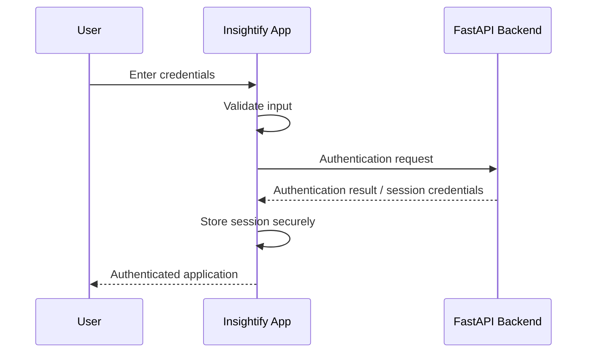
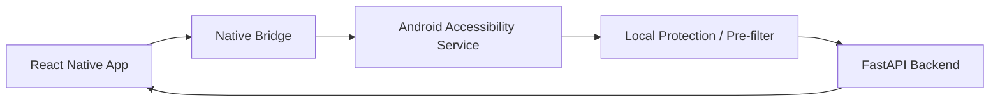

# Insightify — Global Agent Context

> **Document:** `Asciidoctor.md`  
> **Purpose:** Permanent project-wide context and engineering guidance for AI coding agents and developers working on Insightify.  
> **Project Type:** React Native CLI mobile application  
> **Language:** JavaScript  
> **Backend:** External Python/FastAPI service  
> **Architecture Style:** API-driven, feature-oriented React Native frontend  
> **Status:** Production-oriented refactor baseline

---

## 1. Project Overview

**Insightify** is an intelligent mobile cybersecurity companion focused on protecting everyday users from modern digital deception.

The product is designed around a simple idea:

> Traditional security products primarily protect devices and files; Insightify is designed to protect the **person making the decision**.

Scams increasingly rely on social engineering rather than malware. Attackers use urgency, authority impersonation, fake banking messages, phishing links, fraudulent websites, fake job offers, identity theft, AI-generated or manipulated media, and other deceptive communication to influence users into taking unsafe actions.

Insightify is intended to help users:

- inspect suspicious content,
- understand why it may be dangerous,
- make a safer decision,
- learn recurring scam patterns,
- report threats,
- and contribute to a community threat-intelligence experience.

The product includes an AI-assisted detection experience, detection history, a community threat feed, scam reporting, cyber-awareness quizzes, gamification, user profiles, achievements, XP, leaderboards, and real-time protection capabilities through Android accessibility integration.

The current project repository is **frontend-only**. The backend is a separate system developed independently in Python using FastAPI. Insightify must communicate with that backend strictly through its exposed REST APIs.

---

## 2. Product Problem

Digital deception has evolved beyond traditional malware and spam.

A malicious actor may succeed without installing malware at all. The victim may voluntarily:

- open a phishing link,
- disclose an OTP,
- reveal credentials,
- transfer money,
- install a malicious application,
- trust an impersonator,
- or follow fraudulent instructions.

Traditional device-focused security does not fully solve this human-decision problem.

Insightify exists to provide a human-centered safety layer between suspicious digital content and the user's next action.

### Core problem statement

> **People are increasingly targeted through deceptive digital communication, while existing security tools do not consistently provide understandable, in-the-moment guidance before users act. Insightify provides an intelligent safety companion that analyzes suspicious content, explains the risk, and helps users take safer actions while continuously improving their scam awareness.**

---

## 3. Product Vision

Insightify should evolve into a **personal digital safety companion**, not merely an AI classifier.

The desired product loop is:

```text
See Something Suspicious
          ↓
        Scan
          ↓
    Understand Risk
          ↓
   Take Safer Action
          ↓
       Learn Why
          ↓
      Recognize Next Time
          ↓
       Report Threat
          ↓
   Protect Other Users
```

The product should therefore optimize for **decision quality and user safety**, not just detection accuracy.

A high-quality detection result should answer:

1. What is the risk?
2. Why was it flagged?
3. What indicators were found?
4. What should the user avoid?
5. What should the user do next?

---

# 4. Project Goals

The project goals are intentionally high-level. Feature sequencing and implementation phases belong in RFCs.

## 4.1 Product Goals

Insightify should:

- provide a trustworthy scam-analysis experience;
- make suspicious content understandable to non-technical users;
- support multiple content/input types;
- maintain useful detection history;
- provide a moderated community threat feed;
- allow users to submit scam reports;
- support cyber-awareness learning through quizzes and scenarios;
- reward useful user participation through XP and achievements;
- provide profile, statistics, achievements, and leaderboard experiences;
- maintain a consistent and polished mobile UX;
- be suitable for production deployment on Android and, where supported, iOS;
- remain architecturally prepared for future real-time protection capabilities.

## 4.2 Engineering Goals

The codebase should:

- remain modular and maintainable;
- avoid monolithic screens and components;
- avoid duplicate business or UI logic;
- use reusable abstractions only where they provide real value;
- enforce clear feature boundaries;
- centralize API communication;
- centralize design tokens and reusable UI primitives;
- handle loading, error, empty, and success states consistently;
- be easy for both human developers and AI coding agents to understand;
- remain performant on real mobile devices;
- prefer simple, explicit solutions over unnecessary abstraction;
- support incremental feature development through RFCs.

---

# 5. Non-Goals

The following are outside the responsibility of the Insightify mobile repository.

## 5.1 Backend Ownership

Insightify does **not** implement or own:

- the FastAPI backend server;
- backend business logic;
- backend database implementation;
- database schemas;
- backend AI orchestration;
- backend model/provider secrets;
- backend background workers;
- backend server deployment;
- backend database migrations.

The external backend is treated as an API boundary.

## 5.2 Direct Infrastructure Access

The mobile application must never:

- connect directly to PostgreSQL or any backend database;
- execute database queries;
- access backend filesystem resources;
- import backend source code;
- contain backend service credentials;
- bypass the API layer.

## 5.3 Direct AI Provider Integration

The mobile application does not directly integrate with Gemini, OpenAI, or another server-side AI provider.

AI functionality is accessed indirectly through backend APIs.

## 5.4 Authentication Infrastructure

Authentication is treated as an external backend capability.

There is **no Firebase authentication architecture in this project**.

The mobile application only consumes the authentication APIs exposed by the external backend and manages the client-side authenticated session required to call protected APIs.

---

# 6. High-Level Architecture

Insightify is a **frontend-only, API-driven React Native application**.



### Architectural boundary

The fundamental boundary is:

```text
Insightify Mobile
        |
        | HTTPS / REST
        v
External FastAPI Backend
        |
        +--> Database
        |
        +--> AI / Business Services
```

The mobile application owns the **presentation and client experience**.

The backend owns the **authoritative application data and server-side business behavior**.

---

# 7. System Responsibility Boundaries

## 7.1 Mobile Application Responsibilities

The mobile application is responsible for:

- rendering the UI;
- navigation;
- local interaction state;
- frontend input validation;
- form state;
- client-side formatting;
- API communication;
- API response handling;
- loading/error/empty states;
- local secure session handling;
- client-side caching;
- media/file selection;
- local presentation logic;
- feature-specific UI behavior;
- accessibility-facing client integration where applicable;
- local preferences;
- animations and interaction feedback.

## 7.2 External Backend Responsibilities

The backend is responsible for:

- authentication and authorization;
- authoritative user identity;
- server-side validation;
- application business rules;
- persistence;
- detection processing;
- AI integration;
- report persistence and moderation state;
- feed persistence;
- quiz data;
- XP calculation authority;
- leaderboard authority;
- profile data;
- notifications orchestration;
- administrative logic;
- database access.

The mobile application must treat backend responses as the authoritative source for server-owned data.

---

# 8. API-First Architecture

All communication with backend functionality occurs through the external REST API.

A feature should follow this general flow:

```text
Screen
  ↓
Feature Hook / Action
  ↓
Feature API Service
  ↓
Central API Client
  ↓
HTTP Request
  ↓
FastAPI Backend
  ↓
HTTP Response
  ↓
Query / Mutation State
  ↓
UI
```

The UI layer must not scatter raw `fetch()` or HTTP logic throughout screens.

### Example

```text
DetectionScreen
      ↓
useAnalyzeDetection()
      ↓
detectionApi.analyze()
      ↓
apiClient.post(...)
      ↓
FastAPI
      ↓
Detection Result
      ↓
TanStack Query
      ↓
ResultScreen
```

This separation keeps API behavior centralized and testable.

---

# 9. Authentication Boundary

Authentication is an external backend capability.

The frontend should expose normal product flows such as:

- register;
- login;
- logout;
- refresh session;
- retrieve current user;
- password-related flows where supported by the backend.

The conceptual flow is:



The exact token/session strategy is defined by the backend API contract and should not be invented by the frontend.

The frontend must not assume a particular authentication mechanism unless the backend contract specifies it.

---

# 10. Frontend Validation

Frontend validation is required because it improves:

- user experience;
- immediate feedback;
- prevention of obviously invalid requests;
- form usability;
- predictable API payloads.

Examples include:

- required fields;
- email formatting;
- password constraints defined by the API contract;
- text length;
- URL formatting;
- supported file type;
- maximum file size;
- report field validation;
- quiz input;
- media selection constraints.

### Validation rule

> **Frontend validation improves the client experience; it does not replace backend validation.**

The frontend must validate before sending an API request, but the backend remains the authoritative security and business boundary.

---

# 11. State Management

Insightify uses a clear separation between **server state** and **client state**.

## 11.1 Server State — TanStack Query

Backend-owned data should normally be managed through **TanStack Query**.

Examples:

- user profile;
- detection history;
- feed posts;
- reports;
- quiz content;
- quiz results;
- achievements;
- leaderboard;
- notifications;
- other API resources.

TanStack Query should handle:

- fetching;
- caching;
- stale state;
- refetching;
- mutations;
- request lifecycle;
- retry behavior where appropriate;
- query invalidation.

Do not copy backend data into a global client store without a clear reason.

## 11.2 Client State — Zustand

**Zustand** is used for genuinely client-owned application state.

Examples may include:

- UI preferences;
- local app settings;
- selected modes;
- temporary UI state;
- local protection preferences;
- state that must be shared across unrelated components but does not represent backend data.

Keep Zustand stores small and domain-focused.

## 11.3 Local React State

Use normal React state when state:

- belongs to one component;
- has a short lifecycle;
- does not need global access;
- does not represent reusable server state.

Do not move every piece of state into Zustand.

---

# 12. Why Not Redux

Redux is not prohibited because it is bad technology.

Insightify simply does not require Redux as its primary state-management architecture.

Using:

```text
TanStack Query + Redux
```

for backend data would often duplicate responsibility:

```text
Backend
   ↓
TanStack Query
   ↓
Server cache

Backend
   ↓
Redux
   ↓
Duplicated server state
```

Insightify instead follows:

```text
Server State  → TanStack Query
Client State  → Zustand
Local State   → React
```

This provides a smaller mental model and avoids unnecessary boilerplate while preserving a scalable architecture.

A future architectural change to another state solution requires an RFC.

---

# 13. Repository Structure

The exact directory structure may evolve through RFCs, but the project should remain feature-oriented.

A recommended baseline:

```text
Insightify/
│
├── AGENTS.md
│
├── docs/
│   ├── RFC/
│   │   ├── RFC-001-*.md
│   │   ├── RFC-002-*.md
│   │   └── ...
│   │
│   ├── RULES.md
│   └── SKILLS.md
│
├── src/
│   ├── app/
│   │   ├── navigation/
│   │   ├── providers/
│   │   ├── config/
│   │   └── bootstrap/
│   │
│   ├── features/
│   │   ├── auth/
│   │   ├── detection/
│   │   ├── history/
│   │   ├── feed/
│   │   ├── reports/
│   │   ├── quiz/
│   │   ├── gamification/
│   │   ├── profile/
│   │   ├── notifications/
│   │   └── protection/
│   │
│   ├── shared/
│   │   ├── components/
│   │   ├── hooks/
│   │   ├── theme/
│   │   ├── constants/
│   │   ├── utils/
│   │   └── validation/
│   │
│   ├── services/
│   │   ├── api/
│   │   ├── storage/
│   │   └── analytics/
│   │
│   └── native/
│       └── accessibility/
│
├── android/
├── ios/
├── package.json
└── ...
```

This is a **directional architecture**, not a feature implementation plan.

Exact folder responsibilities can be refined through RFCs and project rules.

---

# 14. Feature Isolation

Each feature should be independently understandable.

For example:

```text
features/detection/
├── screens/
├── components/
├── hooks/
├── services/
├── store/
├── utils/
└── types/
```

The objective is to prevent a feature from becoming a collection of unrelated files scattered throughout the repository.

A feature should own its feature-specific:

- screens;
- components;
- hooks;
- API functions;
- state;
- presentation utilities;
- transformations.

Shared functionality belongs in the shared layer only when it is genuinely reused.

---

# 15. Shared Components

Shared components are intended for reusable UI primitives such as:

```text
Button
Input
Card
Modal
Badge
Avatar
Loader
EmptyState
ErrorState
ScreenContainer
SectionTitle
ProgressBar
```

### Rule

> Do not move something into `shared/` merely because it could theoretically be reusable.

A component should become shared when it has a real reuse case or represents a stable design-system primitive.

---

# 16. No Monolithic Code

Large components and screens are prohibited as an architectural pattern.

Avoid:

```text
Screen
 ├── API calls
 ├── validation
 ├── business logic
 ├── navigation logic
 ├── data transformation
 ├── state management
 └── 800 lines of UI
```

Prefer:

```text
Screen
  ↓
Feature Components
  ↓
Hooks / State
  ↓
Feature Services
  ↓
API Client
```

Screens should primarily coordinate presentation rather than becoming the application's entire implementation layer.

---

# 17. No Duplicate Logic

Duplication is treated as an architectural smell.

Do not duplicate:

- API configuration;
- authentication handling;
- loading behavior;
- error mapping;
- validation rules;
- UI primitives;
- theme tokens;
- formatting utilities;
- common navigation helpers;
- API response transformations.

However, **do not over-abstract merely to remove a few similar lines**.

The correct rule is:

> **Reuse meaningful behavior; do not manufacture abstractions.**

---

# 18. Design System and UI Consistency

Insightify should maintain a centralized design system.

Design tokens should cover:

- colors;
- typography;
- spacing;
- corner radii;
- elevation;
- icon sizing;
- animation timing;
- responsive dimensions;
- semantic status colors.

The UI direction is:

> **Calm, trustworthy, modern, premium, and security-oriented.**

It should not feel like an overloaded technical cybersecurity dashboard.

Critical states should be understandable at a glance:

```text
Safe
Suspicious
High Risk
Critical
```

Color must not be the only indicator. Status should also be communicated with text, iconography, and accessible labels.

---

# 19. Product Capabilities

The product context includes the following capabilities.

## Detection

Insightify can provide analysis experiences for suspicious:

- text;
- emails;
- URLs;
- screenshots/images;
- audio;
- video;
- other supported files/media.

The detection experience includes risk classification, explanation, threat category, and recommended safety actions.

## Detection History

Users can access previously analyzed items and relevant metadata, including:

- scan type;
- risk level;
- category;
- timestamp;
- saved/bookmarked state;
- analysis details where supported.

## Community Threat Feed

The community experience includes:

- scam alerts;
- scam categories;
- platform/source metadata;
- risk severity;
- search;
- filtering;
- voting/verification interactions;
- bookmarking;
- sharing where supported.

## Scam Reporting

Users can submit scam reports containing structured information and evidence.

Reports may enter a backend/admin moderation workflow before becoming public community content.

## Quiz and Cyber Awareness

The learning experience includes:

- phishing education;
- crypto-fraud scenarios;
- AI voice-clone awareness;
- identity-theft awareness;
- fake-shopping scenarios;
- challenges;
- quiz attempts;
- educational explanations.

## Gamification

The product includes:

- XP;
- levels;
- streaks;
- achievements;
- badges;
- leaderboards;
- participation rewards.

## User Profile

The profile experience includes:

- user identity;
- XP;
- level;
- statistics;
- achievements;
- scan activity;
- quiz activity;
- community participation;
- leaderboard position;
- settings.

## Real-Time Protection / Accessibility

The product includes a future real-time protection capability based on Android accessibility functionality.

This capability is architecturally isolated from the normal feature/UI layer and must interact with native Android capabilities through a defined boundary.

The detailed design and implementation requirements belong in an RFC.

---

# 20. Real-Time Protection Boundary

Accessibility functionality is a native capability and must not be implemented as ordinary screen logic.

High-level boundary:



The accessibility layer must remain isolated because it has different privacy, lifecycle, permission, and platform constraints from the normal application UI.

Detailed requirements must be defined by RFC before implementation.

---

# 21. Privacy Principles

Insightify handles potentially sensitive user-submitted content.

The frontend must therefore follow privacy-by-design principles.

Do not:

- log passwords;
- log authentication tokens;
- log private user content unnecessarily;
- print entire suspicious messages to debug logs in production;
- expose secrets in application source;
- store sensitive media longer than required by the product contract;
- send data to services outside the documented API architecture.

Where the backend defines redaction or sanitization requirements, the frontend must comply with those API contracts.

---

# 22. Security Principles

Security-sensitive behavior belongs primarily to the backend, but the mobile app still has important responsibilities.

The frontend must:

- use HTTPS APIs in production;
- keep secrets out of source code;
- keep environment-specific values configurable;
- securely persist authentication credentials/session material according to the backend contract;
- avoid exposing sensitive data in logs;
- validate user inputs;
- handle authentication expiry cleanly;
- avoid trusting client-side role checks as a security boundary;
- avoid direct database access;
- avoid direct AI-provider access.

UI checks may hide or disable features for UX, but they must never be considered authoritative authorization.

---

# 23. Performance Principles

Insightify must remain responsive on real mobile hardware.

Prefer:

- small focused components;
- memoization only where profiling or render behavior justifies it;
- virtualized lists for large datasets;
- pagination/infinite queries for large feeds or histories;
- lazy loading where appropriate;
- image optimization;
- minimal unnecessary re-renders;
- server caching through TanStack Query;
- efficient selectors for Zustand stores;
- asynchronous processing for expensive client work;
- avoiding expensive synchronous work during render.

Do not optimize based on assumptions alone. Measure when performance becomes a concern.

---

# 24. Error Handling

Every API-driven feature should have explicit states:

```text
Idle
Loading
Success
Empty
Error
Retrying / Refetching
```

Error presentation should be user-oriented.

Do not expose:

- stack traces;
- raw server internals;
- debugging data;
- secrets;
- implementation details.

Map backend errors into appropriate user-facing messages at the API/service boundary where possible.

---

# 25. API Client Rules

All HTTP communication should go through a centralized API client.

The API client should own cross-cutting concerns such as:

- base URL;
- headers;
- authentication attachment;
- request serialization;
- response parsing;
- common error normalization;
- timeout behavior;
- retry rules where appropriate;
- session-expiry handling.

Feature API modules should describe **what** API resource they use, not rebuild HTTP infrastructure.

Example:

```text
services/api/client.js
services/api/authApi.js
services/api/detectionApi.js
services/api/feedApi.js
services/api/reportApi.js
services/api/quizApi.js
services/api/profileApi.js
```

---

# 26. Backend Contract Discipline

The FastAPI backend is an external system.

Therefore, agents must not invent endpoint behavior, request fields, response shapes, or authentication semantics when implementing frontend integration.

Before changing or creating an API integration:

1. inspect the available backend documentation or OpenAPI contract;
2. inspect existing client usage;
3. verify request and response shapes;
4. follow established API conventions;
5. update frontend integration only after the contract is understood.

If the required API does not exist, do not silently create a fake client contract and pretend it is implemented.

Document the missing dependency and create/update the appropriate RFC when architectural/API design is required.

---

# 27. Documentation Hierarchy

Insightify uses a layered documentation model.

```text
AGENTS.md
    ↓
docs/RULES.md
    ↓
docs/SKILLS.md
    ↓
docs/RFC/
    ↓
Source Code
```

## `AGENTS.md`

Defines:

- project identity;
- project context;
- goals and non-goals;
- broad architecture;
- boundaries;
- permanent engineering principles;
- global agent workflow;
- major product capabilities;
- source-of-truth rules.

## `docs/RULES.md`

Defines:

- detailed engineering rules;
- coding conventions;
- quality standards;
- repository workflow;
- implementation standards;
- validation requirements.

## `docs/SKILLS.md`

Defines:

- agent workflows;
- reusable task procedures;
- project-specific operational skills.

## `docs/RFC/`

Defines feature-specific:

- requirements;
- decisions;
- user flows;
- API contracts;
- data needs;
- constraints;
- design decisions;
- implementation acceptance criteria.

### Important

`AGENTS.md` must not become a duplicate of RFC documents.

`RULES.md` must not replace feature RFCs.

RFCs must not silently contradict permanent project architecture.

---

# 28. RFC-Driven Development

Major features or cross-cutting architectural changes should be defined through RFCs before implementation.

An RFC should answer questions such as:

- What problem are we solving?
- What is the proposed behavior?
- What is inside scope?
- What is outside scope?
- What API contract is required?
- What data is required?
- What UI flow is expected?
- What are the security/privacy considerations?
- What are the acceptance criteria?
- What architectural decisions are being introduced?

AGENTS.md intentionally does **not** define feature sequencing.

Feature order, phases, and implementation milestones belong to RFCs.

---

# 29. Source of Truth

When information conflicts, agents must use the following order:

```text
Current Source Code / Verified API Contract
          ↓
Approved RFC
          ↓
docs/RULES.md
          ↓
AGENTS.md
```

This prevents stale documentation from overriding verified implementation facts.

However, if the source code appears to violate an approved architectural rule, do not silently normalize the inconsistency. Identify it and determine whether the implementation or documentation is incorrect.

---

# 30. Agent Workflow

Every AI coding agent should follow this workflow before making a change.

### Step 1 — Read project context

Read:

```text
AGENTS.md
```

### Step 2 — Identify the affected feature

Determine whether the task belongs to:

```text
auth
detection
history
feed
reports
quiz
gamification
profile
notifications
protection
shared UI
API layer
native layer
```

### Step 3 — Check documentation

Read:

```text
docs/RULES.md
docs/SKILLS.md
relevant docs/RFC/*.md
```

when applicable.

### Step 4 — Inspect current code

Read the existing implementation before modifying it.

Do not assume the project structure from documentation alone.

### Step 5 — Check API contract

For API work, verify the existing FastAPI/OpenAPI contract.

### Step 6 — Plan the smallest correct change

Prefer extending established architecture over creating parallel systems.

### Step 7 — Implement

Keep changes focused and avoid unrelated modifications.

### Step 8 — Validate

Run the appropriate linting, formatting, tests, type/static checks where available, and platform builds relevant to the task.

### Step 9 — Review architecture

Confirm:

- no duplicated logic;
- no accidental coupling;
- no new unnecessary dependency;
- no security regression;
- no API contract invention;
- no unrelated changes.

### Step 10 — Report completion

State:

- what changed;
- what was validated;
- any remaining limitation or external dependency.

---

# 31. Coding Principles

## DRY

Do not duplicate meaningful logic.

Prefer reusable:

- components;
- hooks;
- API services;
- utilities;
- validators;
- formatters.

Do not abstract tiny pieces solely to satisfy an arbitrary DRY rule.

## Single Responsibility

A component, hook, service, and utility should have a clear purpose.

## Composition Over Giant Components

Build UI from small composable pieces.

## Functional React

Use functional React components and hooks.

Avoid class components unless required by an external/native integration.

## Clear Naming

Prefer:

```text
DetectionResultCard
useDetectionHistory
getRiskLabel
submitScamReport
```

Avoid:

```text
DataCard
useThing
doStuff
temp
x
```

## No Dead Code

Do not leave obsolete implementations behind after a refactor.

## No Hidden Magic

Important behavior should be explicit and understandable.

---

# 32. Dependency Management

Do not install a new dependency simply because it is convenient.

Before introducing a package:

1. check whether the platform or existing dependencies already solve the problem;
2. verify that the dependency is actively maintained and appropriate for React Native CLI;
3. consider bundle size and native implications;
4. consider whether the dependency creates unnecessary architectural coupling;
5. document meaningful dependency decisions when required.

Do not replace established architecture casually.

---

# 33. Git and Change Discipline

Changes should remain focused.

Avoid mixing:

```text
feature work
+
large unrelated refactor
+
dependency migration
+
formatting entire repository
```

in a single task unless the task explicitly requires it.

Before changing a major architectural boundary:

- inspect current implementation;
- inspect relevant documentation;
- inspect relevant RFCs;
- determine impact;
- update the RFC when needed;
- implement;
- validate affected areas.

---

# 34. What Agents Must Not Do

Agents must not:

- invent backend endpoints;
- invent backend response schemas;
- connect directly to the database;
- introduce Firebase;
- add direct AI-provider calls to the mobile application;
- move backend logic into frontend code;
- add unrelated features without approval;
- duplicate API infrastructure;
- create multiple competing state-management systems;
- put server data into Zustand without justification;
- add unnecessary dependencies;
- bypass established feature boundaries;
- silently modify architectural conventions;
- commit secrets;
- log sensitive information;
- mark broken work as complete.

---

# 35. Architectural Evolution

Insightify should evolve incrementally.

The architecture is intended to support growth without prematurely introducing unnecessary complexity.

Current high-level direction:

```text
React Native CLI
      ↓
Feature-oriented frontend
      ↓
Central API Client
      ↓
FastAPI REST Backend
      ↓
Backend Services / Database / AI
```

Future changes should extend this architecture rather than create parallel ways of doing the same thing.

For example, do not create:

```text
Feature A → API Client
Feature B → raw fetch()
Feature C → axios instance
Feature D → another global HTTP service
```

Instead, maintain one coherent API communication architecture unless an RFC explicitly changes it.

---

# 36. Production Quality Standard

Insightify is being developed with the intention of becoming a production mobile application.

Therefore, “works on my machine” is not considered sufficient.

Production quality includes:

- predictable UX;
- proper loading states;
- proper error states;
- input validation;
- robust API handling;
- secure session management;
- maintainable code;
- responsive UI;
- no unnecessary duplication;
- no known critical defects;
- appropriate test coverage;
- clean dependency management;
- documented architectural decisions.

Temporary hacks should not become permanent architecture.

If a temporary workaround is unavoidable, it must be clearly documented and preferably tracked through an issue or RFC.

---

# 37. Product Experience Principles

The application should feel:

- trustworthy;
- calm;
- fast;
- understandable;
- modern;
- privacy-conscious;
- helpful rather than alarming.

The app should avoid unnecessary technical jargon.

For dangerous results, the product should explain:

```text
Risk
 ↓
Why
 ↓
What was detected
 ↓
What not to do
 ↓
What to do next
```

The objective is to help users make safer decisions, not simply display an AI score.

---

# 38. Final Architectural Summary

Insightify is a:

> **React Native CLI + JavaScript + API-driven mobile frontend, connected to an independently deployed Python/FastAPI backend through REST APIs.**

The frontend owns:

```text
UI
Navigation
Frontend Validation
Local State
Server-State Caching
API Integration
Presentation Logic
Native Mobile Integration
```

The external backend owns:

```text
Authentication
Authorization
Business Logic
Database
AI Processing
Persistent Data
Server-side Validation
Administrative Logic
```

State management is:

```text
TanStack Query → Server State
Zustand        → Client/App State
React State    → Local Component State
```

Authentication is:

```text
Insightify
   ↓
FastAPI Authentication APIs
   ↓
Authenticated Session
   ↓
Protected REST APIs
```

There is **no Firebase architecture in Insightify**.

The documentation system is:

```text
AGENTS.md
   ↓
docs/RULES.md
   ↓
docs/SKILLS.md
   ↓
docs/RFC/*.md
   ↓
Implementation
```

And the governing engineering principle is:

> **Keep the frontend modular, the boundaries explicit, the API contract centralized, the code reusable without over-engineering, and every significant feature or architectural decision documented through an RFC.**

---

# 39. Agent Closing Checklist

Before considering a task complete, verify:

- [ ] Existing implementation was inspected.
- [ ] Relevant RFCs were reviewed.
- [ ] Relevant project rules were reviewed.
- [ ] Backend API contract was verified.
- [ ] No backend code was added to the mobile repository.
- [ ] No Firebase dependency or architecture was introduced.
- [ ] No direct database or AI-provider access was introduced.
- [ ] Frontend validation is present where appropriate.
- [ ] API communication uses the central API architecture.
- [ ] Server state uses TanStack Query where appropriate.
- [ ] Client state uses Zustand only when needed.
- [ ] No unnecessary global state was introduced.
- [ ] No meaningful logic was duplicated.
- [ ] No unrelated files were changed.
- [ ] Loading/error/empty states were considered.
- [ ] Security and privacy implications were considered.
- [ ] Relevant tests/lint/format/build checks were run.
- [ ] Documentation was updated when the architecture or behavior changed.

---

## End of Insightify Global Agent Context
