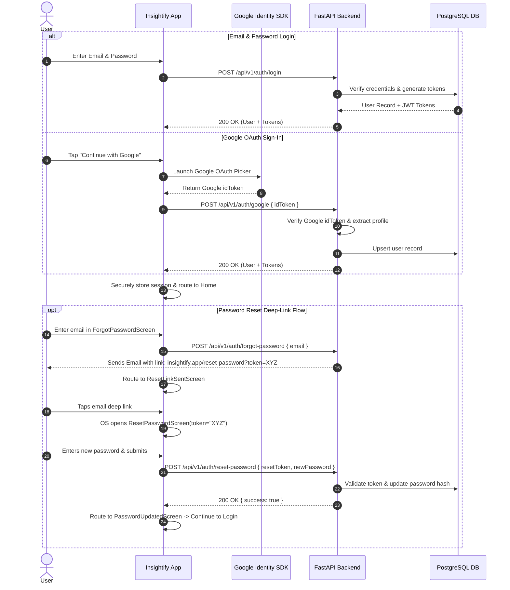
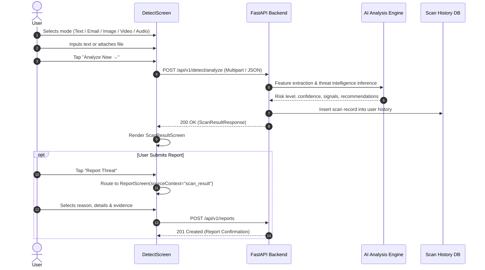
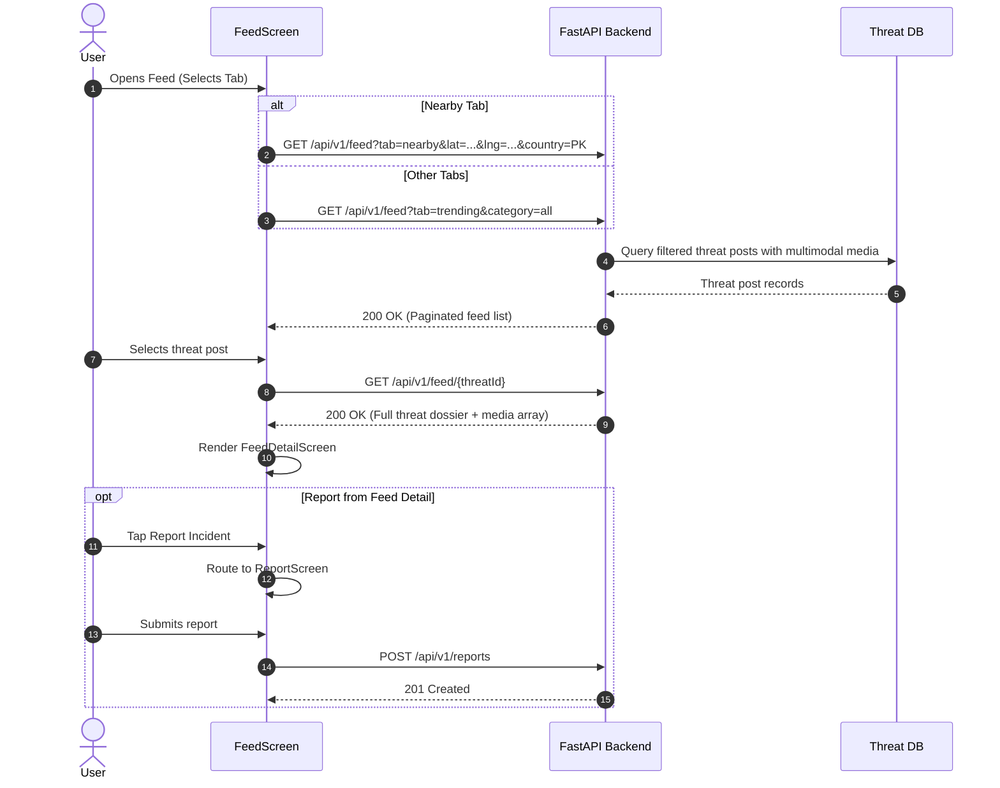
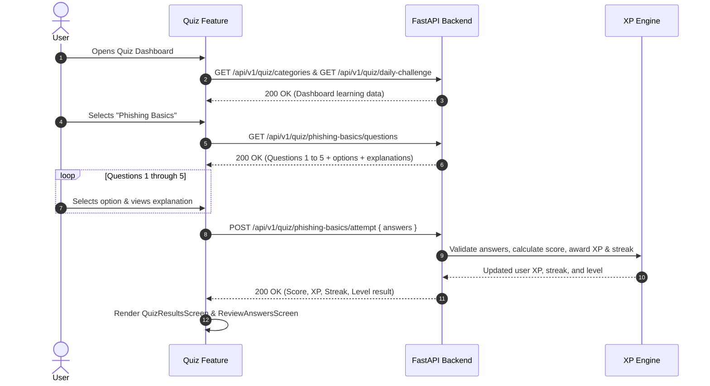

# Insightify — Backend API Specification

> **Document Version:** 2.1.0  
> **Target Service:** External Python / FastAPI Backend  
> **Document Purpose:** Baseline Backend API Contract — Pending Backend/Frontend Agreement. Derived from the Insightify React Native frontend codebase, UI contracts, and frontend RFCs (`RFC-001` through `RFC-005`). This document defines the expected API surface from the frontend's perspective. All items requiring backend team consensus or external infrastructure decisions are explicitly marked `TBD — backend contract verification required`.  
> **Status:** Draft Baseline — Not yet ratified by the backend team. Treat all endpoint paths, payload schemas, and behavioral assumptions as proposed until confirmed during Backend/Frontend contract alignment.

---

## Table of Contents

1. [Architectural Overview & Global Conventions](#1-architectural-overview--global-conventions)
2. [Authentication & Onboarding APIs](#2-authentication--onboarding-apis)
3. [User & Profile APIs](#3-user--profile-apis)
4. [Settings & Preferences APIs](#4-settings--preferences-apis)
5. [Home Dashboard APIs](#5-home-dashboard-apis)
6. [Community Threat Feed APIs](#6-community-threat-feed-apis)
7. [Threat Feed Detail APIs](#7-threat-feed-detail-apis)
8. [Scam Reporting & Moderation APIs](#8-scam-reporting--moderation-apis)
9. [AI Detection & Analysis APIs](#9-ai-detection--analysis-apis)
10. [Scan History APIs](#10-scan-history-apis)
11. [Quiz & Learning APIs](#11-quiz--learning-apis)
12. [Leaderboard APIs](#12-leaderboard-apis)
13. [Achievements APIs](#13-achievements-apis)
14. [Guardian / Public Profile APIs](#14-guardian--public-profile-apis)
15. [Notifications APIs](#15-notifications-apis)
16. [Infrastructure & Health APIs](#16-infrastructure--health-apis)
17. [Protection & Accessibility Feature Scope](#17-protection--accessibility-feature-scope)
18. [Master Endpoint Matrix](#18-master-endpoint-matrix)
19. [Data Models & Schema Specifications](#19-data-models--schema-specifications)
20. [Frontend → Backend Flow Diagrams](#20-frontend--backend-flow-diagrams)
21. [Backend vs Frontend Responsibility Boundary](#21-backend-vs-frontend-responsibility-boundary)
22. [Decisions & Contract Clarification Items](#22-decisions--contract-clarification-items)

---

## 1. Architectural Overview & Global Conventions

Insightify is a **frontend-only, API-driven React Native mobile application**. The FastAPI backend is the authoritative source for user identity, AI detection inference, threat feed aggregation, moderation queues, quiz telemetry, XP calculation, leaderboards, and report persistence.

```text
React Native Mobile App (Insightify)
        │
        │ HTTPS / JSON / Multipart REST
        ▼
FastAPI Backend (/api/v1)
        │
        ├── PostgreSQL Database
        ├── AI / ML Analysis Engine
        └── Cloud Object Storage (Media / Evidence)
```

### 1.1 Base Routing & Versioning
- **Base Path:** `/api/v1` (`TBD — backend contract verification required`)
- **Environment Configuration:** Configurable via `ENV.API_BASE_URL` in `src/app/config/env.js`.

### 1.2 Authentication & Authorization Headers
- **Scheme:** Standard HTTP Bearer Token.
- **Header:** `Authorization: Bearer <access_token>`
- **Public Endpoints:** Register, Login, Google OAuth, Password Reset endpoints.
- **Protected Endpoints:** All profile, scanning, reporting, feed interaction, quiz attempt, and settings endpoints require a valid Bearer token.

### 1.3 Data & Serialization Standards
- **Payload Format:** `application/json` for standard requests; `multipart/form-data` for file uploads.
- **Timestamp Standard:** Canonical ISO-8601 UTC string (`YYYY-MM-DDTHH:mm:ssZ` or `YYYY-MM-DDTHH:mm:ss.sssZ`). The backend must **never** send pre-formatted presentation date strings (e.g. `"May 24, 2024 • 11:42 AM"`); client-side utilities handle localization and relative times.
- **Entity ID Format:** String identifiers:
  - User: `usr_<id>`
  - Threat Post: `threat_<id>`
  - Scan Result: `scan_<id>`
  - Report: `rpt_<id>`
  - Quiz: `quiz_<id>` or slug (`phishing-basics`)
  - Achievement: `ach_<id>`
- **Nullability:** Missing or non-applicable values must be returned as `null` or omitted rather than empty strings `""` or `"undefined"`.

### 1.4 Standard HTTP Status Codes
| Code | Meaning | Frontend Handling |
|---|---|---|
| `200 OK` | Request succeeded with payload | Renders content state |
| `201 Created` | Resource created (e.g. Register, Report, Scan) | Transitions to success / result screen |
| `204 No Content` | Action succeeded with no body (e.g. Logout, Bookmark) | Optimistic cache update |
| `400 Bad Request` | Client validation failure | Displays field error banner / message |
| `401 Unauthorized` | Missing / expired / invalid Bearer token | Triggers `authStore.logout()`, routes to Login |
| `403 Forbidden` | Valid token, but action disallowed | Displays permission denial message |
| `404 Not Found` | Target entity does not exist | Renders EmptyState / ErrorState component |
| `409 Conflict` | Duplicate entity (e.g. email already registered) | Displays inline form error |
| `422 Unprocessable Entity` | Pydantic validation failure | Maps errors to form input fields |
| `429 Too Many Requests` | Rate limit hit (e.g. rapid scanning) | Displays cooldown alert |
| `500+ Internal Error` | Unhandled server exception | Displays friendly error screen ("Something went wrong") |

### 1.5 Standard Error Response Schema
```json
{
  "error": {
    "code": "VALIDATION_ERROR",
    "message": "The email address is already in use.",
    "details": [
      {
        "field": "email",
        "issue": "unique_violation"
      }
    ]
  }
}
```

---

## 2. Authentication & Onboarding APIs

**Frontend Reference:** `RFC-001-F-authentication-and-onboarding.md`, `src/features/auth/`

```text
Onboarding (1,2,3) ──> Login ──> Home Dashboard
                       │   ▲
                       │   ├── Register
                       │   └── Google Sign-In
                       └──> Forgot Password ──> Reset Link Sent ──> Reset Password ──> Password Updated
```

### 2.1 Register (Email / Password)
- **Screen:** `RegisterScreen.jsx`
- **Operation:** Create a new user account with email, full name, and password.
- **Method:** `POST`
- **Endpoint:** `/api/v1/auth/register` (`TBD`)
- **Authentication:** `Public`
- **Request Body:**
  ```json
  {
    "fullName": "Muhammad Maaz",
    "email": "maaz@example.com",
    "password": "SecurePassword123!"
  }
  ```
- **Validation Rules:**
  - `fullName`: Required, 2–100 characters.
  - `email`: Required, valid email format.
  - `password`: Required, minimum 8 characters.
- **Success Response (`201 Created`):**
  ```json
  {
    "user": {
      "id": "usr_948271",
      "name": "Muhammad Maaz",
      "email": "maaz@example.com",
      "createdAt": "2026-09-01T12:00:00Z"
    },
    "tokens": {
      "accessToken": "eyJhbGciOi...",
      "refreshToken": "eyJhbGciOi...",
      "expiresIn": 3600
    }
  }
  ```
- **Errors:** `400` (Validation failed), `409` (Email already registered).

---

### 2.2 Login (Email / Password)
- **Screen:** `LoginScreen.jsx`
- **Operation:** Authenticate using email and password.
- **Method:** `POST`
- **Endpoint:** `/api/v1/auth/login` (`TBD`)
- **Authentication:** `Public`
- **Request Body:**
  ```json
  {
    "email": "maaz@example.com",
    "password": "SecurePassword123!"
  }
  ```
- **Success Response (`200 OK`):**
  ```json
  {
    "user": {
      "id": "usr_948271",
      "name": "Muhammad Maaz",
      "email": "maaz@example.com",
      "username": "maaz_dev",
      "avatar": "https://cdn.insightify.app/avatars/usr_948271.jpg"
    },
    "tokens": {
      "accessToken": "eyJhbGciOi...",
      "refreshToken": "eyJhbGciOi...",
      "expiresIn": 3600
    }
  }
  ```
- **Errors:** `401 Unauthorized` (Invalid credentials), `429 Too Many Requests`.

---

### 2.3 Google Authentication (Google OAuth Only)
- **Screen:** `LoginScreen.jsx`
- **Operation:** Authenticate via Google Sign-In identity token. Apple Sign-In is not supported.
- **Method:** `POST`
- **Endpoint:** `/api/v1/auth/google` (`TBD`)
- **Authentication:** `Public`
- **Flow:**
  ```text
  Login Screen ──> Google Sign-In SDK ──> Google idToken ──> FastAPI ──> Authenticated Session ──> Home
  ```
- **Request Body:**
  ```json
  {
    "idToken": "eyJhbGciOiJSUzI1NiIsImtpZCI6IjFkNmQ..."
  }
  ```
- **Backend Responsibility:**
  - Verify Google `idToken` using Google API Client / public certificates.
  - Extract email, verified status, full name, and avatar URL.
  - If user exists: generate session tokens.
  - If user does not exist: auto-provision new user account, then generate session tokens.
- **Success Response (`200 OK` or `201 Created`):**
  ```json
  {
    "user": {
      "id": "usr_948271",
      "name": "Muhammad Maaz",
      "email": "maaz@gmail.com",
      "username": "maaz_google",
      "avatar": "https://lh3.googleusercontent.com/a/..."
    },
    "tokens": {
      "accessToken": "eyJhbGciOi...",
      "refreshToken": "eyJhbGciOi...",
      "expiresIn": 3600
    }
  }
  ```
- **Errors:** `401 Unauthorized` (Invalid/expired Google token), `400 Bad Request`.

---

### 2.4 Forgot Password
- **Screen:** `ForgotPasswordScreen.jsx`
- **Operation:** Request password reset email containing a secure token / deep link.
- **Method:** `POST`
- **Endpoint:** `/api/v1/auth/forgot-password` (`TBD`)
- **Authentication:** `Public`
- **Request Body:**
  ```json
  {
    "email": "maaz@example.com"
  }
  ```
- **Success Response (`200 OK`):**
  ```json
  {
    "success": true,
    "message": "Password reset instructions have been sent to your email."
  }
  ```

---

### 2.5 Reset Password (Token & Deep-Link Flow)
- **Screens:** `ResetLinkSentScreen.jsx` → `ResetPasswordScreen.jsx` → `PasswordUpdatedScreen.jsx`
- **Operation:** Validate reset token and update user password.
- **Method:** `POST`
- **Endpoint:** `/api/v1/auth/reset-password` (`TBD`)
- **Authentication:** `Public` (with Reset Token)
- **Deep-Link Contract (`TBD — frontend/backend deep-link contract required`):**
  - Email contains a link formatted as `https://insightify.app/auth/reset-password?token=<token>` or custom scheme `insightify://reset-password?token=<token>`.
  - When tapped on mobile, React Native navigation extracts the `token` parameter and renders `ResetPasswordScreen(token)`.
- **Request Body:**
  ```json
  {
    "resetToken": "rst_9f81a2b3c4d5e6f7...",
    "newPassword": "NewSecurePassword456!"
  }
  ```
- **Success Response (`200 OK`):**
  ```json
  {
    "success": true,
    "message": "Password has been reset successfully."
  }
  ```
- **Errors:** `400 Bad Request` (Invalid/expired token, password complexity failure).

---

### 2.6 Logout
- **Screen:** `SettingsScreen.jsx`
- **Operation:** Invalidate active server session and refresh token.
- **Method:** `POST`
- **Endpoint:** `/api/v1/auth/logout` (`TBD`)
- **Authentication:** `Bearer Token`
- **Request Body:** `{ "refreshToken": "eyJhb..." }` (`TBD`)
- **Success Response (`200 OK` or `204 No Content`)**

---

### 2.7 Refresh Access Token
- **Operation:** Exchange refresh token for a new access token.
- **Method:** `POST`
- **Endpoint:** `/api/v1/auth/refresh` (`TBD`)
- **Authentication:** `Public`
- **Request Body:** `{ "refreshToken": "eyJhb..." }`
- **Success Response (`200 OK`):**
  ```json
  {
    "accessToken": "eyJhbGciOi...",
    "expiresIn": 3600
  }
  ```

---

## 3. User & Profile APIs

**Frontend Reference:** `src/features/profile/`, `profileApi.js`

```text
ProfileScreen
  ├── Get Current User Profile (XP, Level, Rank, Safety Score, Activity Counts)
  ├── Update Profile (Name, Bio, Username)
  └── Upload Profile Avatar (Multipart)
```

### 3.1 Get Current User Profile
- **Screens:** `ProfileScreen.jsx`, `SettingsScreen.jsx`, `EditProfileScreen.jsx`
- **Operation:** Retrieve authoritative profile and security activity metrics for the authenticated user.
- **Method:** `GET`
- **Endpoint:** `/api/v1/users/me` (`TBD`)
- **Authentication:** `Bearer Token`
- **Success Response (`200 OK`):**
  ```json
  {
    "id": "usr_001",
    "name": "Muhammad Maaz",
    "username": "maaz_dev",
    "title": "AI Awareness Champion",
    "bio": "Fighting scams & making the internet safer 🚀",
    "email": "mohammad.maaz@gmail.com",
    "avatar": "https://cdn.insightify.app/avatars/usr_001.jpg",
    "level": 6,
    "xp": 820,
    "nextLevelXp": 1000,
    "rank": 69,
    "stats": {
      "safetyScore": 92,
      "threatsPrevented": 19,
      "scansCount": 47,
      "reportsCount": 8,
      "verificationsCount": 12
    }
  }
  ```

---

### 3.2 Update User Profile
- **Screen:** `EditProfileScreen.jsx`
- **Operation:** Update editable user profile details.
- **Method:** `PATCH`
- **Endpoint:** `/api/v1/users/me` (`TBD`)
- **Authentication:** `Bearer Token`
- **Request Body:**
  ```json
  {
    "name": "Muhammad Maaz",
    "username": "maaz_dev",
    "bio": "Fighting scams & making the internet safer 🚀"
  }
  ```
- **Success Response (`200 OK`):** Updated user object matching `3.1`.

---

### 3.3 Upload Profile Avatar
- **Screen:** `EditProfileScreen.jsx`
- **Operation:** Upload custom profile image.
- **Method:** `POST`
- **Endpoint:** `/api/v1/users/me/avatar` (`TBD`)
- **Authentication:** `Bearer Token`
- **Content-Type:** `multipart/form-data`
- **Form Fields:** `avatar` (Binary image file, JPEG/PNG/WebP, max 5MB).
- **Success Response (`200 OK`):**
  ```json
  {
    "avatarUrl": "https://cdn.insightify.app/avatars/usr_001_v2.jpg"
  }
  ```

---

## 4. Settings & Preferences APIs

**Frontend Reference:** `src/features/profile/screens/SettingsScreen.jsx`, `useSettings.js`

### 4.1 Boundary: Client-Only vs Backend-Persisted Settings
| Setting | Storage Location | Backend API Required |
|---|---|---|
| **Dark Mode** | Local (AsyncStorage / Theme State) | ❌ No |
| **Public Profile** | Backend DB | ✅ Yes |
| **Show on Leaderboard** | Backend DB | ✅ Yes |
| **Anonymous Reports** | Backend DB | ✅ Yes |
| **Enable Notifications** | Backend DB | ✅ Yes |
| **Scam Alerts** | Backend DB | ✅ Yes |
| **Achievements Alerts** | Backend DB | ✅ Yes |
| **Leaderboard Updates** | Backend DB | ✅ Yes |

*(Note: `Low Data Mode` has been removed as it is not part of the active settings design).*

### 4.2 Get User Settings
- **Screen:** `SettingsScreen.jsx`
- **Operation:** Fetch backend-persisted user preferences.
- **Method:** `GET`
- **Endpoint:** `/api/v1/users/me/settings` (`TBD`)
- **Authentication:** `Bearer Token`
- **Success Response (`200 OK`):**
  ```json
  {
    "profilePublic": true,
    "showOnLeaderboard": true,
    "anonymousReports": false,
    "notifications": {
      "enabled": true,
      "scamAlerts": true,
      "achievements": true,
      "leaderboardUpdates": true
    }
  }
  ```

---

### 4.3 Update User Settings
- **Screen:** `SettingsScreen.jsx`
- **Operation:** Update one or more server-persisted user preferences.
- **Method:** `PATCH`
- **Endpoint:** `/api/v1/users/me/settings` (`TBD`)
- **Authentication:** `Bearer Token`
- **Request Body:**
  ```json
  {
    "showOnLeaderboard": false,
    "notifications": {
      "scamAlerts": true
    }
  }
  ```
- **Success Response (`200 OK`):** Updated settings object.

---

## 5. Home Dashboard APIs

**Frontend Reference:** `RFC-002-F-home-dashboard.md`, `src/features/home/services/homeApi.js`

```text
HomeScreen
  ├── User Activity Summary (On-demand scan counts, threats detected, safety score)
  ├── Threat Feed Preview (Top 2 recent verified alerts)
  ├── Daily Safety Tip
  └── Unread Notifications Counter
```

### 5.1 Protection Status Scope
- **Current Product Stage:** The Home screen displays a `Protected` shield badge as a **frontend presentation / demo state**. This status is **not** derived from a backend protection service or background device monitoring.
- **Backend Requirement:** The backend is **not** required to execute background accessibility monitoring, notification scanning, or live stream ingestion. There is no continuous device-protection service. The backend aggregates **on-demand scan activity metrics** (user-initiated scans via `/api/v1/detect/analyze`).
- **Future Scope:** Continuous real-time protection endpoints and background telemetry ingestion are deferred to the future native protection/accessibility architecture and will require a dedicated RFC.

### 5.2 Get User Activity Summary
- **Screen:** `HomeScreen.jsx`
- **Operation:** Retrieve aggregated on-demand scan activity metrics for the home card grid. These metrics reflect user-initiated detection scans, not background/continuous monitoring.
- **Method:** `GET`
- **Endpoint:** `/api/v1/users/me/activity-summary?timeframe=this_week` (`TBD`)
- **Authentication:** `Bearer Token`
- **Query Parameters:** `timeframe` (`this_week` | `this_month` | `all_time`)
- **Success Response (`200 OK`):**
  ```json
  {
    "timeframe": "this_week",
    "scansCount": 24,
    "threatsDetected": 7,
    "safeInteractionsRate": 98,
    "alertsCount": 12
  }
  ```
- *(Note: The `Protected` shield status shown on the Home screen is a frontend-only presentation state and is not sourced from this API response).*

---

### 5.3 Get Threat Feed Preview
- **Screen:** `HomeScreen.jsx`
- **Operation:** Fetch a lightweight preview of recent verified threat alerts (limit 2).
- **Method:** `GET`
- **Endpoint:** `/api/v1/feed/preview?limit=2` (`TBD`)
- **Authentication:** `Bearer Token`
- **Success Response (`200 OK`):**
  ```json
  [
    {
      "id": "threat_001",
      "riskLevel": "HIGH",
      "title": "Fake Banking SMS Circulating Again",
      "description": "Multiple users reported this SMS impersonating banks to steal credentials.",
      "location": "Pakistan",
      "type": "text",
      "verifiedCount": 142,
      "timestamp": "2026-08-29T10:15:00Z"
    },
    {
      "id": "threat_002",
      "riskLevel": "MEDIUM",
      "title": "Suspicious WhatsApp Link Detected",
      "description": "This link is reported for phishing attempts.",
      "location": "India",
      "type": "text",
      "verifiedCount": 89,
      "timestamp": "2026-08-29T10:02:00Z"
    }
  ]
  ```

---

### 5.4 Get Daily Safety Tip
- **Screen:** `HomeScreen.jsx`
- **Operation:** Retrieve current daily cybersecurity micro-learning tip.
- **Method:** `GET`
- **Endpoint:** `/api/v1/learn/daily-tip` (`TBD`)
- **Authentication:** `Bearer Token`
- **Success Response (`200 OK`):**
  ```json
  {
    "id": "tip_001",
    "title": "Daily Safety Tip",
    "content": "Never share OTPs, passwords, or personal information with anyone. Stay safe!",
    "category": "credential_safety"
  }
  ```

---

## 6. Community Threat Feed APIs

**Frontend Reference:** `RFC-003-F-feed-and-feed-detail.md`, `src/features/feed/services/feedApi.js`

```text
FeedScreen
  ├── Tabs: For You | Trending | Nearby | Latest
  ├── Category Filter Sheet (Banking, Phishing, Voice AI, Deepfake, Fraud, etc.)
  ├── Incident Card List (Risk Badge, Verified Pill, Threat Title, Stats, Bookmark)
  └── Pull-to-Refresh & Pagination
```

### 6.1 Get Threat Feed List
- **Screen:** `FeedScreen.jsx`
- **Operation:** Retrieve paginated community threat posts with tab and category filtering.
- **Method:** `GET`
- **Endpoint:** `/api/v1/feed` (`TBD`)
- **Authentication:** `Bearer Token`
- **Query Parameters:**
  - `tab`: `for_you` | `trending` | `nearby` | `latest` (default: `for_you`)
  - `category`: `all` | `banking` | `phishing` | `fraud` | `voice_ai` | `deepfake`
  - `search`: String search query (optional)
  - `page`: Integer (default: `1`)
  - `limit`: Integer (default: `10`)
  - **Nearby Location Parameters (`TBD — backend/frontend location contract required`):**
    - `lat` / `lng`: Coordinate floats (optional)
    - `country`: Two-letter ISO country code e.g. `PK`, `IN` (optional)
    - `region` / `city`: String (optional)
- **Success Response (`200 OK`):**
  ```json
  {
    "data": [
      {
        "id": "threat_001",
        "riskLevel": "HIGH",
        "title": "Fake Banking SMS Circulating Again",
        "description": "Multiple users reported this SMS impersonating banks to steal credentials.",
        "category": "Banking",
        "platformTag": "SMS",
        "location": "Pakistan",
        "reportCount": 103,
        "viewCount": 246,
        "timestamp": "2026-08-29T10:15:00Z",
        "media": [
          {
            "id": "med_101",
            "type": "image",
            "url": "https://cdn.insightify.app/feed/banking-scam.png",
            "thumbnailUrl": "https://cdn.insightify.app/feed/thumb_banking-scam.png",
            "title": "SMS Screenshot"
          }
        ],
        "isBookmarked": false,
        "isVerified": true
      }
    ],
    "pagination": {
      "page": 1,
      "limit": 10,
      "total": 45,
      "hasNext": true
    }
  }
  ```

---

### 6.2 Toggle Threat Bookmark
- **Screens:** `FeedScreen.jsx`, `FeedDetailScreen.jsx`
- **Operation:** Save or unsave a threat post to user's saved list.
- **Method:** `POST`
- **Endpoint:** `/api/v1/feed/{threatId}/bookmark` (`TBD`)
- **Authentication:** `Bearer Token`
- **Success Response (`200 OK`):**
  ```json
  {
    "threatId": "threat_001",
    "isBookmarked": true
  }
  ```

---

## 7. Threat Feed Detail APIs

**Frontend Reference:** `RFC-003-F-feed-and-feed-detail.md`, `FeedDetailScreen.jsx`

### 7.1 Multimodal Media / Evidence Model
A threat post may contain **no media, 1 image, multiple images, video, audio, or mixed evidence**. The media array is optional:

```typescript
interface ThreatMediaItem {
  id: string;
  type: "image" | "video" | "audio";
  url: string;
  thumbnailUrl?: string | null;
  title?: string | null;
  metadata?: {
    durationSeconds?: number;
    fileSizeBytes?: number;
    width?: number;
    height?: number;
  };
}
```

### 7.2 Get Threat Detail Dossier
- **Screen:** `FeedDetailScreen.jsx`
- **Operation:** Retrieve complete threat incident dossier, multimodal evidence, example message, and safety tips.
- **Method:** `GET`
- **Endpoint:** `/api/v1/feed/{threatId}` (`TBD`)
- **Authentication:** `Bearer Token`
- **Success Response (`200 OK`):**
  ```json
  {
    "id": "threat_001",
    "riskLevel": "HIGH",
    "title": "Fake Banking SMS Circulating Again",
    "description": "Multiple users reported this SMS impersonating banks to steal credentials.",
    "category": "Banking",
    "platformTag": "SMS",
    "location": "Pakistan",
    "reportCount": 103,
    "viewCount": 246,
    "timestamp": "2026-08-29T10:15:00Z",
    "media": [
      {
        "id": "med_101",
        "type": "image",
        "url": "https://cdn.insightify.app/feed/banking-scam.png",
        "thumbnailUrl": "https://cdn.insightify.app/feed/thumb_banking-scam.png",
        "title": "SMS Screenshot"
      },
      {
        "id": "med_102",
        "type": "image",
        "url": "https://cdn.insightify.app/feed/phishing-link.png",
        "thumbnailUrl": "https://cdn.insightify.app/feed/thumb_phishing-link.png",
        "title": "Fake Login Page"
      }
    ],
    "isBookmarked": false,
    "isVerified": true,
    "reportedBy": {
      "name": "Insightify Community",
      "badge": "Verified",
      "role": "Community contributor"
    },
    "whatIsHappening": "Attackers are sending SMS messages impersonating banks to trick users into verifying accounts and stealing OTPs or personal information.",
    "exampleContent": {
      "type": "sms",
      "prefix": "Dear customer, your account will be temporarily blocked. Verify now: ",
      "link": "bit.ly/kyz123"
    },
    "safetyTips": [
      "Do not share OTPs or passwords with anyone.",
      "Do not click on links from unknown senders.",
      "Always verify from official app or website."
    ]
  }
  ```

---

## 8. Scam Reporting & Moderation APIs

**Frontend Reference:** `src/features/reports/`, `reportApi.js`, `ReportScreen.jsx`

```text
Report Entry Points:
  1. Feed Detail ──> Report Screen
  2. Scan Result ──> Report Screen
```

### 8.1 Unified Submit Scam Report
- **Screen:** `ReportScreen.jsx`
- **Operation:** Submit a scam report with categorized reasons, details, and optional evidence attachments.
- **Method:** `POST`
- **Endpoint:** `/api/v1/reports` (`TBD`)
- **Authentication:** `Bearer Token`
- **Content-Type:** `multipart/form-data` (when evidence files are attached) or `application/json`
- **Payload Fields:**
  - `reasonId`: String (`phishing` | `scam` | `malware` | `spam` | `other`)
  - `details`: String (optional, up to 1000 characters)
  - `isAnonymous`: Boolean (default: `false`)
  - `sourceContext`: Object (optional):
    ```json
    {
      "origin": "feed_detail" | "scan_result",
      "referenceId": "threat_001" | "scan_001"
    }
    ```
  - `evidence`: Binary file array (up to 3 images, JPEG/PNG/WebP, max 5MB each).
- **Success Response (`201 Created`):**
  ```json
  {
    "reportId": "rpt_178829102",
    "status": "submitted",
    "submittedAt": "2026-09-02T18:00:00Z",
    "xpAwarded": null
  }
  ```
- **`xpAwarded` field:** Nullable integer. Returns `null` until the backend gamification rule is finalized. Once the XP timing policy is established, this field will return the XP amount if XP is awarded at submission time, or `null` / `0` if XP is deferred until moderation approval.
- **XP Rule (`TBD — backend gamification rule verification required`):** The backend team must finalize whether report XP is credited immediately on submission or only upon moderation approval. Until this decision is made, the frontend treats `xpAwarded: null` as "XP pending" and does not display an XP reward confirmation.

### 8.2 Report Lifecycle & Moderation Boundary
```text
[User Submits Report] ──> status: "submitted"
                                │
                                ▼
                       status: "pending_review"
                                │
                 ┌──────────────┴──────────────┐
                 ▼                             ▼
        status: "approved"            status: "rejected"
        (Appears in Feed)             (Archived)
```
> **Admin Moderation Boundary:** Admin moderation endpoints are outside the scope of this mobile API specification and belong in a dedicated Admin/Backend RFC.

---

## 9. AI Detection & Analysis APIs

**Frontend Reference:** `RFC-004-F-detection-and-scan-history.md`, `src/features/detection/services/detectionApi.js`

```text
DetectScreen (Scan Modes: Text, Email, Image, Video, Audio)
      ↓
[Analyze Now] ──> POST /api/v1/detect/analyze
      ↓
ScanResultScreen
  ├── Hero Status (Threat Detected / Suspicious / Looks Safe)
  ├── Risk Badge (HIGH / MEDIUM / LOW / SAFE) & Confidence (%)
  ├── AI Risk Signals & Reasons Breakdown
  ├── Actionable Recommendations
  └── [Report Threat] CTA / [Scan Another] CTA
```

### 9.1 Normalized Detection Scan Modes
The scan modes match the 5 user-facing options in `DetectScreen`:
1. `text` (Raw message text, SMS, social copy, or pasted URL)
2. `email` (Email message body, headers, or suspicious sender content)
3. `image` (Screenshot, flyer, QR code image upload)
4. `video` (Deepfake video clip, manipulated media)
5. `audio` (Voice note, potential AI voice cloning audio clip)

*(Note: URL scanning is performed within `text` or `email` mode without requiring a disjoint scan mode).*

### 9.2 File Upload & Media Constraints (`TBD — backend/frontend contract required`)
The following constraints must be finalized during contract verification:
- **Image:** JPEG, PNG, WebP; max size: `10MB`; max dimensions: `4096 x 4096`.
- **Video:** MP4, MOV, WebM; max size: `50MB`; max duration: `60 seconds`.
- **Audio:** M4A, MP3, WAV, AAC, OGG; max size: `25MB`; max duration: `120 seconds`.
- **Single vs Multiple:** 1 file per scan analysis submission.

### 9.3 Submit Content for AI Scan Analysis
- **Screen:** `DetectScreen.jsx`
- **Operation:** Run multimodal content through backend AI models, heuristics, and threat databases.
- **Method:** `POST`
- **Endpoint:** `/api/v1/detect/analyze` (`TBD`)
- **Authentication:** `Bearer Token`
- **Content-Type:** `multipart/form-data` (for `image`, `video`, `audio`) or `application/json` (for `text`, `email`)
- **Request Parameters:**
  - `mode`: String (`text` | `email` | `image` | `video` | `audio`)
  - `content`: String (required for `text` and `email`, max 5000 characters)
  - `file`: Binary file upload (required for `image`, `video`, `audio`)
- **Success Response (`200 OK` or `201 Created`):**
  ```json
  {
    "id": "scan_178829301",
    "type": "text",
    "displayType": "Phishing SMS",
    "title": "Suspicious Text Message",
    "snippet": "\"Dear customer, your account will be locked. Verify now: bit.ly/kyz123\"",
    "riskLevel": "HIGH",
    "confidence": 94,
    "timestamp": "2026-09-02T11:42:00Z",
    "heroTitle": "Threat Detected!",
    "heroSubtitle": "This content is likely a scam and may steal your data or money.",
    "reasons": [
      "Impersonates a financial institution",
      "Contains suspicious link",
      "Requests sensitive information",
      "Reported by multiple users"
    ],
    "recommendedActions": [
      "Do not click any embedded links",
      "Do not reply or share OTPs",
      "Block the sender immediately"
    ],
    "isReportEligible": true,
    "isBookmarked": false
  }
  ```

---

## 10. Scan History APIs

**Frontend Reference:** `RFC-004-F-detection-and-scan-history.md`, `ScanHistoryScreen.jsx`

### 10.1 Get Scan History List
- **Screen:** `ScanHistoryScreen.jsx`
- **Operation:** Retrieve paginated scan history and summary counts for the authenticated user.
- **Method:** `GET`
- **Endpoint:** `/api/v1/detect/history` (`TBD`)
- **Authentication:** `Bearer Token`
- **Query Parameters:**
  - `type`: `all` | `text` | `email` | `image` | `video` | `audio`
  - `risk`: `all` | `HIGH` | `MEDIUM` | `LOW` | `SAFE`
  - `page`: Integer (default: `1`)
  - `limit`: Integer (default: `20`)
- **Success Response (`200 OK`):**
  ```json
  {
    "stats": {
      "totalScans": 47,
      "totalThreats": 19
    },
    "scans": [
      {
        "id": "scan_001",
        "type": "text",
        "displayType": "Phishing SMS",
        "title": "Suspicious Text Message",
        "snippet": "\"Dear customer, your account will be locked...\"",
        "riskLevel": "HIGH",
        "confidence": 92,
        "timestamp": "2026-09-02T11:42:00Z",
        "heroTitle": "Threat Detected!",
        "heroSubtitle": "This content is likely a scam and may steal your data or money.",
        "reasons": ["Impersonates a financial institution", "Contains suspicious link"],
        "isBookmarked": true
      }
    ],
    "pagination": {
      "page": 1,
      "limit": 20,
      "total": 47,
      "hasNext": true
    }
  }
  ```

---

### 10.2 Get Historical Scan Result Detail
- **Screen:** `ScanResultScreen.jsx`
- **Operation:** Retrieve the full analysis result for a past scan.
- **Method:** `GET`
- **Endpoint:** `/api/v1/detect/history/{scanId}` (`TBD`)
- **Authentication:** `Bearer Token`
- **Success Response (`200 OK`):** Full Scan Result entity matching `9.3`.

---

### 10.3 Toggle Scan Result Bookmark
- **Screens:** `ScanHistoryScreen.jsx`, `ScanResultScreen.jsx`
- **Operation:** Toggle bookmark status of a scan record.
- **Method:** `POST`
- **Endpoint:** `/api/v1/detect/history/{scanId}/bookmark` (`TBD`)
- **Authentication:** `Bearer Token`
- **Success Response (`200 OK`):** `{ "scanId": "scan_001", "isBookmarked": true }`

---

## 11. Quiz & Learning APIs

**Frontend Reference:** `RFC-005-F-quiz-and-learning.md`, `mockQuizData.js`, `src/features/quiz/`

```text
QuizDashboard
  ├── Top XP Progress Card (Level, XP/1000, 820 XP, 180 XP to Level 7)
  ├── Daily Challenge Card (50 XP Reward, Time Remaining)
  └── Categories & Featured Quizzes (Phishing Basics)
       ↓
QuizStart ──> QuizRules ──> QuizQuestion (1..5) ──> QuizCompleted ──> QuizResults ──> Review Answers
```

### 11.1 Current vs Future Integration State
- **Current State:** Frontend operates with local mock data for `Phishing Basics` (5 verified MCQs).
- **Future Integration:** The backend serves dynamic categories, questions, explanations, daily challenges, and computes attempt scoring and streaks.

### 11.2 Get Quiz Categories
- **Screen:** `QuizDashboardScreen.jsx`
- **Operation:** Fetch available cyber learning categories.
- **Method:** `GET`
- **Endpoint:** `/api/v1/quiz/categories` (`TBD`)
- **Authentication:** `Bearer Token`
- **Success Response (`200 OK`):**
  ```json
  [
    { "id": "phishing", "name": "Phishing", "count": 12 },
    { "id": "scams", "name": "Scams", "count": 10 },
    { "id": "privacy", "name": "Privacy", "count": 8 },
    { "id": "malware", "name": "Malware", "count": 7 }
  ]
  ```
- *(Note: The backend returns semantic category data only. The frontend design system maps category IDs to icons and colors through its centralized theme)*.

---

### 11.3 Get Daily Challenge
- **Screen:** `QuizDashboardScreen.jsx`
- **Operation:** Fetch today's featured micro-challenge.
- **Method:** `GET`
- **Endpoint:** `/api/v1/quiz/daily-challenge` (`TBD`)
- **Authentication:** `Bearer Token`
- **Success Response (`200 OK`):**
  ```json
  {
    "id": "daily_challenge_01",
    "quizId": "phishing-basics",
    "title": "Spot the Real Link",
    "subtitle": "Can you identify the real website?",
    "rewardXp": 50,
    "timeRemainingSeconds": 27932
  }
  ```

---

### 11.4 Get Quiz List / Library
- **Screens:** `QuizDashboardScreen.jsx`, `QuizLibraryScreen.jsx`
- **Operation:** Fetch all available and locked quizzes.
- **Method:** `GET`
- **Endpoint:** `/api/v1/quiz` (`TBD`)
- **Authentication:** `Bearer Token`
- **Query Parameters:** `difficulty` (`all` | `Beginner` | `Intermediate` | `Advanced`), `category`
- **Success Response (`200 OK`):**
  ```json
  [
    {
      "id": "phishing-basics",
      "title": "Phishing Basics",
      "category": "Phishing",
      "difficulty": "Beginner",
      "questionCount": 5,
      "durationMinutes": 5,
      "xpReward": 50,
      "bestScore": 85,
      "description": "Test your knowledge about phishing attacks and stay safe online.",
      "learningObjectives": ["How phishing works", "Common phishing signs", "How to stay protected"],
      "available": true
    }
  ]
  ```

---

### 11.5 Get Quiz Questions
- **Screens:** `QuizStartScreen.jsx`, `QuizQuestionScreen.jsx`
- **Operation:** Retrieve sequential questions and options for a quiz.
- **Method:** `GET`
- **Endpoint:** `/api/v1/quiz/{quizId}/questions` (`TBD`)
- **Authentication:** `Bearer Token`
- **Success Response (`200 OK`):**
  ```json
  {
    "quizId": "phishing-basics",
    "title": "Phishing Basics",
    "totalQuestions": 5,
    "questions": [
      {
        "id": "q1",
        "number": 1,
        "text": "Which of the following is an example of a phishing attempt?",
        "xp": 100,
        "options": [
          { "id": "q1_o1", "text": "A friend sending you a birthday message" },
          { "id": "q1_o2", "text": "An email from your bank asking you to verify your account" },
          { "id": "q1_o3", "text": "A notification about a new app update" },
          { "id": "q1_o4", "text": "A text from your mobile network provider" }
        ],
        "correctOptionId": "q1_o2",
        "explanation": "Legitimate banks never ask you to verify account details via email links. This is the hallmark of a phishing attempt designed to steal credentials."
      }
    ]
  }
  ```

---

### 11.6 Submit Quiz Attempt
- **Screen:** `QuizCompletedScreen.jsx`
- **Operation:** Submit answers for scoring, XP award, and streak progression.
- **Method:** `POST`
- **Endpoint:** `/api/v1/quiz/{quizId}/attempt` (`TBD`)
- **Authentication:** `Bearer Token`
- **Request Body:**
  ```json
  {
    "answers": [
      { "questionId": "q1", "selectedOptionId": "q1_o2" },
      { "questionId": "q2", "selectedOptionId": "q2_o3" },
      { "questionId": "q3", "selectedOptionId": "q3_o2" },
      { "questionId": "q4", "selectedOptionId": "q4_o2" },
      { "questionId": "q5", "selectedOptionId": "q5_o2" }
    ],
    "timeTakenSeconds": 142
  }
  ```
- **Success Response (`200 OK`):**
  ```json
  {
    "attemptId": "att_839210",
    "quizId": "phishing-basics",
    "scorePercentage": 100,
    "correctCount": 5,
    "totalCount": 5,
    "xpEarned": 50,
    "currentStreak": 4,
    "streakBonus": 10,
    "newTotalXp": 870,
    "newLevel": 6,
    "leveledUp": false
  }
  ```

---

## 12. Leaderboard APIs

**Frontend Reference:** `src/features/gamification/screens/LeaderboardScreen.jsx`, `profileApi.js`

```text
Leaderboard Scopes:
  ├── daily     (UI: "Daily")
  ├── monthly   (UI: "Monthly")
  └── all_time  (UI: "All Time")
```

### 12.1 Terminology & Score Meaning
- **Score Meaning:** The `score` integer represents the user's accumulated **Awareness Points (XP)** within the requested period.
- **Scope Normalization:**
  - Machine query param values: `daily` | `monthly` | `all_time`
  - Frontend display titles: `Daily` | `Monthly` | `All Time`

### 12.2 Get Leaderboard Rankings
- **Screens:** `LeaderboardScreen.jsx`, `ProfileScreen.jsx` (Monthly Top 3 Preview)
- **Operation:** Retrieve ranked user list and the authenticated user's position.
- **Method:** `GET`
- **Endpoint:** `/api/v1/leaderboard?period=monthly` (`TBD`)
- **Authentication:** `Bearer Token`
- **Query Parameters:** `period` (`daily` | `monthly` | `all_time`)
- **Success Response (`200 OK`):**
  ```json
  {
    "period": "monthly",
    "currentUserRank": {
      "id": "usr_001",
      "name": "Muhammad Maaz",
      "score": 780,
      "rank": 7,
      "avatar": "https://cdn.insightify.app/avatars/usr_001.jpg",
      "isCurrentUser": true
    },
    "rankings": [
      {
        "id": "d1",
        "name": "Hasan Sajjad",
        "score": 1800,
        "rank": 1,
        "avatar": "https://cdn.insightify.app/avatars/hasan.jpg",
        "isCurrentUser": false
      },
      {
        "id": "d2",
        "name": "Masuma",
        "score": 1490,
        "rank": 2,
        "avatar": "https://cdn.insightify.app/avatars/masuma.jpg",
        "isCurrentUser": false
      },
      {
        "id": "d3",
        "name": "Tanim",
        "score": 1205,
        "rank": 3,
        "avatar": "https://cdn.insightify.app/avatars/tanim.jpg",
        "isCurrentUser": false
      }
    ]
  }
  ```

---

## 13. Achievements APIs

**Frontend Reference:** `AchievementsScreen.jsx`, `profileApi.js`

### 13.1 Strict Separation of Styling vs Semantic Data
The backend **must not** return UI colors or styling tokens (`iconColor`, `bg`, `pillBg`, `pillTextColor`). The backend returns semantic properties; the frontend design system maps them to theme colors.

### 13.2 Get User Achievements
- **Screens:** `AchievementsScreen.jsx`, `ProfileScreen.jsx`
- **Operation:** Retrieve unlocked and locked badge progression.
- **Method:** `GET`
- **Endpoint:** `/api/v1/achievements` (`TBD`)
- **Authentication:** `Bearer Token`
- **Query Parameters:** `filter` (`all` | `unlocked` | `locked`)
- **Success Response (`200 OK`):**
  ```json
  [
    {
      "id": "a1",
      "title": "Scam Spotter",
      "description": "Detect 10 scams",
      "points": 50,
      "level": "Level 3",
      "iconName": "shield-checkmark",
      "unlocked": true,
      "unlockedAt": "2025-05-24T10:00:00Z",
      "currentProgress": 10,
      "targetProgress": 10
    },
    {
      "id": "a5",
      "title": "Phishing Fighter",
      "description": "Report 10 phishing attempts",
      "points": 50,
      "level": "Level 2",
      "iconName": "shield",
      "unlocked": false,
      "unlockedAt": null,
      "currentProgress": 4,
      "targetProgress": 10
    }
  ]
  ```

---

## 14. Guardian / Public Profile APIs

**Frontend Reference:** `ChampionScreen.jsx`

### 14.1 Get Public Guardian Profile
- **Screen:** `ChampionScreen.jsx`
- **Operation:** Retrieve public statistics, level, and verification record for a ranked guardian.
- **Method:** `GET`
- **Endpoint:** `/api/v1/guardians/{userId}` (`TBD`)
- **Authentication:** `Bearer Token` (`TBD — access policy verification required`)
- **Success Response (`200 OK`):**
  ```json
  {
    "id": "usr_002",
    "name": "Hasan Sajjad",
    "rank": 1,
    "scope": "Daily",
    "score": 1800,
    "avatar": "https://cdn.insightify.app/avatars/hasan.jpg",
    "level": 7,
    "nextLevel": 8,
    "xpIntoLevel": 1800,
    "xpForNext": 2000,
    "xpRemaining": 200,
    "progressPercentage": 90,
    "verifications": 12,
    "reports": 3,
    "accuracyPercentage": 94,
    "todayDelta": 140
  }
  ```

---

## 15. Notifications APIs

**Frontend Reference:** `HomeScreen.jsx`

### 15.1 Scope: Active Badge vs Future Inbox
- **Active UI Requirement:** Unread notifications badge counter on Home.
- **Future Scope:** Full notification list, mark-as-read, and push notification history are deferred.

### 15.2 Get Unread Notifications Count
- **Screen:** `HomeScreen.jsx`
- **Operation:** Retrieve active unread notifications count for the top badge.
- **Method:** `GET`
- **Endpoint:** `/api/v1/notifications/unread-count` (`TBD`)
- **Authentication:** `Bearer Token`
- **Success Response (`200 OK`):**
  ```json
  {
    "unreadCount": 3
  }
  ```

---

## 16. Infrastructure & Health APIs

### 16.1 Operational Health Check
- **Purpose:** Cloud orchestration, load balancer liveness probe, CI/CD health checks.
- **Method:** `GET`
- **Endpoint:** `/health` or `/api/v1/health` (`TBD`)
- **Authentication:** `Public`
- **Success Response (`200 OK`):**
  ```json
  {
    "status": "healthy",
    "version": "1.0.0",
    "timestamp": "2026-09-02T19:00:00Z"
  }
  ```
- *(Note: The mobile Splash screen executes local animation and authentication hydration; it does not block on this health check).*

---

## 17. Protection & Accessibility Feature Scope

> [!IMPORTANT]
> **Backend Architecture Boundary:**  
> The Android Accessibility background service and overlay listener have been removed from the mobile repository.  
> **No background accessibility streaming, notification monitoring, or live window ingestion endpoints are required from the backend.**  
> Real-time content protection is executed purely on-demand via `/api/v1/detect/analyze` when the user submits content.

---

## 18. Master Endpoint Matrix

| Feature | Screen / Source | Operation | Method | Target Endpoint Path | Auth | Request Type | Response Entity | Pagination | Status |
|---|---|---|---|---|---|---|---|---|---|
| **Auth** | `RegisterScreen` | Register Account | `POST` | `/api/v1/auth/register` | Public | JSON | User + Tokens | No | Active |
| **Auth** | `LoginScreen` | Login User | `POST` | `/api/v1/auth/login` | Public | JSON | User + Tokens | No | Active |
| **Auth** | `LoginScreen` | Google OAuth Sign-In | `POST` | `/api/v1/auth/google` | Public | JSON | User + Tokens | No | Active |
| **Auth** | `ForgotPasswordScreen` | Request Password Reset | `POST` | `/api/v1/auth/forgot-password` | Public | JSON | Status Message | No | Active |
| **Auth** | `ResetPasswordScreen` | Submit New Password | `POST` | `/api/v1/auth/reset-password` | Public | JSON | Status Message | No | Deep-Link TBD |
| **Auth** | `SettingsScreen` | Logout User | `POST` | `/api/v1/auth/logout` | Bearer | JSON | Void / 204 | No | Active |
| **Auth** | App Bootstrap | Refresh Access Token | `POST` | `/api/v1/auth/refresh` | Public | JSON | Token Object | No | Active |
| **Profile** | `ProfileScreen` | Get Current User | `GET` | `/api/v1/users/me` | Bearer | Query | User Profile | No | Active |
| **Profile** | `EditProfileScreen` | Update Profile Info | `PATCH` | `/api/v1/users/me` | Bearer | JSON | User Profile | No | Active |
| **Profile** | `EditProfileScreen` | Upload User Avatar | `POST` | `/api/v1/users/me/avatar` | Bearer | Multipart | Avatar URL | No | Active |
| **Settings** | `SettingsScreen` | Get Server Settings | `GET` | `/api/v1/users/me/settings` | Bearer | Query | Settings Object | No | Active |
| **Settings** | `SettingsScreen` | Update Server Settings | `PATCH` | `/api/v1/users/me/settings` | Bearer | JSON | Settings Object | No | Active |
| **Home** | `HomeScreen` | Get Activity Summary | `GET` | `/api/v1/users/me/activity-summary` | Bearer | Query | Activity Metrics | No | Active |
| **Home** | `HomeScreen` | Get Feed Preview (2) | `GET` | `/api/v1/feed/preview` | Bearer | Query | Array (2 Items) | Limit (2) | Active |
| **Home** | `HomeScreen` | Get Daily Safety Tip | `GET` | `/api/v1/learn/daily-tip` | Bearer | Query | Safety Tip | No | Active |
| **Feed** | `FeedScreen` | Get Threat Feed List | `GET` | `/api/v1/feed` | Bearer | Query | Feed Post Array | Page/Limit | Active |
| **Feed** | `FeedScreen` | Toggle Bookmark | `POST` | `/api/v1/feed/{id}/bookmark` | Bearer | Path | Bookmark Status | No | Active |
| **Feed Detail** | `FeedDetailScreen` | Get Threat Dossier | `GET` | `/api/v1/feed/{id}` | Bearer | Path | Full Threat Post | No | Active |
| **Reports** | `ReportScreen` | Submit Threat Report | `POST` | `/api/v1/reports` | Bearer | Multipart | Report Status | No | Active |
| **Detection** | `DetectScreen` | Run AI Scam Analysis | `POST` | `/api/v1/detect/analyze` | Bearer | Multi/JSON | Scan Result | No | Active |
| **Detection** | `ScanHistoryScreen` | Get Scan History | `GET` | `/api/v1/detect/history` | Bearer | Query | History List + Stats | Page/Limit | Active |
| **Detection** | `ScanResultScreen` | Get Historical Result | `GET` | `/api/v1/detect/history/{id}` | Bearer | Path | Scan Result | No | Active |
| **Detection** | `ScanHistoryScreen` | Bookmark Scan Result | `POST` | `/api/v1/detect/history/{id}/bookmark` | Bearer | Path | Bookmark Status | No | Active |
| **Quiz** | `QuizDashboardScreen` | Get Categories | `GET` | `/api/v1/quiz/categories` | Bearer | Query | Category Array | No | Active |
| **Quiz** | `QuizDashboardScreen` | Get Daily Challenge | `GET` | `/api/v1/quiz/daily-challenge` | Bearer | Query | Challenge Object | No | Active |
| **Quiz** | `QuizLibraryScreen` | Get Quiz Library | `GET` | `/api/v1/quiz` | Bearer | Query | Quiz Array | No | Active |
| **Quiz** | `QuizStartScreen` | Get Quiz Questions | `GET` | `/api/v1/quiz/{id}/questions` | Bearer | Path | Question Array | No | Active |
| **Quiz** | `QuizCompletedScreen` | Submit Quiz Attempt | `POST` | `/api/v1/quiz/{id}/attempt` | Bearer | JSON | Score & XP Result | No | Active |
| **Leaderboard** | `LeaderboardScreen` | Get Leaderboard | `GET` | `/api/v1/leaderboard` | Bearer | Query | Ranked List + User | No | Active |
| **Achievements**| `AchievementsScreen` | Get Achievements | `GET` | `/api/v1/achievements` | Bearer | Query | Badge Array | No | Active |
| **Guardian** | `ChampionScreen` | Get Public Guardian Profile | `GET` | `/api/v1/guardians/{id}` | Bearer | Path | Guardian Dossier | No | Active |
| **Notifications**| `HomeScreen` | Get Unread Count | `GET` | `/api/v1/notifications/unread-count` | Bearer | Query | Unread Count | No | Active |
| **Health** | Infrastructure | Liveness / Health Probe | `GET` | `/health` | Public | None | Status Object | No | Infrastructure |

---

## 19. Data Models & Schema Specifications

### 19.1 Detection Analysis Result Entity
```typescript
interface ScanResultResponse {
  id: string;                  // e.g. "scan_178829301"
  type: "text" | "email" | "image" | "video" | "audio";
  displayType: string;         // e.g. "Phishing SMS", "Voice Note", "Deepfake Video"
  title: string;               // e.g. "Suspicious Text Message"
  snippet: string;             // Content snippet or filename
  riskLevel: "HIGH" | "MEDIUM" | "LOW" | "SAFE";
  confidence: number;          // Integer percentage: 0 to 100
  timestamp: string;           // ISO-8601 UTC
  heroTitle: string;           // "Threat Detected!" | "Suspicious Content" | "Looks Safe"
  heroSubtitle: string;        // Explanatory guidance summary
  reasons: string[];           // Discovered risk indicator strings
  recommendedActions: string[];// Safe next-step actions
  isReportEligible: boolean;   // true if HIGH or MEDIUM risk
  isBookmarked: boolean;       // User bookmark state
}
```

### 19.2 Threat Feed Item Entity (with Flexible Multimodal Media)
```typescript
interface ThreatFeedItem {
  id: string;                  // e.g. "threat_001"
  riskLevel: "HIGH" | "MEDIUM" | "INFO";
  title: string;
  description: string;
  category: "Banking" | "Phishing" | "Fraud" | "Voice AI" | "Deepfake";
  platformTag: string;         // "SMS" | "WhatsApp" | "Facebook" | "Voice AI"
  location: string;            // e.g. "Pakistan", "India", "Global"
  reportCount: number;
  viewCount: number;
  timestamp: string;           // ISO-8601 UTC
  media?: Array<{              // Optional multimodal evidence array
    id: string;
    type: "image" | "video" | "audio";
    url: string;
    thumbnailUrl?: string | null;
    title?: string | null;
  }>;
  isBookmarked: boolean;
  isVerified: boolean;
  reportedBy?: {
    name: string;
    badge: string;
    role: string;
  };
  whatIsHappening?: string;
  exampleContent?: {
    type: string;
    prefix: string;
    link: string | null;
  };
  safetyTips?: string[];
}
```

---

## 20. Frontend → Backend Flow Diagrams

### 20.1 Authentication & Password Recovery Deep-Link Flow


### 20.2 AI Detection & Scan Analysis Flow


### 20.3 Community Threat Feed & Reporting Flow


### 20.4 Quiz & Learning Flow


---

## 21. Backend vs Frontend Responsibility Boundary

```text
┌──────────────────────────────────────────────────────────┐
│              FASTAPI BACKEND RESPONSIBILITY              │
├──────────────────────────────────────────────────────────┤
│ 1. User Accounts, Password Hashes & Google OAuth Verify │
│ 2. Multimodal AI Analysis & Threat Heuristics            │
│ 3. Threat Feed Database & Multimodal Evidence Storage    │
│ 4. Report Queue Moderation & Status Persistence          │
│ 5. Authoritative XP, Streak, and Level Calculations      │
│ 6. Daily, Monthly, and All-Time Leaderboard Aggregations │
│ 7. Canonical ISO-8601 Timestamps & Raw Entity Data       │
└──────────────────────────────────────────────────────────┘
                            │
                            ▼ REST API (/api/v1)
┌──────────────────────────────────────────────────────────┐
│            REACT NATIVE FRONTEND RESPONSIBILITY          │
├──────────────────────────────────────────────────────────┤
│ 1. Screen Rendering & Stack Navigation Transitions       │
│ 2. Form Input Validation (Email format, Password length) │
│ 3. Theme & Appearance Management (Light / Dark Mode)     │
│ 4. Local Media Picking (Camera / Gallery / Files)        │
│ 5. Timestamp Display Localization & Relative Time Format │
│ 6. Deep Link Routing (Password Reset token capture)      │
│ 7. Mapping Semantic Badges to Design System Colors       │
└──────────────────────────────────────────────────────────┘
```

---

## 22. Decisions & Contract Clarification Items

The following items are designated for alignment during the upcoming Backend/Frontend contract meeting:

1. **Google OAuth Client IDs:** Alignment on Web vs Android OAuth Client IDs for token audience validation.
2. **Password Reset Deep Link Scheme:** Final URI scheme / App Links domain (e.g. `https://insightify.app/reset-password` vs `insightify://reset-password`).
3. **Nearby Location Strategy:** Agreement on coordinate (`lat`/`lng`) vs Country (`PK`, `IN`, etc.) query format for the `nearby` feed tab.
4. **Multimodal Media Upload Pipeline:** Direct `multipart/form-data` uploads to FastAPI vs pre-signed S3 / Cloud Storage upload URLs.
5. **Detection Inference Timeout:** Suggested 30-second client timeout for audio/video multimodal processing (`ENV.ANALYSIS_TIMEOUT_MS`).
6. **Report XP Award Rule:** Whether XP is credited immediately on submission or upon moderation approval.
7. **Daily Streak Cutoff:** UTC midnight cutoff vs 24-hour rolling activity window.
