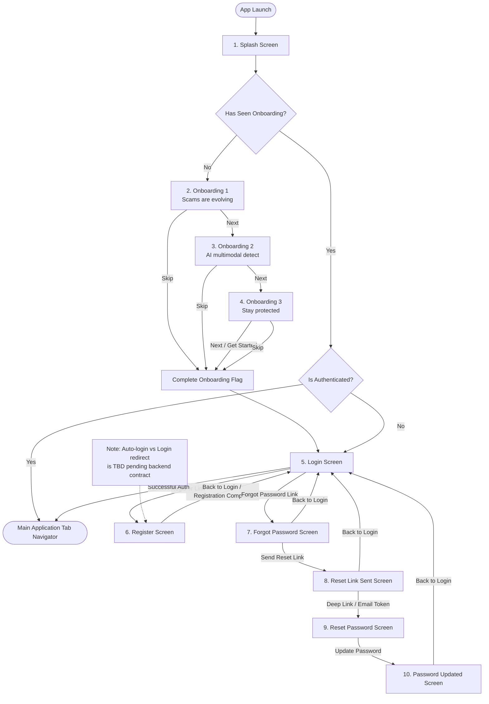
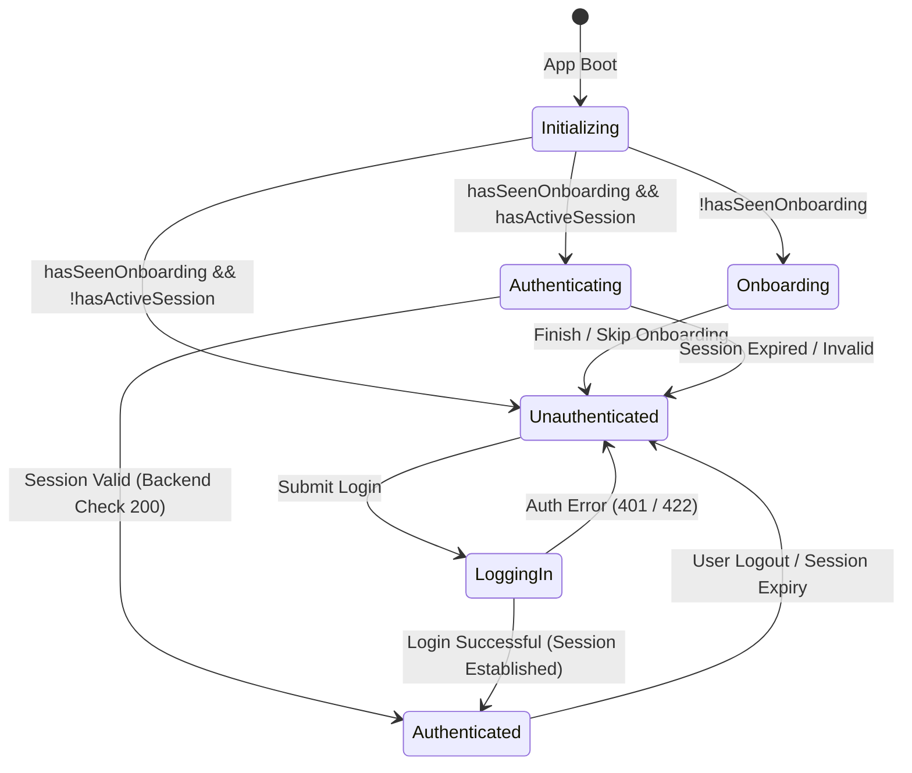

# RFC-001-F — Authentication & Onboarding Frontend Architecture

**Status:** Proposed / Under Review  
**Author:** Insightify Frontend Team  
**Created:** 2026-08-28  
**Scope:** Frontend (`src/features/auth/`, `src/features/onboarding/`, `src/app/navigation/`)  
**Platform:** React Native CLI (JavaScript)  
**Theme Support:** Light Mode + Dark Mode (Dual Theme)  
**Visual Reference:** Approved Figma/UI Design Specifications (10 Screens)

---

## 1. Overview

This RFC defines the complete frontend architecture, visual design implementation, state management, validation rules, navigation flows, and API integration boundary for the **Onboarding & User Authentication** module in Insightify.

The module encompasses the first-time user journey from application launch to authenticated dashboard entry, spanning **exactly 10 screens**:

1. **Splash Screen**
2. **Onboarding 1** (*"Scams are evolving."*)
3. **Onboarding 2** (*"AI has the power to detect."*)
4. **Onboarding 3** (*"Stay protected, always."*)
5. **Login** (*"Welcome back!"*)
6. **Register** (*"Create your account"*)
7. **Forgot Password** (*"Forgot password?"*)
8. **Reset Link Sent** (*"Check your email!"*)
9. **Reset Password** (*"Create new password"*)
10. **Password Updated** (*"Password updated!"*)

All UI components and layouts are designed to render natively and pixel-faithfully in both **Light Mode** and **Dark Mode**, consuming the centralized design tokens established in `src/shared/theme/`.

---

## 2. Problem Statement

A security product must establish **trust, calmness, and clarity** from the very first interaction. 

1. **First-Time Guidance:** Everyday users need immediate, digestible awareness of why Insightify exists (scam defense, multimodal AI, real-time protection) without cognitive overload.
2. **Frictionless & Trustworthy Authentication:** Security applications often suffer from clinical, intimidating authentication flows. Insightify requires a welcoming, consumer-friendly, yet visibly secure experience with live validation and clear privacy guarantees.
3. **Seamless State Gating:** The mobile application must cleanly navigate between first-time onboarding, unauthenticated auth stack, and authenticated dashboard without race conditions, navigation blinks, or token leakage.

---

## 3. Goals & Non-Goals

### 3.1 Goals

- **Visual Fidelity:** Implement all 10 screens matching the approved Light Mode and Dark Mode UI references.
- **Unified Design System:** Consume centralized theme tokens (`src/shared/theme/`) across all screens with zero hardcoded semantic colors.
- **Robust Client Validation:** Implement instant, field-level feedback for email format, password complexity, and confirmation matching before API calls.
- **Resilient Auth State Management:** Manage auth credentials and session lifecycle using **Zustand** (client store) + **TanStack Query** (user identity query) + native secure storage.
- **Deterministic Navigation Gating:** Structure navigation so that onboarding completion and auth state deterministically switch stacks at root level.
- **Graceful Error & Loading States:** Handle network latency, server validation errors, and rate limits with non-intrusive feedback and retry actions.

### 3.2 Non-Goals

- Implementing backend FastAPI endpoints, database schemas, or server-side password hashing (this is a frontend-only RFC).
- Social OAuth SDK configuration (Google/Apple sign-in buttons will be visual primitives with delegated hooks; native SDK linking will be defined in a dedicated sub-RFC).
- Biometric authentication (FaceID/Fingerprint) — deferred to a subsequent security RFC.
- Backend email dispatching or SMTP server configuration.

---

## 4. User Flow & Navigation Architecture

### 4.1 Complete Screen Flow Diagram



---

## 5. Screen-by-Screen UI/UX Specifications

All 10 screens strictly follow the provided UI reference designs in both Light and Dark modes.

---

### Screen 1: Splash Screen

| Attribute | Specification |
|---|---|
| **Purpose** | Application bootloader, session initialization, onboarding check, and brand immersion. |
| **Hero Element** | Large 3D glossy shield with heartbeat / cyber-intelligence pulse wave icon (`assets/images/Insightify_logo.png`). |
| **Typography** | App title: `typography.display` ("Insightify"). Subtitle: `typography.bodyLarge` ("AI-Powered Scam Detection"). Tagline: `typography.bodySmall` ("Stay Alert. Stay Safe."). |
| **Bottom Indicator** | Horizontal gradient progress pill (`#245BFF → #A63DFF`) animating during initial session resolution. |
| **Light Mode** | `background: colors.background` (`#F8FAFF`), subtle light-blue cyber mesh background, dark navy text (`#071A49`). |
| **Dark Mode** | `background: colors.background` (`#061329`), deep navy glow surface, crisp white text (`#F5F9FF`). |
| **Transition** | Automatically transitions to `Onboarding` or `Login` / `App` after state resolution (max 2.0s). |

---

### Screen 2: Onboarding 1 — "Scams are evolving."

| Attribute | Specification |
|---|---|
| **Top Bar** | Top-right "Skip" text button (`typography.button`, `color: colors.primary` or `colors.textSecondary`). |
| **Illustration** | `assets/onboarding/scams-evolving.png` — Cloaked cyber-threat figure surrounded by floating chat, SMS, phone call, and alert hazard cards. |
| **Heading** | "Scams are **evolving.**" — Split color: "Scams are" in `colors.textPrimary`, "evolving." in `colors.primary`. |
| **Body** | "Every day, new AI scams, fake texts, calls, and deepfakes put you at risk. Don't be the next victim." (`typography.body`, `colors.textSecondary`). |
| **Pagination** | 3-dot indicator (Dot 1 active: `#245BFF` elongated pill, Dots 2–3 inactive: `colors.border` circles). |
| **CTA** | Primary Gradient Button: `"Next →"` (`#245BFF → #A63DFF`). |

---

### Screen 3: Onboarding 2 — "AI has the power to detect."

| Attribute | Specification |
|---|---|
| **Top Bar** | Top-right "Skip" text button. |
| **Illustration** | `assets/onboarding/ai-detection.png` — Glowing digital brain / neural chip with connected multimodal nodes (chat, voice note, image, video player, security shield). |
| **Heading** | "AI has the power to **detect.**" — "AI has the power to" in `colors.textPrimary`, "detect." in `colors.primary`. |
| **Body** | "Our multimodal AI analyzes text, images, audio, and video to catch what humans miss." (`typography.body`, `colors.textSecondary`). |
| **Pagination** | 3-dot indicator (Dot 2 active: `#245BFF` elongated pill, Dots 1 & 3 inactive). |
| **CTA** | Primary Gradient Button: `"Next →"`. |

---

### Screen 4: Onboarding 3 — "Stay protected, always."

| Attribute | Specification |
|---|---|
| **Top Bar** | Top-right "Skip" text button. |
| **Illustration** | `assets/onboarding/stay-protected.png` — Smartphone displaying verified shield with notification bell and alert audio wave elements. |
| **Heading** | "Stay protected, **always.**" — "Stay protected," in `colors.textPrimary`, "always." in `colors.primary`. |
| **Body** | "Get real-time alerts, block threats, and stay one step ahead. Your safety is our mission." (`typography.body`, `colors.textSecondary`). |
| **Pagination** | 3-dot indicator (Dot 3 active: `#245BFF` elongated pill, Dots 1–2 inactive). |
| **CTA** | Primary Gradient Button: `"Next →"` (completes onboarding flow). |

---

### Screen 5: Login Screen — "Welcome back!"

| Attribute | Specification |
|---|---|
| **Header** | Back arrow (top-left). Center brand lockup: Shield badge icon + "Insightify" title + "Welcome back!" subtitle (`typography.body`). |
| **Input Fields** | 1. **Email:** Left icon `mail-outline`, placeholder "Email", type `email-address`.<br/>2. **Password:** Left icon `lock-closed-outline`, right eye toggle, placeholder "Password". |
| **Inline Link** | "Forgot password?" right-aligned below password field (`typography.caption`, `colors.primary`). |
| **Primary Action** | Primary Gradient Button: `"Login →"` (with loading spinner state). |
| **Social Divider** | Centered line divider with text `"or continue with"` (`typography.caption`, `colors.textTertiary`). |
| **Social Logins** | 1. `"Continue with Google"` (Google G logo, `colors.surface` card, `colors.border` border).<br/>2. `"Continue with Apple"` (Apple logo, `colors.surface` card, `colors.border` border). |
| **Footer Link** | `"Don't have an account? Register"` (`"Register"` in `colors.primary`, bold). |

---

### Screen 6: Register Screen — "Create your account"

| Attribute | Specification |
|---|---|
| **Header** | Back arrow (top-left). Center lockup: Shield badge + "Insightify" title + "Create your account" (`typography.h1`) + "Join Insightify and stay safe online." (`typography.bodySmall`). |
| **Input Fields** | 1. **Full Name:** Left icon `person-outline`, placeholder "Full Name".<br/>2. **Email:** Left icon `mail-outline`, placeholder "Email".<br/>3. **Password:** Left icon `lock-closed-outline`, right eye toggle, placeholder "Password".<br/>4. **Confirm Password:** Left icon `lock-closed-outline`, right eye toggle, placeholder "Confirm Password". |
| **Security Trust Pill** | Full-width container with teal/green shield checkmark: `"Your data is encrypted and always protected."` (`colors.successSoft` background, `colors.success` text/icon). |
| **Primary Action** | Primary Gradient Button: `"Create Account →"` (with loading state). |
| **Footer Link** | `"Already have an account? Login"` (`"Login"` in `colors.primary`, bold). |

---

### Screen 7: Forgot Password — "Forgot password?"

| Attribute | Specification |
|---|---|
| **Header** | Back arrow (top-left). |
| **Illustration** | `assets/auth/forgot-password.png` — Centered 3D mail envelope with document lock shield and paper airplane. |
| **Heading & Copy** | Title: `"Forgot password?"` (`typography.h2`). Description: `"Enter your email and we'll send you a link to reset your password."` (`typography.body`, `colors.textSecondary`). |
| **Input Field** | Email input with `mail-outline` icon, placeholder `"Email address"`. |
| **Primary Action** | Primary Gradient Button: `"Send Reset Link →"`. |
| **Footer Action** | Centered text button: `"Back to login"` (`colors.primary`). |

---

### Screen 8: Reset Link Sent — "Check your email!"

| Attribute | Specification |
|---|---|
| **Illustration** | `assets/auth/reset-link-sent.png` — 3D blue paper airplane with circular verified teal checkmark badge. |
| **Heading & Copy** | Title: `"Check your email!"` (`typography.h2`). Description: `"We've sent a password reset link to "` + `user@email.com` (highlighted in `colors.primary`). |
| **Spam Callout Card** | Surface card with `information-circle` icon: `"Didn't receive the email? Check your spam folder or request a new link."`<br/>*Note:* Resend action trigger is informational copy in this stage; active resend API call is TBD pending backend contract verification. |
| **Primary Action** | Primary Gradient Button: `"Back to Login →"`. |

---

### Screen 9: Reset Password — "Create new password"

| Attribute | Specification |
|---|---|
| **Header** | Back arrow (top-left). |
| **Heading & Copy** | Title: `"Create new password"` (`typography.h2`). Description: `"Your new password must be different from previous used passwords."` |
| **Input Fields** | 1. **New Password:** `lock-closed-outline` icon, eye toggle, placeholder "New Password".<br/>2. **Password Strength Meter:** 3-tier horizontal progress bar (Weak/Fair/Strong) with dynamic color label (`#EF4444` → `#F59E0B` → `#20B86B`).<br/>3. **Confirm New Password:** `lock-closed-outline` icon, eye toggle, placeholder "Confirm New Password". |
| **Primary Action** | Primary Gradient Button: `"Update Password →"`. |

---

### Screen 10: Password Updated — "Password updated!"

| Attribute | Specification |
|---|---|
| **Illustration** | `assets/auth/password-updated.png` — Large 3D glowing teal/green shield with white checkmark and subtle celebratory particles. |
| **Heading & Copy** | Title: `"Password updated!"` (`typography.h2`). Description: `"Your password has been updated successfully."` (`typography.body`, `colors.textSecondary`). |
| **Primary Action** | Primary Gradient Button: `"Back to Login →"`. |

---

## 6. Theme & Visual Design System Mapping

All screens consume semantic tokens from `src/shared/theme/`:

```text
src/shared/theme/
├── colors.js       → light / dark palettes, brand, semantic status
├── typography.js   → display (34), h1 (28), h2 (22), h3 (18), body (15), label (12), caption (11)
├── spacing.js      → 4-point scale (xxs: 4, xs: 8, sm: 12, md: 16, lg: 20, xl: 24, xxl: 32)
├── radii.js        → small: 8, medium: 12, large: 16, card: 18, pill: 999
├── shadows.js      → subtle platform elevation (card, medium, high)
└── gradients.js    → primaryCta: ['#245BFF', '#A63DFF'] (left → right)
```

### Theme Differences Comparison Matrix

| UI Component | Light Mode Token | Dark Mode Token |
|---|---|---|
| **Screen Background** | `colors.background` (`#F8FAFF`) | `colors.background` (`#061329`) |
| **Card / Input Surface** | `colors.surface` (`#FFFFFF`) | `colors.surface` (`#0D1D36`) |
| **Input Border** | `colors.border` (`#DDE6F2`) | `colors.border` (`#213652`) |
| **Primary Headings** | `colors.textPrimary` (`#071A49`) | `colors.textPrimary` (`#F5F9FF`) |
| **Secondary Body** | `colors.textSecondary` (`#5B6B84`) | `colors.textSecondary` (`#B8C7DB`) |
| **Placeholders / Icons** | `colors.textTertiary` (`#8793A7`) | `colors.textTertiary` (`#7F90A7`) |
| **CTA Button** | Gradient `#245BFF → #A63DFF` | Gradient `#245BFF → #A63DFF` |
| **CTA Button Text** | `colors.textOnBrand` (`#FFFFFF`) | `colors.textOnBrand` (`#FFFFFF`) |
| **Trust Badge Background** | `colors.successSoft` (`#E9F9F1`) | `colors.surfaceSecondary` (`#122743`) |
| **Status Bar Style** | `dark-content` | `light-content` |

---

## 7. Frontend Validation Specifications

Client-side validation is executed in real time and on form submission using `src/shared/validation/validators.js`.

| Field | Validation Rules | Error Message |
|---|---|---|
| **Full Name** | Required, trimmed length ≥ 2 characters | `"Full Name is required"` |
| **Email Address** | Required, standard RFC 5322 regex format | `"Please enter a valid email address"` |
| **Password (Register / Reset)** | Required, minimum 8 characters, at least 1 uppercase, 1 lowercase, 1 number | `"Password must be at least 8 characters with letters & numbers"` |
| **Confirm Password** | Required, strict equality (`===`) with password | `"Passwords do not match"` |

### Password Strength Calculation (Screen 9)

- **Score 1 (Weak):** Length < 8 (`#EF4444`)
- **Score 2 (Fair):** Length ≥ 8 + letters + numbers (`#F59E0B`)
- **Score 3 (Strong):** Length ≥ 10 + letters + numbers + special characters (`#20B86B`)

---

## 8. State Management & Authentication Flow

### 8.1 State Layer Allocation

```text
Server State  → TanStack Query  (current user identity, profile verification, session queries)
Client State  → Zustand         (client UI authentication status, onboarding completion state)
Local State   → React useState  (form inputs, password visibility, field errors, slide index)
```

> **Session Storage Note:** Client-side session and credential persistence mechanisms will strictly follow the verified FastAPI backend contract (e.g., secure encrypted storage for Bearer tokens or HTTP-only cookies). No token storage strategy is assumed or hardcoded prior to backend contract confirmation.

### 8.2 Authentication State Machine (Mermaid)



---

## 9. Frontend ↔ FastAPI Backend API Boundary

All network communication is dispatched through `apiClient` (`src/services/api/client.js`).

> [!IMPORTANT]
> **API Contracts Status: TBD (Backend Contract Verification Required)**  
> The table below outlines the **expected frontend dependency model**. Exact production FastAPI endpoints, request schemas, response envelopes, and token transmission mechanisms must be verified against the live FastAPI/OpenAPI documentation before feature implementation. The frontend will not invent or finalize API contracts.

### Expected Auth Endpoints Model (Pending Verification)

| Method | Expected Endpoint | Purpose | Request Body *(TBD)* | Response Payload *(TBD)* | Contract Status |
|---|---|---|---|---|---|
| `POST` | `/api/v1/auth/login` | User Login | `{ email, password }` | Session credentials / user profile | *TBD — pending contract* |
| `POST` | `/api/v1/auth/register` | User Registration | `{ name, email, password }` | Registration result / session credentials | *TBD — pending contract* |
| `POST` | `/api/v1/auth/forgot-password` | Request Reset Link | `{ email }` | `{ success: boolean, message: string }` | *TBD — pending contract* |
| `POST` | `/api/v1/auth/reset-password` | Reset with Token | `{ token, newPassword }` | `{ success: boolean, message: string }` | *TBD — pending contract* |
| `GET` | `/api/v1/auth/me` | Fetch Active Profile | *Session Header / Cookie* | `{ user: { id, name, email } }` | *TBD — pending contract* |
| `POST` | `/api/v1/auth/logout` | Revoke Session | *Session Header / Cookie* | `{ success: boolean }` | *TBD — pending contract* |

### Standard Frontend Error Normalization Mapping

| Backend HTTP Status | Frontend UI Treatment | User-Facing Message |
|---|---|---|
| `400` / `422` | Inline field errors under respective inputs | Field-specific validation message |
| `401` | Form banner alert (danger) | `"Invalid email or password. Please try again."` |
| `409` | Email field error | `"An account with this email already exists."` |
| `429` | Timed lockout banner | `"Too many attempts. Please wait a moment."` |
| `5xx` / Network Error | Modal or toast alert with retry button | `"Unable to connect to server. Check your connection."` |

---

## 10. Proposed Implementation Structure

```text
src/
├── features/
│   ├── onboarding/
│   │   ├── components/
│   │   │   ├── OnboardingPagination.jsx
│   │   │   └── OnboardingSlide.jsx
│   │   ├── hooks/
│   │   │   └── useOnboarding.js
│   │   ├── screens/
│   │   │   ├── OnboardingScreen1.jsx
│   │   │   ├── OnboardingScreen2.jsx
│   │   │   └── OnboardingScreen3.jsx
│   │   └── store/
│   │       └── onboardingStore.js
│   │
│   └── auth/
│       ├── components/
│       │   ├── AuthHeader.jsx
│       │   ├── PasswordStrengthMeter.jsx
│       │   ├── SocialAuthButtons.jsx
│       │   └── TrustBadge.jsx
│       ├── hooks/
│       │   ├── useAuth.js
│       │   ├── useLoginForm.js
│       │   └── useRegisterForm.js
│       ├── screens/
│       │   ├── SplashScreen.jsx
│       │   ├── LoginScreen.jsx
│       │   ├── RegisterScreen.jsx
│       │   ├── ForgotPasswordScreen.jsx
│       │   ├── ResetLinkSentScreen.jsx
│       │   ├── ResetPasswordScreen.jsx
│       │   └── PasswordUpdatedScreen.jsx
│       ├── services/
│       │   └── authApi.js
│       └── store/
│           └── authStore.js
│
└── app/
    └── navigation/
        ├── AuthStack.jsx
        ├── OnboardingStack.jsx
        └── RootNavigator.jsx
```

---

## 11. Security & Privacy Considerations

1. **Secure Session Handling:** Authentication tokens or session credentials must never be stored in plain text or ordinary insecure storage. Persistence must follow the verified FastAPI contract (e.g., native encrypted keystore/keychain storage or secure HTTP-only cookies).
2. **No Sensitive Logging:** Passwords, confirm passwords, and session tokens must never be printed to `console.log` in development or production.
3. **Protected Input Fields:** All password inputs must have `secureTextEntry={true}` by default and disable system autofill learning on untrusted keyboards.
4. **TLS Enforcement:** All API communication strictly executes over HTTPS (`ENV.API_BASE_URL`).

---

## 12. Acceptance Criteria

- [ ] All 10 screens render pixel-accurately in both **Light Mode** and **Dark Mode**.
- [ ] Onboarding slides smoothly transition with working pagination indicators and skip capability.
- [ ] Onboarding completion persists in storage so returning users bypass onboarding directly to Login or App.
- [ ] Login and Register forms execute full client-side validation with field-level error messages.
- [ ] Password visibility toggle works smoothly on all password inputs.
- [ ] Password strength meter dynamically updates colors and indicator steps on `ResetPasswordScreen`.
- [ ] Navigation back buttons and inline cross-links navigate cleanly without stack duplication.
- [ ] `AppProviders` and central `apiClient` are fully integrated for network calls and query caching.
- [ ] Zero hardcoded hex colors exist inside feature screens (all resolve from `useTheme()`).
- [ ] Minimum touch target of 44×44px is maintained for all interactive elements.

---

## 13. Out of Scope

- Native Google Sign-In and Apple Sign-In SDK configuration and native certificate linking (UI buttons provided, SDK integration deferred to separate OAuth RFC).
- Backend FastAPI implementation and database migrations.
- Biometric authentication (Face ID / Fingerprint unlock).
- Push notification permission prompts during authentication.

---

## 14. Genuine Open Questions

- [ ] **Backend OAuth Endpoint Contract:** Does the FastAPI backend accept Google/Apple ID tokens directly at `/api/v1/auth/oauth/google`, or via a custom exchange flow?
- [ ] **Deep Linking Scheme for Password Reset:** What URI scheme should be configured for the password reset email link (e.g. `insightify://reset-password?token=...` or Universal Links)?
- [ ] **Auto-Login after Registration:** Should registration immediately log the user in and transition to the Dashboard, or require explicit login on the Login screen?

---

## 15. Consistency Checklist

- [x] Covers **exactly all 10 required screens** with visual and functional specs.
- [x] Includes both **Light Mode** and **Dark Mode** definitions.
- [x] Directly references existing centralized tokens in `src/shared/theme/`.
- [x] Uses genuine asset paths in `assets/auth/`, `assets/onboarding/`, and `assets/images/`.
- [x] Uses approved state architecture (Zustand + TanStack Query + React local state).
- [x] Contains clear, useful Mermaid sequence and state diagrams.
- [x] Frontend-only scope; no backend implementation details or invented endpoints.
