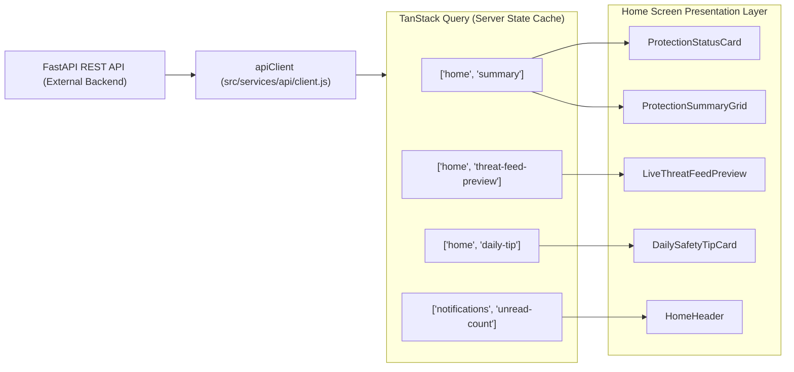

# RFC-002-F — Home Dashboard Frontend Architecture

**Status:** Proposed / Under Review  
**Author:** Insightify Frontend Team  
**Created:** 2026-08-28  
**Scope:** Frontend (`src/features/home/`, `src/app/navigation/`)  
**Platform:** React Native CLI (JavaScript)  
**Theme Support:** Light Mode + Dark Mode (Dual Theme)  
**Visual Reference:** Approved Home Dashboard UI Design (Attached Specification)  
**Asset References:** `assets/home/protection-status.png`, `assets/images/Insightify_logo.png`  
**Navigation Model:** `Home | Feed | Detect | Learn | Profile` (5-Tab Structure with Center Floating Action)

---

## 1. Overview

This RFC defines the complete frontend architecture, layout hierarchy, component breakdown, state management, edge cases, and future API dependencies for the **Insightify Home Dashboard** (`src/features/home/`).

The Home Dashboard is the primary post-authentication screen. It provides users with immediate reassurance regarding their active real-time protection status, a high-level security summary, one-tap multimodal detection entrypoints, real-time community threat alerts, and bite-sized daily cyber safety education.

### Core Dashboard Sections (Exact Visual Hierarchy)

1. **Top App Bar / Header:** Official Insightify brand lockup (`assets/images/Insightify_logo.png`), stylized *"Insightify"* title, *"Stay Alert. Stay Safe."* tagline, and notification action with unread badge counter (`"3"`).
2. **Protection Status Hero Card:** High-impact gradient card featuring *"You're Protected"* with a live green indicator (🟢), *"Real-time protection is ON"*, *"We're watching for threats 24/7"*, and the 3D glowing shield illustration (`assets/home/protection-status.png`).
3. **Protection Summary (4 Metrics):** Timeframe selector (*"This Week ⌵"*) with 4 horizontal metric tiles:
   - **Scans:** Icon (Scanner), Metric: `24`
   - **Threats Blocked:** Icon (Shield Warning), Metric: `7`
   - **Safe Interactions:** Icon (Shield Verified), Metric: `98%`
   - **Alerts:** Icon (Bell), Metric: `12`
4. **Quick Actions (5 Detection Entrypoints):** 5 colorful icon tiles in a single horizontal row:
   - **Scan Text** (Purple chat tile)
   - **Scan Link** (Blue link tile)
   - **Scan Image** (Green picture tile)
   - **Scan File** (Orange document tile)
   - **Scan Audio** (Red/coral audio wave tile)
5. **Live Threat Feed Preview:** Section header (*"Live Threat Feed"* + *"See All"*) with 2 preview cards featuring severity badges (*HIGH RISK*, *MEDIUM RISK*), titles, descriptions, location tags (`📍 Pakistan`, `📍 India`), timestamps (`🕒 2m ago`, `🕒 15m ago`), and threat iconography.
6. **Daily Safety Tip Card:** Highlighted insight card with 3D star shield icon, title, practical protection advice, and navigation arrow (`→`) to the Learn module.
7. **Bottom Tab Navigation:** 5-tab bar with custom center elevated floating Detect shield button (`Home | Feed | Detect | Learn | Profile`).

---

## 2. Problem Statement

Everyday mobile users need an intelligent digital safety companion that inspires confidence rather than anxiety.

The Home Dashboard solves four critical UX requirements:
1. **At-a-Glance Reassurance:** Instant confirmation that active scanning is running in the background.
2. **Effortless Multimodal Scanning:** Instant, single-tap entry into scanning text, links, screenshots, files, or voice notes.
3. **Localized Threat Awareness:** Immediate visibility into real threats currently targeting other users nearby.
4. **Habitual Learning:** Actionable daily security advice that improves scam detection instincts over time.

---

## 3. Goals & Non-Goals

### 3.1 Goals

- **Pixel-Accurate Implementation:** Replicate the exact layout, typography, icon badges, colors, and proportions from the approved UI reference.
- **Dual-Theme Fidelity:** Render flawlessly in both Light Mode and Dark Mode using centralized tokens (`src/shared/theme/`).
- **Smooth Navigation Transitions:** Deep-link cleanly from Home into Detection modes, the Community Feed, Feed Detail, Learn, Profile, and Notifications.
- **Robust Edge & Offline States:** Gracefully handle loading skeletons, empty threat lists, offline protection indicators, and network timeouts.
- **Instant Asset Rendering:** Ensure local bundled assets (`protection-status.png`, `Insightify_logo.png`) render immediately with zero visual delay (`fadeDuration={0}`).

### 3.2 Non-Goals

- Implementing the Detection multimodal engine, camera OCR, or audio recording (defined in Detection RFC).
- Implementing the Community Threat Feed voting, reporting, or comment threads (defined in Feed RFC).
- Implementing the Quiz player and educational scenario engine (defined in Learn RFC).
- Making "Report" a bottom navigation tab (Reporting is a contextual action inside Detection Result and Feed Detail).
- Backend FastAPI database schemas, SQL queries, or server-side calculations.

---

## 4. High-Level Architecture & Mermaid Flows

### 4.1 Home Navigation & Exit Transitions

```mermaid
flowchart TD
    HOME["HomeScreen (Home Dashboard)"]
    
    %% Header Exit
    HOME -->|Notification Bell Tap| NOTIF_SCREEN["Notifications Screen"]
    
    %% Quick Actions Exits
    HOME -->|Scan Text Tile| DETECT_TEXT["Detect Tab (Mode: Text)"]
    HOME -->|Scan Link Tile| DETECT_LINK["Detect Tab (Mode: Link)"]
    HOME -->|Scan Image Tile| DETECT_IMAGE["Detect Tab (Mode: Image)"]
    HOME -->|Scan File Tile| DETECT_FILE["Detect Tab (Mode: File)"]
    HOME -->|Scan Audio Tile| DETECT_AUDIO["Detect Tab (Mode: Audio)"]
    
    %% Hero / Center Tab
    HOME -->|Center Floating Button| DETECT_DEFAULT["Detect Tab (Scanner Home)"]
    
    %% Feed Exits
    HOME -->|See All Link| FEED_TAB["Feed Tab (Full Community Feed)"]
    HOME -->|Threat Card Tap| FEED_DETAIL["Feed Detail Screen (threatId)"]
    
    %% Learn Exit
    HOME -->|Daily Tip Arrow Tap| LEARN_TAB["Learn Tab (Quizzes & Guides)"]
    
    %% Bottom Tab Bar Exits
    HOME -->|Feed Tab Tap| FEED_TAB
    HOME -->|Learn Tab Tap| LEARN_TAB
    HOME -->|Profile Tab Tap| PROFILE_TAB["Profile Tab (Settings & XP)"]
```



### 4.2 Data & Query Flow



---

## 5. Screen-by-Screen Layout & Component Breakdown

```text
┌─────────────────────────────────────────────────────────┐
│ [Shield] Insightify                    [Notification 🔔3]│ ← HomeHeader
│          Stay Alert. Stay Safe.                         │
├─────────────────────────────────────────────────────────┤
│ ┌─────────────────────────────────────────────────────┐ │
│ │ You’re Protected 🟢                                 │ │
│ │ Real-time protection is ON                          │ │
│ │ We're watching for threats 24/7                     │ │
│ │                                  [3D Hero Shield]   │ │ ← ProtectionStatusCard
│ └─────────────────────────────────────────────────────┘ │
├─────────────────────────────────────────────────────────┤
│ Protection Summary                         This Week ⌵  │ ← SectionHeader + Dropdown
│ ┌──────────┐ ┌──────────┐ ┌──────────┐ ┌──────────┐     │
│ │ 📷       │ │ 🛡️       │ │ 🛡️       │ │ 🔔       │     │
│ │ 24       │ │ 7        │ │ 98%      │ │ 12       │     │ ← ProtectionSummaryGrid (4 Cards)
│ │ Scans    │ │ Blocked  │ │ Safe     │ │ Alerts   │     │
│ └──────────┘ └──────────┘ └──────────┘ └──────────┘     │
├─────────────────────────────────────────────────────────┤
│ Quick Actions                                           │
│  [ 💬 Text ] [ 🔗 Link ] [ 🖼️ Image ] [ 📄 File ] [ 🎙️ ]│ ← QuickActionTiles (5 Icons)
├─────────────────────────────────────────────────────────┤
│ Live Threat Feed                             See All    │ ← SectionHeader
│ ┌─────────────────────────────────────────────────────┐ │
│ │ 🔴 HIGH RISK                                  [✉️!] │ │
│ │ Fake Banking SMS Circulating Again                  │ │ ← ThreatPreviewCard 1
│ │ Multiple users reported this SMS impersonating...   │ │
│ │ 📍 Pakistan   🕒 2m ago                             │ │
│ └─────────────────────────────────────────────────────┘ │
│ ┌─────────────────────────────────────────────────────┐ │
│ │ 🟡 MEDIUM RISK                                [🔗!] │ │
│ │ Suspicious WhatsApp Link Detected                   │ │ ← ThreatPreviewCard 2
│ │ This link is reported for phishing attempts.        │ │
│ │ 📍 India      🕒 15m ago                            │ │
│ └─────────────────────────────────────────────────────┘ │
├─────────────────────────────────────────────────────────┤
│ ┌─────────────────────────────────────────────────────┐ │
│ │ [⭐ Shield] Daily Safety Tip                     [→]│ │ ← DailySafetyTipCard
│ │             Never share OTPs, passwords, or personal│ │
│ │             information with anyone. Stay safe!     │ │
│ └─────────────────────────────────────────────────────┘ │
└─────────────────────────────────────────────────────────┘
  [ Home ]     [ Feed ]     [(🛡️ Detect)]     [ Learn ]     [ Profile ]  ← BottomTab
```

---

### Detailed Component Specifications

### 5.1 `HomeHeader.jsx`
- **Brand Lockup (Left):**
  - Shield Logo: `assets/images/Insightify_logo.png` (40×40px).
  - Title: *"Insight" + "ify"* (`typography.h2`, `colors.textPrimary` + `colors.primary`).
  - Tagline: *"Stay Alert. Stay Safe."* (`typography.caption`, `colors.textSecondary`).
- **Notification Action (Right):**
  - Bell Icon: `notifications-outline` in `colors.textPrimary` (44×44px touch container).
  - Unread Badge: Circular red pill (`colors.danger`) in top-right corner with text `"3"`.
  - Action: Navigates to `Notifications` screen.

### 5.2 `ProtectionStatusCard.jsx` (Hero Banner)
- **Background:** Gradient surface card (`#245BFF → #4A7DFF` or theme-resolved card gradient).
- **Status Indicator:** Title *"You’re Protected"* with a bright green pulsing status dot (`#20B86B`).
- **Subtitle Copy:** *"Real-time protection is ON"* (`typography.body`, `colors.textOnBrand`).
- **Secondary Copy:** *"We're watching for threats 24/7"* (`typography.bodySmall`, `rgba(255,255,255,0.85)`).
- **Hero Image:** `assets/home/protection-status.png` (140×140px, positioned on the right with glowing aura, `fadeDuration={0}`).

### 5.3 `ProtectionSummaryGrid.jsx` (4 Metric Cards)
- **Top Row:** Title *"Protection Summary"* (`typography.h3`) and Timeframe selector (*"This Week ⌵"* in `colors.textSecondary`).
- **Grid Layout:** 4 equal-width cards in a single row (`flexDirection: 'row'`, `gap: 8`).
- **Card 1 (Scans):** Soft blue icon badge (`camera-outline`), count `24` (`typography.h2`), label `Scans`.
- **Card 2 (Threats Blocked):** Soft orange icon badge (`shield-outline`), count `7`, label `Threats Blocked`.
- **Card 3 (Safe Interactions):** Soft green icon badge (`checkmark-circle-outline`), count `98%`, label `Safe Interactions`.
- **Card 4 (Alerts):** Soft purple icon badge (`notifications-outline`), count `12`, label `Alerts`.

### 5.4 `QuickActionTiles.jsx` (5 Detection Entrypoints)
- **Section Title:** *"Quick Actions"* (`typography.h3`).
- **Row of 5 Action Tiles:**
  1. **Scan Text:** Purple icon container (`chatbox-ellipses-outline`), label *"Scan Text"*.
  2. **Scan Link:** Blue icon container (`link-outline`), label *"Scan Link"*.
  3. **Scan Image:** Green icon container (`image-outline`), label *"Scan Image"*.
  4. **Scan File:** Orange icon container (`document-text-outline`), label *"Scan File"*.
  5. **Scan Audio:** Red/coral icon container (`radio-outline` or `mic-outline`), label *"Scan Audio"*.
- **Interaction:** Tapping any tile triggers `navigation.navigate('Detect', { initialMode: 'text' | 'url' | 'image' | 'file' | 'audio' })`.

### 5.5 `LiveThreatFeedPreview.jsx`
- **Section Header:** *"Live Threat Feed"* with right action *"See All"* (`colors.primary`, navigates to `Feed` tab).
- **Card 1 (High Risk):**
  - Severity: `! HIGH RISK` (Red soft pill `#FEE2E2`, text `#EF4444`).
  - Title: *"Fake Banking SMS Circulating Again"* (`typography.bodyLarge`, bold).
  - Description: *"Multiple users reported this SMS impersonating banks to steal credentials."*
  - Metadata: `📍 Pakistan` + `🕒 2m ago`.
  - Right Icon Card: 3D mail envelope with red alert bubble.
- **Card 2 (Medium Risk):**
  - Severity: `! MEDIUM RISK` (Yellow soft pill `#FEF3C7`, text `#F59E0B`).
  - Title: *"Suspicious WhatsApp Link Detected"*.
  - Description: *"This link is reported for phishing attempts."*
  - Metadata: `📍 India` + `🕒 15m ago`.
  - Right Icon Card: 3D link chain with yellow alert bubble.
- **Interaction:** Tapping any card navigates to `FeedDetail` with `{ threatId }`.

### 5.6 `DailySafetyTipCard.jsx`
- **Background:** Soft gradient/surface card with subtle sparkle decorations.
- **Left Icon:** 3D blue shield badge with white star.
- **Middle Content:**
  - Category / Title: *"Daily Safety Tip"* (`typography.label`, `colors.primary`).
  - Copy: *"Never share OTPs, passwords, or personal information with anyone. Stay safe!"* (`typography.bodySmall`, `colors.textSecondary`).
- **Right Action:** Circular button with arrow icon (`arrow-forward-outline`) navigating to `Learn` tab.

---

## 6. Light Mode & Dark Mode Token Mappings

| UI Element | Light Mode Token | Dark Mode Token |
|---|---|---|
| **Screen Background** | `colors.background` (`#F8FAFF`) | `colors.background` (`#061329`) |
| **Hero Card Surface** | Gradient `#245BFF → #4A7DFF` | Gradient `#1748D1 → #0D1D36` |
| **Metric Card Surface** | `colors.surface` (`#FFFFFF`) | `colors.surface` (`#0D1D36`) |
| **Quick Action Icon Tiles** | Soft tinted backgrounds (`#F3F0FF`, `#EBF5FF`, `#E8F8F0`, `#FFF4EB`, `#FFF0F0`) | Subtle dark tints (`#1A1528`, `#102038`, `#102C1E`, `#2D1E10`, `#2D1010`) |
| **Threat Card Surface** | `colors.surface` (`#FFFFFF`) | `colors.surface` (`#0D1D36`) |
| **Threat Card Border** | `colors.border` (`#DDE6F2`) | `colors.border` (`#213652`) |
| **Safety Tip Card Surface** | `colors.surfaceSecondary` (`#F1F5FB`) | `colors.surfaceSecondary` (`#122743`) |
| **Primary Headings** | `colors.textPrimary` (`#071A49`) | `colors.textPrimary` (`#F5F9FF`) |
| **Secondary Body Copy** | `colors.textSecondary` (`#5B6B84`) | `colors.textSecondary` (`#B8C7DB`) |
| **Status Bar Style** | `dark-content` | `light-content` |

---

## 7. Bottom Navigation Architecture (5 Tabs)

The application shell uses a **5-Tab Navigation Model**:

```text
[ Home ]       [ Feed ]       [(🛡️ Detect)]       [ Learn ]       [ Profile ]
```

### Tab Configuration

| Tab Name | Route Key | Icon (Outline / Active) | Center Elevated | Destination |
|---|---|---|---|---|
| **Home** | `HomeTab` | `home` / `home-outline` | No | `HomeScreen` |
| **Feed** | `FeedTab` | `newspaper` / `newspaper-outline` | No | `FeedStack` (Threat Feed) |
| **Detect** | `DetectTab` | `shield` / `shield-outline` | **Yes (Floating Action)** | `DetectStack` (Scanner) |
| **Learn** | `LearnTab` | `book` / `book-outline` | No | `LearnStack` (Quizzes) |
| **Profile** | `ProfileTab` | `person` / `person-outline` | No | `ProfileStack` (Account) |

> **Note on Report:** The Report feature is intentionally **not** a bottom tab. Reporting is initiated contextually from Detection results or Feed detail.

---

## 8. Server / API Dependencies (Frontend Contract Model)

> [!IMPORTANT]
> **API Contracts Status: TBD (Backend Contract Verification Required)**  
> The endpoints below represent the **frontend dependency model**. Exact routes, request parameters, and response envelopes will be verified against the FastAPI backend documentation.

### Expected Endpoints Summary

| Feature Area | Method | Expected Endpoint *(TBD)* | Query / Params | Expected Response Data *(TBD)* |
|---|---|---|---|---|
| **Protection Status** | `GET` | `/api/v1/protection/status` | *None* | `{ isProtected: boolean, activeSince: string }` |
| **Protection Summary** | `GET` | `/api/v1/protection/summary` | `timeframe=this_week` | `{ scansCount: 24, threatsBlocked: 7, safeRate: 98, alertsCount: 12 }` |
| **Threat Feed Preview** | `GET` | `/api/v1/feed/preview` | `limit=2` | `Array<{ id, title, description, riskLevel, location, timeAgo, type }>` |
| **Daily Safety Tip** | `GET` | `/api/v1/learn/daily-tip` | *None* | `{ id, title, tip, category }` |
| **Notifications Count** | `GET` | `/api/v1/notifications/unread-count` | *None* | `{ unreadCount: 3 }` |

---

## 9. State Management

```text
Server State  → TanStack Query  (protection status, 4-metric summary, threat feed preview, daily tip)
Client State  → Zustand         (selected summary timeframe, local protection preferences)
Local State   → React useState  (pull-to-refresh state)
```

### TanStack Query Keys & Invalidation

- `['home', 'protection-status']` — staleTime: 5 mins
- `['home', 'summary', timeframe]` — staleTime: 2 mins
- `['home', 'feed-preview']` — staleTime: 1 min
- `['home', 'daily-tip']` — staleTime: 60 mins
- `['notifications', 'unread-count']` — staleTime: 30 secs

---

## 10. Loading, Empty, & Fallback States

| Scenario | Component Impact | Treatment |
|---|---|---|
| **Summary Metrics Loading** | `ProtectionSummaryGrid` | Render 4 animated `Skeleton` blocks. |
| **Feed Preview Loading** | `LiveThreatFeedPreview` | Render 2 placeholder `Skeleton` threat rows. |
| **Zero Community Threats** | `LiveThreatFeedPreview` | Display clean card: *"No active threats reported in your area."* with green checkmark. |
| **Feed API Error** | `LiveThreatFeedPreview` | Render inline retry banner without breaking the rest of the Home dashboard. |
| **Protection State Offline** | `ProtectionStatusCard` | Fall back gracefully with subtitle: *"Device protection active locally"*. |
| **Zero User Activity** | `ProtectionSummaryGrid` | Display `0` values with friendly hint to perform first scan. |

---

## 11. Proposed Implementation Structure

```text
src/
├── features/
│   └── home/
│       ├── components/
│       │   ├── HomeHeader.jsx
│       │   ├── ProtectionStatusCard.jsx
│       │   ├── ProtectionSummaryGrid.jsx
│       │   ├── QuickActionTiles.jsx
│       │   ├── LiveThreatFeedPreview.jsx
│       │   ├── ThreatPreviewCard.jsx
│       │   └── DailySafetyTipCard.jsx
│       ├── hooks/
│       │   └── useHomeDashboard.js
│       ├── screens/
│       │   └── HomeScreen.jsx
│       └── services/
│           └── homeApi.js
│
└── app/
    └── navigation/
        ├── TabNavigator.jsx
        └── CustomTabBar.jsx
```

---

## 12. Acceptance Criteria

- [ ] Home Dashboard exactly matches the approved UI reference layout and component order.
- [ ] Header renders official logo (`assets/images/Insightify_logo.png`), brand title, tagline, and bell icon with unread badge `"3"`.
- [ ] Hero card renders *"You’re Protected 🟢"*, protection subtitles, and `assets/home/protection-status.png` with zero fade lag.
- [ ] Protection summary renders 4 metric cards (*Scans, Threats Blocked, Safe Interactions, Alerts*) and timeframe selector (*"This Week ⌵"*).
- [ ] Quick Actions render 5 icon tiles (*Scan Text, Scan Link, Scan Image, Scan File, Scan Audio*) deep-linking into Detection with corresponding mode.
- [ ] Live Threat Feed renders 2 preview cards with risk pills (*HIGH RISK*, *MEDIUM RISK*), descriptions, location tags, timestamps, and *"See All"* link to Feed.
- [ ] Daily Safety Tip card renders 3D star shield icon, tip copy, and right arrow link to Learn.
- [ ] Bottom navigation displays `Home | Feed | Detect (Center Floating) | Learn | Profile` (Report is not in bottom bar).
- [ ] Pull-to-refresh updates all queries seamlessly via TanStack Query.
- [ ] Strict dual-theme compliance (Light Mode `#F8FAFF` / Dark Mode `#061329`) with zero hardcoded hex colors in feature components.

---

## 13. Out of Scope

- Full multimodal Detection screen implementation.
- Full Community Threat Feed list, filters, and search.
- Full Learn module quizzes and interactive scenarios.
- Profile settings, statistics, and achievement details.
- Real-time Android accessibility service background event engine.

---

## 14. Genuine Open Questions

- [ ] **Summary Timeframe Options:** Will the timeframe selector (*"This Week"*) support dynamic filtering (e.g., *"Today"*, *"This Month"*, *"All Time"*) on the FastAPI backend, or is it fixed to weekly telemetry?
- [ ] **Location Tag Sourcing:** Are threat location tags (e.g., `📍 Pakistan`, `📍 India`) derived from user report metadata or server-side IP geolocation?
- [ ] **Daily Tip Refresh Frequency:** Should the Daily Safety Tip rotate every 24 hours based on calendar date or on each app launch?

---

## 15. Consistency Checklist

- [x] Matches the exact approved Home Dashboard UI reference image.
- [x] All 7 dashboard sections accurately documented in order.
- [x] Uses existing repository assets: `assets/home/protection-status.png`, `assets/images/Insightify_logo.png`.
- [x] Bottom navigation strictly defined as `Home | Feed | Detect | Learn | Profile` (Report excluded).
- [x] All API dependencies marked as `TBD — backend contract verification required`.
- [x] Clear Mermaid diagrams for navigation transitions and data query flow.
- [x] Frontend-only scope; no backend implementation details or invented endpoints.
