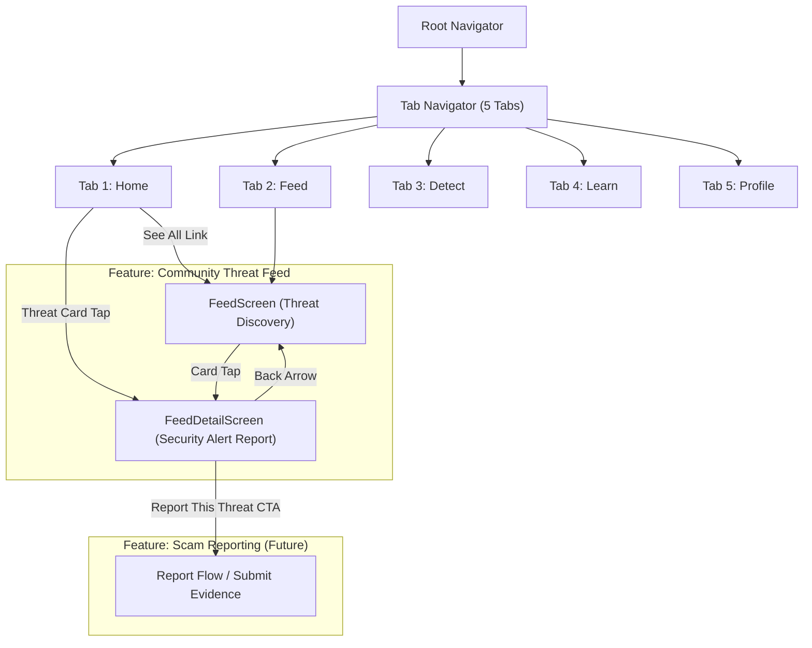
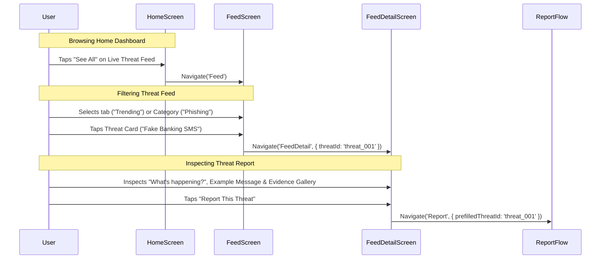
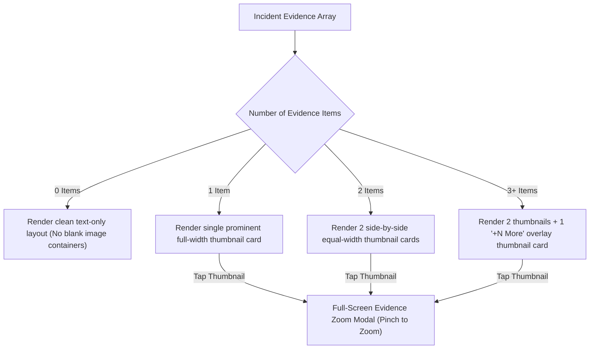
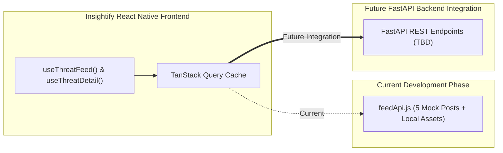

# RFC-003-F — Community Threat Feed & Threat Detail Frontend Architecture

**Status:** Proposed / Under Review  
**Author:** Insightify Frontend Team  
**Created:** 2026-08-29  
**Scope:** Frontend (`src/features/feed/`, `src/app/navigation/`)  
**Platform:** React Native CLI (JavaScript)  
**Theme Support:** Light Mode + Dark Mode (Dual Theme)  
**Visual Reference:** Approved Feed & Feed Detail UI Design Specification  
**Asset References:**  
- `assets/feed/banking-scam.png`  
- `assets/feed/phishing-link.png`  
- `assets/feed/voice-scam.png`  
- `assets/feed/deepfake.png`  
- `assets/feed/threat-scam.png`  
- `assets/images/Insightify_logo.png`  
**Navigation Model:** `Home | Feed | Detect | Learn | Profile` (Feed is Tab 2; Feed Detail is a Nested Screen)

---

## 1. Overview

This RFC defines the complete frontend architecture, visual design implementation, component hierarchy, state management, edge cases, and future API dependencies for the **Insightify Community Threat Feed** and **Threat Detail** screens (`src/features/feed/`).

The Feed feature is a **curated cybersecurity threat-intelligence and community-safety feed**, not a social-media timeline. It empowers users to discover emerging digital deception tactics in real time, inspect verified evidence, learn preventative safety steps, and report active threats to protect the community.

### Feature Scope: Two Main Screens

1. **Threat Feed Screen (`FeedScreen.jsx`):** Filterable, categorised threat discovery feed with 4 tab views (*For You, Trending, Nearby, Latest*), category filter dropdown (*"All Threats ⌵"*), and structured threat cards with risk badges, location tags, community report counts, timestamps, and thumbnail previews.
2. **Threat Detail Screen (`FeedDetailScreen.jsx`):** In-depth security incident report featuring risk severity, incident explanation (*"What's happening?"*), raw example messages, multi-item visual evidence gallery, community verification badge, actionable safety tips checklist, and a prominent *"Report This Threat"* CTA.

---

## 2. Problem Statement

Modern social engineering attacks (urgent fake SMS, cloned voice calls, malicious sponsored ads, WhatsApp OTP theft, and deepfakes) spread rapidly through local communities before antivirus software or security tools update their definitions.

Users require:
1. **Intelligence, Not Noise:** A security-focused intelligence feed stripped of algorithmic social-media vanity metrics (no likes, no unrelated comments, no influencer clutter).
2. **Immediate Threat Context:** Rapid clarity on *what* the scam is, *where* it is circulating, *how* it deceives victims, and *what* an example message looks like.
3. **Actionable Defense:** Concrete, step-by-step verification rules to avoid falling victim.
4. **Community Protection:** Frictionless escalation to report suspicious variations or save alerts for offline reference.

---

## 3. Goals & Non-Goals

### 3.1 Goals

- **Security Intelligence Aesthetic:** Implement a clean, trustworthy, and modern cybersecurity feed strictly matching the approved Light & Dark UI references.
- **Two Complete Screen Experiences:** Implement both `FeedScreen` and `FeedDetailScreen` with full transition handling.
- **5 Realistic Mock Threat Posts:** Define and bundle exactly 5 mock threat records mapping to the 5 local assets in `assets/feed/` for isolated frontend development and testing.
- **Dynamic Media Support:** Support 0, 1, or multiple image screenshots/evidence items with an expandable `+N More` thumbnail gallery.
- **Deep-Link Integration:** Support seamless entry from Home (`Home → See All → Feed`, and `Home → Threat Card → Feed Detail`).
- **Dual-Theme Token Compliance:** Strictly consume centralized tokens from `src/shared/theme/` across Light Mode (`#F8FAFF`) and Dark Mode (`#061329`).
- **Future FastAPI Decoupling:** Keep the mock data service cleanly isolated so it can be swapped for live REST endpoints without restructuring UI components.

### 3.2 Non-Goals

- Implementing social-media features (user follower graphs, arbitrary comment sections, vanity likes, public profile walls).
- Implementing full scam reporting backend ingestion (the *"Report This Threat"* button routes to the future Report flow defined in its own RFC).
- Real-time WebSocket push feed streaming (standard TanStack Query polling / pull-to-refresh is used).
- Backend database schemas, moderation workflows, or IP-based geolocation servers.

---

## 4. Navigation & Interaction Architecture

### 4.1 System-Wide Navigation Flow



### 4.2 Home to Feed & Feed Detail Interactions



---

## 5. Screen 1: Threat Feed Layout & Structure

```text
┌─────────────────────────────────────────────────────────┐
│ [Shield] Insightify                    [Notification 🔔3]│ ← App Header
├─────────────────────────────────────────────────────────┤
│ Threat Feed                              [🛡️ All Threats ⌵]│ ← Title & Filter Dropdown
│ Real threats. Real people. Real protection.             │
├─────────────────────────────────────────────────────────┤
│ [✨ For You]   [🎵 Trending]   [📍 Nearby]   [🕒 Latest] │ ← FeedTabs (Horizontal Row)
├─────────────────────────────────────────────────────────┤
│ ┌─────────────────────────────────────────────────────┐ │
│ │ [✉️!]  🔴 HIGH RISK                              [🔖]│ │
│ │       Fake Banking SMS Circulating Again            │ │
│ │       Multiple users reported this SMS impersonat...│ │ ← ThreatCard 1
│ │       [SMS]  [📍 Pakistan]           [Screenshot 🖼️]│ │
│ │       👥 103 reports • 2m ago                       │ │
│ └─────────────────────────────────────────────────────┘ │
│ ┌─────────────────────────────────────────────────────┐ │
│ │ [🔗!]  🟡 MEDIUM RISK                            [🔖]│ │
│ │       Phishing Links on Facebook Ads                │ │
│ │       Scammers are using fake ads to steal your...  │ │ ← ThreatCard 2
│ │       [Phishing]  [📍 India]         [Sponsored 🖼️] │ │
│ │       👥 78 reports • 15m ago                       │ │
│ └─────────────────────────────────────────────────────┘ │
│ ┌─────────────────────────────────────────────────────┐ │
│ │ [💼!]  🔵 INFO                                   [🔖]│ │
│ │       Beware of Online Job Scams                    │ │
│ │       Fake recruiters ask for advance payments...   │ │ ← ThreatCard 3
│ │       [Fraud]  [📍 Nepal]            [Ad Banner 🖼️] │ │
│ │       👥 51 reports • 32m ago                       │ │
│ └─────────────────────────────────────────────────────┘ │
└─────────────────────────────────────────────────────────┘
  [ Home ]     [ Feed ]     [(🛡️ Detect)]     [ Learn ]     [ Profile ]  ← BottomTab
```

### Component Breakdown for `FeedScreen.jsx`

1. **`FeedHeader.jsx`:**
   - Official Insightify logo (`assets/images/Insightify_logo.png`) + title *"Insightify"* + Notification bell with unread badge (`"3"`).
2. **`FeedTitleBar.jsx`:**
   - Title: *"Threat Feed"* (`typography.h1` / `typography.h2`, `colors.textPrimary`).
   - Subtitle: *"Real threats. Real people. Real protection."* (`typography.caption`, `colors.textSecondary`).
   - Category Filter Button: *"🛡️ All Threats ⌵"* pill button triggering category filter modal/sheet (*All, Banking, Phishing, Voice AI, Deepfakes, Job Fraud, Identity Theft*).
3. **`FeedTabs.jsx`:**
   - Horizontal tab bar with 4 segment pills:
     - **✨ For You** (Personalized threat relevance)
     - **🎵 Trending** (Most reported / fastest circulating threats)
     - **📍 Nearby** (Threats reported in user's region/country)
     - **🕒 Latest** (Chronological real-time alerts)
4. **`ThreatCard.jsx`:**
   - **Left Icon Box:** 3D threat category illustration (`48×48px`) with small risk exclamation badge.
   - **Top Row:** Semantic `RiskBadge` (*HIGH RISK*, *MEDIUM RISK*, *INFO*, *LOW RISK*) + Bookmark toggle button (`bookmark-outline` / `bookmark`).
   - **Title & Description:** Bold 1-line title (`typography.h3`) + 2-line preview copy (`typography.bodySmall`).
   - **Metadata Badges:** Platform pill (e.g. `SMS`, `WhatsApp`, `Phishing`, `Voice AI`) + Location badge (`📍 Pakistan`, `📍 India`).
   - **Footer Stats:** Community count (`👥 103 reports`) • Relative timestamp (`2m ago`).
   - **Right Thumbnail Preview:** Compact evidence thumbnail preview (`64×64px`, rounded corners).

---

## 6. Screen 2: Threat Detail Layout & Structure

```text
┌─────────────────────────────────────────────────────────┐
│ [← Back]                                   [🔖 Save] [↗️]│ ← Top Action Bar
├─────────────────────────────────────────────────────────┤
│ 🔴 HIGH RISK                                            │
│ Fake Banking SMS Circulating Again             [✉️ 3D] │ ← Hero Incident Header
│ 📍 Pakistan  •  🕒 2m ago  •  👁️ 246 views              │
├─────────────────────────────────────────────────────────┤
│ ┌─────────────────────────────────────────────────────┐ │
│ │ What's happening?                                   │ │
│ │ Attackers are sending SMS messages impersonating    │ │ ← IncidentContextCard
│ │ banks to trick users into verifying accounts and    │ │   (Soft Tint + 3D Hacker Icon)
│ │ stealing OTPs or personal information.  [🥷 3D Hero] │ │
│ └─────────────────────────────────────────────────────┘ │
├─────────────────────────────────────────────────────────┤
│ Example Message                                         │
│ ┌─────────────────────────────────────────────────────┐ │
│ │ ❝ Dear Customer,                                    │ │ ← ExampleMessageCard
│ │   Your account will be temporarily locked.          │ │   (Quote format + Phishing link)
│ │   Verify now: bit.ly/kyz123                         │ │
│ └─────────────────────────────────────────────────────┘ │
├─────────────────────────────────────────────────────────┤
│ Evidence                                                │
│ ┌──────────────┐ ┌──────────────┐ ┌──────────────┐      │
│ │ [SMS Screen] │ │ [Bank Page]  │ │   +2 More    │      │ ← EvidenceGallery
│ └──────────────┘ └──────────────┘ └──────────────┘      │
├─────────────────────────────────────────────────────────┤
│ Reported By                                             │
│ ┌─────────────────────────────────────────────────────┐ │
│ │ [🛡️] Insightify Community  [Verified]               │ │ ← ReportedByCard
│ │     Community contributor                           │ │
│ └─────────────────────────────────────────────────────┘ │
├─────────────────────────────────────────────────────────┤
│ Safety Tips                                             │
│ ┌─────────────────────────────────────────────────────┐ │
│ │ ✅ Do not share OTPs or passwords with anyone.      │ │
│ │ ✅ Do not click on links from unknown senders. [🛡️] │ │ ← SafetyTipsCard
│ │ ✅ Always verify from official app or website.      │ │
│ └─────────────────────────────────────────────────────┘ │
├─────────────────────────────────────────────────────────┤
│ [ 🛡️ Report This Threat ]                               │ ← Sticky / Bottom Primary CTA
└─────────────────────────────────────────────────────────┘
```

### Component Breakdown for `FeedDetailScreen.jsx`

1. **`DetailHeader.jsx`:**
   - Left: Back arrow button (`arrow-back` with 44×44px hitSlop).
   - Right: Bookmark toggle button + Share action button (`share-social-outline`).
2. **`DetailIncidentHero.jsx`:**
   - Risk Pill (`RiskBadge`), Threat Title (`typography.h1`), Metadata row (`📍 Location • 🕒 Timestamp • 👁️ View Count`), and top-right 3D threat icon badge.
3. **`IncidentContextCard.jsx` (*"What's happening?"*):**
   - Soft red/amber tinted surface card explaining the attacker's motive and mechanism.
   - Right graphic: 3D hooded security icon with phone & exclamation mark.
4. **`ExampleMessageCard.jsx`:**
   - Section title *"Example Message"*.
   - Quote styled container with subtle blue/gray tint, quotation mark (❝), and highlighted phishing link (e.g. `bit.ly/kyz123` with underline, non-clickable to prevent accidental navigation).
5. **`EvidenceGallery.jsx`:**
   - Section title *"Evidence"*.
   - Horizontal thumbnail gallery displaying 1, 2, or 3 visible images with an overlay tile for additional evidence (*"+2 More"*).
   - Tapping an image opens a full-screen image viewer modal.
6. **`ReportedByCard.jsx`:**
   - Section title *"Reported By"*.
   - Shield icon + Contributor Name (*"Insightify Community"*) + Verified badge (`colors.primary`) + Subtitle (*"Community contributor"*).
7. **`SafetyTipsCard.jsx`:**
   - Section title *"Safety Tips"*.
   - Soft green card (`#E8F8F0` in Light, `#102C1E` in Dark) with 3 actionable checklist items (✅) and right 3D green shield checkmark.
8. **`ReportThreatButton.jsx` (Bottom Action):**
   - High-impact destructive/alert gradient button (*"🛡️ Report This Threat"*) navigating to the future Scam Report flow.

---

## 7. Mock Feed Dataset (5 Specific Threat Posts)

For the current frontend implementation, exactly **5 mock threat posts** are defined, each permanently mapped to one of the 5 approved local bundled assets in `assets/feed/`:

```text
assets/feed/
├── banking-scam.png       → Post 1: Fake Banking SMS Phishing
├── phishing-link.png      → Post 2: Malicious Facebook Sponsored Ad
├── voice-scam.png         → Post 3: Urgent AI Voice-Cloning Kidnap Scam
├── deepfake.png           → Post 4: Executive Video Deepfake Transfer
└── threat-scam.png        → Post 5: Advance-Fee Work-From-Home Job Offer
```

### Complete 5 Mock Post Specifications

```javascript
export const MOCK_FEED_POSTS = [
  {
    id: 'threat_001',
    riskLevel: 'HIGH',
    title: 'Fake Banking SMS Circulating Again',
    description: 'Multiple users reported this SMS impersonating banks to steal credentials and drain accounts.',
    category: 'Banking',
    platformTag: 'SMS',
    location: 'Pakistan',
    reportCount: 103,
    viewCount: 246,
    timeAgo: '2m ago',
    timestamp: '2026-08-29T10:15:00Z',
    heroAsset: require('../../../../assets/feed/banking-scam.png'),
    isBookmarked: false,
    isVerified: true,
    reportedBy: {
      name: 'Insightify Community',
      badge: 'Verified',
      role: 'Community contributor',
    },
    whatIsHappening: 'Attackers are sending SMS messages impersonating banks to trick users into verifying accounts and stealing OTPs or personal information.',
    exampleContent: {
      type: 'sms',
      body: 'Dear Customer, Your account will be temporarily locked. Verify now: bit.ly/kyz123',
      link: 'bit.ly/kyz123',
    },
    evidence: [
      { id: 'ev_1', title: 'SMS Screenshot', uri: require('../../../../assets/feed/banking-scam.png') },
      { id: 'ev_2', title: 'Fake Login Page', uri: require('../../../../assets/feed/phishing-link.png') },
    ],
    safetyTips: [
      'Do not share OTPs or passwords with anyone.',
      'Do not click on links from unknown senders.',
      'Always verify from the official bank app or website.',
    ],
  },
  {
    id: 'threat_002',
    riskLevel: 'MEDIUM',
    title: 'Phishing Links on Facebook Ads',
    description: 'Scammers are running sponsored ads offering fake tech giveaways to harvest social logins.',
    category: 'Phishing',
    platformTag: 'Facebook',
    location: 'India',
    reportCount: 78,
    viewCount: 189,
    timeAgo: '15m ago',
    timestamp: '2026-08-29T10:02:00Z',
    heroAsset: require('../../../../assets/feed/phishing-link.png'),
    isBookmarked: false,
    isVerified: true,
    reportedBy: {
      name: 'CyberDefend Group',
      badge: 'Verified',
      role: 'Security researcher',
    },
    whatIsHappening: 'Fraudulent sponsored advertisements on Facebook and Instagram claim you won high-end headphones, directing you to a credential-harvesting clone page.',
    exampleContent: {
      type: 'ad',
      body: 'Claim your free prize now! Limited time giveaway for verified accounts: bit.ly/abc-offer',
      link: 'bit.ly/abc-offer',
    },
    evidence: [
      { id: 'ev_3', title: 'Sponsored Ad', uri: require('../../../../assets/feed/phishing-link.png') },
    ],
    safetyTips: [
      'Legitimate brands do not host giveaways on obscure short links.',
      'Check the advertiser page transparency and follower history.',
      'Never input social credentials into third-party web forms.',
    ],
  },
  {
    id: 'threat_003',
    riskLevel: 'HIGH',
    title: 'Urgent AI Voice-Cloning Scam',
    description: 'Scammers use 3-second audio clips scraped from TikTok to impersonate family members claiming medical emergencies.',
    category: 'Voice AI',
    platformTag: 'WhatsApp Audio',
    location: 'United States',
    reportCount: 142,
    viewCount: 412,
    timeAgo: '28m ago',
    timestamp: '2026-08-29T09:48:00Z',
    heroAsset: require('../../../../assets/feed/voice-scam.png'),
    isBookmarked: true,
    isVerified: true,
    reportedBy: {
      name: 'AI Safety Watch',
      badge: 'Verified',
      role: 'Threat intelligence',
    },
    whatIsHappening: 'Attackers synthesize cloned voices of family members using generative AI audio tools, demanding instant crypto or wire transfers for fake hospital bail.',
    exampleContent: {
      type: 'audio_transcript',
      body: '"Mom, I got into a severe accident and lost my wallet, please wire $2,000 to this urgent account right now..."',
      link: null,
    },
    evidence: [
      { id: 'ev_4', title: 'Audio Call Log', uri: require('../../../../assets/feed/voice-scam.png') },
    ],
    safetyTips: [
      'Establish a secret family offline safe-word that AI cannot guess.',
      'Hang up immediately and call the family member back on their known number.',
      'Never send funds under pressure before independent verification.',
    ],
  },
  {
    id: 'threat_004',
    riskLevel: 'HIGH',
    title: 'Executive Video Deepfake Transfer',
    description: 'Real-time video call deepfakes impersonating corporate executives requesting urgent wire transfers.',
    category: 'Deepfake',
    platformTag: 'Zoom / Teams',
    location: 'United Kingdom',
    reportCount: 39,
    viewCount: 156,
    timeAgo: '45m ago',
    timestamp: '2026-08-29T09:30:00Z',
    heroAsset: require('../../../../assets/feed/deepfake.png'),
    isBookmarked: false,
    isVerified: true,
    reportedBy: {
      name: 'Enterprise Guard',
      badge: 'Verified',
      role: 'Corporate response team',
    },
    whatIsHappening: 'Fraudsters join video conference calls using real-time video deepfakes of CFOs or directors to authorize high-value vendor account changes.',
    exampleContent: {
      type: 'video_call',
      body: 'Urgent vendor payment change requested during emergency executive video briefing.',
      link: null,
    },
    evidence: [
      { id: 'ev_5', title: 'Video Artifact Screenshot', uri: require('../../../../assets/feed/deepfake.png') },
    ],
    safetyTips: [
      'Always enforce out-of-band multi-person payment authorization policies.',
      'Ask the caller to turn their head sideways (deepfake models often glitch at angles).',
      'Verify account modifications via physical phone lines.',
    ],
  },
  {
    id: 'threat_005',
    riskLevel: 'INFO',
    title: 'Beware of Online Job Scams',
    description: 'Fake recruiters offer daily work-from-home salaries but demand upfront equipment and training fees.',
    category: 'Job Fraud',
    platformTag: 'Telegram',
    location: 'Nepal',
    reportCount: 51,
    viewCount: 134,
    timeAgo: '1h ago',
    timestamp: '2026-08-29T09:15:00Z',
    heroAsset: require('../../../../assets/feed/threat-scam.png'),
    isBookmarked: false,
    isVerified: false,
    reportedBy: {
      name: 'Community Contributor',
      badge: 'Community',
      role: 'Verified user',
    },
    whatIsHappening: 'Scammers promise $100–$300 daily for liking YouTube videos or rating hotels, but demand initial security deposits that are never refunded.',
    exampleContent: {
      type: 'telegram_msg',
      body: 'WORK FROM HOME. Earn Daily Rs. 5000+. No experience needed. Apply now on Telegram: @earn_easy_24',
      link: 't.me/earn_easy_24',
    },
    evidence: [
      { id: 'ev_6', title: 'Telegram Poster', uri: require('../../../../assets/feed/threat-scam.png') },
    ],
    safetyTips: [
      'Legitimate employers will never ask candidates to pay for a job or equipment.',
      'Beware of generic job descriptions offering unusually high daily pay.',
      'Do not disclose banking or national identity documents on messaging apps.',
    ],
  },
];
```

---

## 8. Dynamic Media & Evidence Architecture

Threat incidents may have 0, 1, or multiple attached evidence assets (screenshots, links, waveforms, or document scans).



### Media Priority Hierarchy

1. **Authoritative Backend Media:** If the threat includes remote URLs (e.g. `evidence[i].url`), load via high-performance cached image.
2. **Local Bundled Mock Asset:** For local development/testing, fallback to the 5 bundled assets (`assets/feed/*.png`).
3. **Category Fallback Graphic:** If media fails to load or is null, render the themed category icon container (`colors.surfaceSecondary`).

---

## 9. Light Mode & Dark Mode Theme Mappings

Both screens strictly resolve colors via `useTheme()`.

| UI Element | Light Mode Token | Dark Mode Token |
|---|---|---|
| **Screen Background** | `colors.background` (`#F8FAFF`) | `colors.background` (`#061329`) |
| **Card Surface** | `colors.surface` (`#FFFFFF`) | `colors.surface` (`#0D1D36`) |
| **Card Border** | `colors.border` (`#DDE6F2`) | `colors.border` (`#213652`) |
| **Active Tab Pill Background** | Gradient `#245BFF → #A63DFF` | Gradient `#245BFF → #A63DFF` |
| **Inactive Tab Pill Surface** | `colors.surface` (`#FFFFFF`) | `colors.surface` (`#0D1D36`) |
| **Inactive Tab Pill Border** | `colors.border` (`#DDE6F2`) | `colors.border` (`#213652`) |
| **High Risk Badge Background** | `#FEE2E2` | `#3E1616` |
| **High Risk Badge Text** | `#EF4444` | `#EF4444` |
| **Medium Risk Badge Background** | `#FEF3C7` | `#3D2808` |
| **Medium Risk Badge Text** | `#F59E0B` | `#F59E0B` |
| **Info / Low Risk Badge Background**| `#E0F2FE` | `#0E2442` |
| **Info / Low Risk Badge Text** | `#0284C7` | `#38BDF8` |
| **Context Banner ("What's happening")** | Soft Red `#FFF1F2` | Dark Burgundy `#2B1218` |
| **Example Quote Box Surface** | `#F1F5FB` | `#122743` |
| **Safety Tips Card Surface** | Soft Green `#E8F8F0` | Dark Pine `#102C1E` |
| **Report Threat CTA** | `#EF4444` (Solid Red Gradient) | `#EF4444` |
| **Status Bar Style** | `dark-content` | `light-content` |

---

## 10. Risk Severity System

Insightify communicates threat severity using a **multi-signal approach** (never relying on color alone):

| Risk Level | Pill Label | Icon | Semantic Meaning | Action Urgency |
|---|---|---|---|---|
| **HIGH** | `! HIGH RISK` | `alert-circle` | Active, verified phishing/financial theft | Immediate avoidance; report immediately |
| **MEDIUM** | `! MEDIUM RISK` | `warning` | Suspicious sponsored links / impersonation | Caution; verify before engaging |
| **INFO** | `ℹ️ INFO` | `information-circle` | Educational trend / emerging scam alert | Informational awareness |
| **SAFE / LOW** | `✓ VERIFIED SAFE` | `checkmark-circle` | Disproven false alarm or verified brand | Safe interaction |

---

## 11. Server / API Dependencies (Future Transition)

> [!IMPORTANT]
> **API Contracts Status: TBD (Backend Contract Verification Required)**  
> All live API endpoints below represent the future dependency model. The initial frontend implementation uses the local mock data provider (`feedApi.js`) which will be swapped for FastAPI endpoints without UI refactoring.



### Expected Endpoints Specification *(TBD)*

| Endpoint | Method | Query / Body | Response Payload *(TBD)* |
|---|---|---|---|
| `/api/v1/feed` | `GET` | `tab=trending&category=all&page=1&limit=10` | `{ items: Array<ThreatPost>, nextPage: number, total: number }` |
| `/api/v1/feed/{id}` | `GET` | *None* | `{ threat: DetailedThreatReport }` |
| `/api/v1/feed/{id}/bookmark` | `POST` | `{ bookmarked: boolean }` | `{ success: boolean, isBookmarked: boolean }` |
| `/api/v1/feed/{id}/share` | `GET` | *None* | `{ shareUrl: string, previewText: string }` |

---

## 12. State Management Architecture

```text
Server State  → TanStack Query  (feed list, active tab data, threat detail, bookmark status)
Client State  → Zustand         (active category filter, active tab index: 'for_you'|'trending'|'nearby'|'latest')
Local State   → React useState  (image zoom modal state, filter dropdown open/close state)
```

### TanStack Query Keys

- `['feed', 'list', activeTab, activeCategory]` — staleTime: 2 minutes
- `['feed', 'detail', threatId]` — staleTime: 5 minutes
- `['feed', 'bookmarks']` — staleTime: 10 minutes

---

## 13. UI States (Loading, Empty, Error, Fallback)

| State | Feed Screen Treatment | Feed Detail Screen Treatment |
|---|---|---|
| **Initial Loading** | Render 3 animated `Skeleton` threat cards. | Render skeleton header, context card, quote box, and safety tips. |
| **Populated Feed** | Smooth scrollable list with pull-to-refresh. | Full incident report with sticky bottom CTA. |
| **Empty Category / Tab** | Clean card: *"No threats reported in this category yet. Check back soon!"* with shield icon. | Fallback banner: *"Threat report unavailable or archived."* |
| **Network Error** | Inline retry banner (*"Unable to load threat alerts."* + *"Retry"* button). | Error screen with back button + retry action. |
| **Pull-to-Refresh** | Native `RefreshControl` invalidating `['feed']` queries. | Native `RefreshControl` refreshing `['feed', 'detail', id]`. |
| **Missing Media** | Hide thumbnail preview smoothly; card expands text area. | Hide Evidence gallery section cleanly without blank box. |

---

## 14. Proposed Directory & Component Structure

```text
src/
├── features/
│   └── feed/
│       ├── components/
│       │   ├── FeedHeader.jsx              # Official logo + title + notification bell
│       │   ├── FeedTitleBar.jsx            # "Threat Feed" title + category dropdown button
│       │   ├── FeedTabs.jsx                # For You, Trending, Nearby, Latest segment pills
│       │   ├── ThreatCard.jsx              # Reusable threat card with risk badge & thumbnail
│       │   ├── CategoryFilterModal.jsx     # Category selection bottom sheet modal
│       │   ├── DetailHeader.jsx            # Back button, bookmark, share action bar
│       │   ├── DetailIncidentHero.jsx      # Detail title, severity badge, metadata row
│       │   ├── IncidentContextCard.jsx     # "What's happening?" explanation card
│       │   ├── ExampleMessageCard.jsx      # Quote box with raw scam message and warning
│       │   ├── EvidenceGallery.jsx         # Multi-item image gallery with zoom modal
│       │   ├── ReportedByCard.jsx          # Community contributor / verified badge card
│       │   └── SafetyTipsCard.jsx          # Actionable prevention checklist
│       ├── hooks/
│       │   ├── useThreatFeed.js            # TanStack Query hook for feed list & filtering
│       │   └── useThreatDetail.js          # TanStack Query hook for single threat report
│       ├── screens/
│       │   ├── FeedScreen.jsx              # Main threat discovery screen (Tab 2)
│       │   └── FeedDetailScreen.jsx        # Security incident detail report screen
│       ├── services/
│       │   └── feedApi.js                  # 5 mock threat posts + local assets provider
│       └── utils/
│           └── feedFormatters.js           # Timestamp and report count formatters
```

---

## 15. Acceptance Criteria

- [ ] `FeedScreen` renders exactly according to the approved UI reference (Title, Subtitle, Category Dropdown, 4 Tabs, Threat Cards).
- [ ] `FeedDetailScreen` renders exactly according to the approved UI reference (Header, Incident Hero, "What's happening?", Example Quote, Evidence Gallery, Reported By, Safety Tips, "Report This Threat" CTA).
- [ ] Feed does not look like a social media app (zero likes, zero public wall clutter; information-first cybersecurity intelligence aesthetic).
- [ ] Exactly 5 mock threat posts are defined and correctly mapped to the 5 local assets in `assets/feed/`:
  - `banking-scam.png` (SMS / Bank OTP scam)
  - `phishing-link.png` (Sponsored social media link)
  - `voice-scam.png` (AI Voice cloning emergency)
  - `deepfake.png` (Executive video call deepfake)
  - `threat-scam.png` (Advance-fee job offer)
- [ ] Tapping any Threat Card on `FeedScreen` opens `FeedDetailScreen` with the selected threat record.
- [ ] Tapping *"See All"* on `HomeScreen` opens `FeedScreen`.
- [ ] Tapping a Threat Card on `HomeScreen` opens `FeedDetailScreen` directly.
- [ ] Tapping *"Report This Threat"* on `FeedDetailScreen` prepares transition into the Report flow.
- [ ] Bookmark toggle updates local state / cache seamlessly.
- [ ] Evidence gallery renders dynamically for 0, 1, 2, or 3+ images with a "+N More" tile overlay.
- [ ] Both Light Mode (`#F8FAFF`) and Dark Mode (`#061329`) render with zero hardcoded hex colors.
- [ ] Responsive layout adapts across all Android screen sizes without text clipping or awkward wrapping.
- [ ] Mock data is cleanly isolated in `feedApi.js` for zero-friction future FastAPI replacement.

---

## 16. Out of Scope

- Implementing the full multi-step Scam Report submission form (handled in Report RFC).
- Real-time accessibility background screen scanner (handled in Accessibility RFC).
- Backend FastAPI database migrations and production OAuth token exchange.

---

## 17. Genuine Open Questions

- [ ] **Threat Feed Geolocation Precision:** In the *"Nearby"* tab, should threats be filtered by city, state/province, or country code?
- [ ] **Evidence Full-Screen Viewer:** Should full-screen evidence zoom support pinch-to-zoom gestures via `react-native-image-viewing` or a clean modal overlay?
- [ ] **Share Threat Format:** When sharing a threat alert (via the share button), should it generate a clean text warning with a deep-link URL (e.g., `insightify.app/threat/threat_001`), or plain text summary?

---

## 18. Consistency Checklist

- [x] Directly aligns with `AGENTS.md` and `docs/RULES.md`.
- [x] Perfectly matches the approved Feed & Feed Detail visual references.
- [x] Maps all 5 local assets in `assets/feed/` to 5 realistic mock threat posts.
- [x] Covers both `FeedScreen` and `FeedDetailScreen` in detail.
- [x] Includes clear Mermaid diagrams for navigation, data flow, and future API transition.
- [x] Marks all future backend endpoints as `TBD — backend contract verification required`.
- [x] Frontend-only scope; no backend implementation details or invented database schemas.
