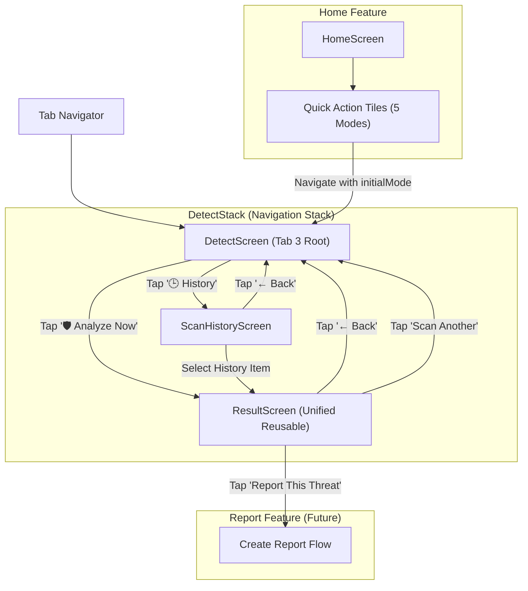
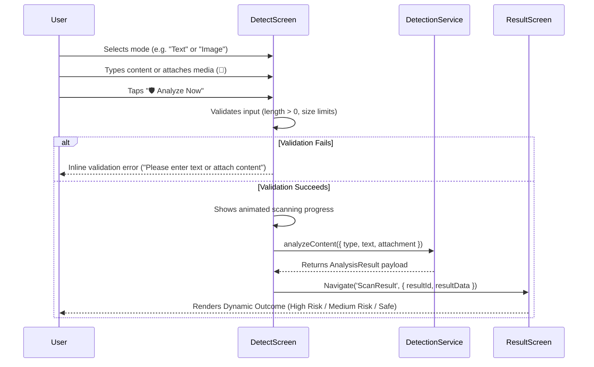
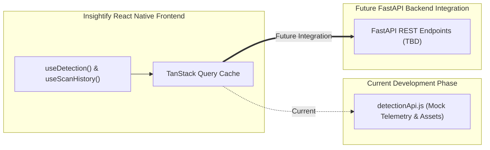

# RFC-004-F — AI Detection, Unified Result & Scan History Frontend Architecture

**Status:** Proposed / Under Review  
**Author:** Insightify Frontend Team  
**Created:** 2026-08-29  
**Scope:** Frontend (`src/features/detection/`, `src/navigation/DetectStack.jsx`)  
**Platform:** React Native CLI (JavaScript)  
**Theme Support:** Light Mode + Dark Mode (Dual Theme)  
**Visual References:**  
1. Approved Detect Screen UI Reference  
2. Approved Scan History Screen UI Reference  
3. Approved Scan Result Screen UI Reference (High Risk & Low Risk Dynamic States)  
**Asset References:**  
- `assets/detect/ai-scanner.png` (3D Shield with Orbiting Glow Rings for AI Scam Analyzer Hero)  
- `assets/detect/scan-history.png` (3D Clipboard with Checklist, Magnifying Glass, and Cloud)  
- `assets/images/Insightify_logo.png`  
**Navigation Model:** `Home | Feed | Detect | Learn | Profile` (Detect is Tab 3; Scan History & Scan Result are Stack Screens)

---

## 1. Overview

This RFC defines the complete frontend architecture, visual design implementation, component hierarchy, scanning workflows, state management, and future API dependencies for the **Insightify Detection & Scan History** feature (`src/features/detection/`).

Detection is the core emotional anchor and functional centerpiece of Insightify. It provides a fast, human-centered safety layer between deceptive digital content (*text messages, emails, phishing links, screenshots, deepfake videos, and voice notes*) and the user's next action.

### 3 Screens in Scope

1. **Detect Screen (`DetectScreen.jsx`):** Primary scanning hub featuring the AI Scam Analyzer hero card (`assets/detect/ai-scanner.png`), a 5-mode multimodal selector (*Text, Email, Image, Video, Audio*), dynamic content input area with file attachment action (`📎`) and character counter (`0/5000`), and prominent *"Analyze Now"* CTA.
2. **Scan History Screen (`ScanHistoryScreen.jsx`):** Historical telemetry dashboard with header illustration (`assets/detect/scan-history.png`), 2 summary metric cards (*Analyze Logs / 24* and *Threats Detected / 7*), and an interactive list of recent scans with risk severity badges and timestamp metadata.
3. **Unified Scan Result Screen (`ResultScreen.jsx`):** **A single, highly reusable screen** that dynamically adapts its layout, semantic color palette, threat gauge, indicator checklists, and call-to-action buttons for all outcome levels:
   - **High Risk** (*Threat Detected! / Red Palette / Risk Score / Reasons Checklist / "Report This Threat" CTA*)
   - **Medium Risk** (*Suspicious Content / Amber Palette / Risk Score / Warning Checklist / "Report This Threat" & "Scan Another"*)
   - **Low Risk / Safe** (*Looks Safe / Green-Teal Palette / Safety Score / Safe Checklist / "Scan Another" CTA*)

---

## 2. Problem Statement

Everyday users encounter suspicious messages across disparate channels (SMS, WhatsApp, Gmail, Facebook, Telegram, and phone calls) without knowing if an interaction is legitimate or fraudulent.

Users need:
1. **Zero-Friction Multimodal Entry:** The ability to scan raw text, pasted links, uploaded email screenshots, audio voice notes, or video clips from a single unified screen.
2. **Instant Decision Clarity:** A crystal-clear explanation of the danger level (*What is the risk? Why was it flagged? What indicators were found?*).
3. **Single Reusable Result Interface:** A consistent, predictable layout regardless of whether the content is dangerous or benign, eliminating jarring UI shifts.
4. **Historical Record & Re-inspection:** Fast access to past scan logs to verify prior threats or show proof to family/banks.

---

## 3. Goals & Non-Goals

### 3.1 Goals

- **Visual Match:** Implement all 3 screens strictly matching the approved UI references for Light Mode and Dark Mode.
- **Unified Reusable Result Screen:** One screen component (`ResultScreen.jsx`) dynamically rendering High Risk, Medium Risk, and Safe outcomes via theme tokens and semantic data.
- **Multimodal Scan Support:** 5 input modes (*Text, Email, Image, Video, Audio*) with clean validation, attachment handling, and character limits.
- **Compact Viewport Sizing:** The main Detect screen fits comfortably on standard mobile screens without requiring awkward scrolling to reach the *"Analyze Now"* button.
- **History to Result Navigation:** Selecting any previous scan from `ScanHistoryScreen` opens the exact same `ResultScreen` with historical telemetry.
- **Deep Linking from Home:** Quick Action tiles on `HomeScreen` (*Scan Text, Scan Link, Scan Image, Scan File, Scan Audio*) deep-link directly into `DetectScreen` with the corresponding mode pre-selected.
- **Future FastAPI Decoupling:** Isolated mock analysis service in `detectionApi.js` for development testing, designed to swap for live REST endpoints without frontend refactoring.

### 3.2 Non-Goals

- Implementing server-side AI model inference or Gemini/OpenAI orchestrations (handled by external FastAPI backend).
- Real-time Android accessibility background scanning service (isolated native capability handled in a dedicated RFC).
- Full multi-step scam report creation (handled by the Reports feature via navigation transition).
- Direct database persistence of scanned files on device storage beyond local session state.

---

## 4. Navigation & Interaction Architecture

### 4.1 Route Structure & Stack Definition

`DetectStack` is registered as Tab 3 in `TabNavigator`:

```text
DetectStack (Native Stack Navigator)
├── DetectMain       → DetectScreen.jsx (Tab 3 root)
├── ScanHistory      → ScanHistoryScreen.jsx (History route)
└── ScanResult       → ResultScreen.jsx (Unified result route)
```



### 4.2 Scanning & Analysis Sequence



---

## 5. Screen 1: Detect Screen (`DetectScreen.jsx`)

```text
┌─────────────────────────────────────────────────────────┐
│ Detect                                      [🕒 History]│ ← Header Row
│ AI-Powered Scam Shield                                  │
├─────────────────────────────────────────────────────────┤
│ ┌─────────────────────────────────────────────────────┐ │
│ │ [🛡️]                                                 │ │
│ │ AI Scam Analyzer                     [3D Glowing    │ │ ← Hero Card
│ │ Paste suspicious text, URLs, or       Shield Graphic│ │   (assets/detect/
│ │ upload media to scan for threats       Ring Orbit]  │ │    ai-scanner.png)
│ └─────────────────────────────────────────────────────┘ │
├─────────────────────────────────────────────────────────┤
│ Quick Scan                                              │
│ ┌───────┐  ┌───────┐  ┌───────┐  ┌───────┐  ┌───────┐   │
│ │  [💬] │  │  [✉️]  │  │  [🖼️] │  │  [📹] │  │  [🎙️] │   │ ← Mode Selector
│ │  Text │  │ Email │  │ Image │  │ Video │  │ Audio │   │   (5 Quick Scan Options)
│ └───────┘  └───────┘  └───────┘  └───────┘  └───────┘   │
├─────────────────────────────────────────────────────────┤
│ Enter Content to Analyze                                │
│ ┌─────────────────────────────────────────────────────┐ │
│ │ Paste or type the suspicious message, URL,          │ │
│ │ or email content here...                            │ │ ← Dynamic Input Card
│ │                                                     │ │
│ │ [📎 Attach]                                  0/5000 │ │
│ └─────────────────────────────────────────────────────┘ │
├─────────────────────────────────────────────────────────┤
│ [ 🛡️ Analyze Now ]                                      │ ← Primary CTA Button
└─────────────────────────────────────────────────────────┘
  [ Home ]     [ Feed ]     [(🛡️ Detect)]     [ Learn ]     [ Profile ]
```

### Component Breakdown for `DetectScreen.jsx`

1. **`DetectHeader.jsx`:**
   - Left: Title *"Detect"* (`typography.h1`) + Subtitle *"AI-Powered Scam Shield"* (`typography.caption`).
   - Right: Pill button `🕒 History` navigating to `ScanHistoryScreen`.
2. **`AnalyzerHeroCard.jsx`:**
   - Blue gradient surface (`#2563EB → #1D4ED8` in Light, `#1E3A8A → #0F2E5E` in Dark).
   - Top-left: Shield badge pill.
   - Title: *"AI Scam Analyzer"*.
   - Subtitle: *"Paste suspicious text, URLs, or upload media to scan for threats"*.
   - Right: 3D glowing shield illustration (`assets/detect/ai-scanner.png`).
3. **`QuickScanSelector.jsx`:**
   - Section Title: *"Quick Scan"*.
   - 5 soft rounded icon tiles in a horizontal row:
     - **Text:** Blue tint (`#EBF5FF` / `#102038`), chat bubble icon.
     - **Email:** Purple tint (`#F3F0FF` / `#1A1528`), envelope icon.
     - **Image:** Green tint (`#E8F8F0` / `#102C1E`), photo landscape icon.
     - **Video:** Red tint (`#FFF0F0` / `#2D1010`), video camera icon.
     - **Audio:** Orange tint (`#FFF4EB` / `#2D1E10`), microphone icon.
   - Selected tile displays an active outline highlight and scaling feedback.
4. **`ScanInputCard.jsx`:**
   - Section Title: *"Enter Content to Analyze"*.
   - Rounded text container (`backgroundColor: colors.surface`, `borderColor: colors.border`).
   - Multiline `TextInput` (min height 120dp, placeholder adapting based on active mode e.g. *"Paste URL or suspicious email..."*).
   - Bottom Action Row:
     - Left: Attachment button (`📎`) opening device media/document picker.
     - Center: Removable thumbnail pill when an attachment is selected (*"IMG_2025.png ✕"*).
     - Right: Character counter indicator (`0/5000`).
5. **`AnalyzeButton.jsx`:**
   - Full-width blue primary button: `🛡️ Analyze Now` with subtle elevation.
   - Animated activity spinner when analysis is in flight.

---

## 6. Screen 2: Scan History Screen (`ScanHistoryScreen.jsx`)

```text
┌─────────────────────────────────────────────────────────┐
│ [← Back]                                                │
│ Scan History                         [3D Clipboard      │ ← Header Row
│ Review your past scam analysis        Magnifying Glass  │   (assets/detect/
│                                       Graphic]          │    scan-history.png)
├─────────────────────────────────────────────────────────┤
│ ┌───────────────────────────┐ ┌───────────────────────┐ │
│ │ [📄]  Analyze Logs        │ │ [🛡️]  Threats Detected │ │ ← Summary Metrics
│ │      24                   │ │      7                │ │   (2 Compact Cards)
│ │      Total scans          │ │      Potential threats│ │
│ └───────────────────────────┘ └───────────────────────┘ │
├─────────────────────────────────────────────────────────┤
│ Recent Scans                                            │
│ ┌─────────────────────────────────────────────────────┐ │
│ │ [💬] Suspicious Text Message      [High Risk]   [>] │ │
│ │     "Dear customer, your acc..."     11:42 AM       │ │ ← HistoryItem 1
│ ├─────────────────────────────────────────────────────┤ │
│ │ [🖼️] Screenshot Analysis           [Medium Risk] [>] │ │
│ │     IMG_20250520_1142.png            11:25 AM       │ │ ← HistoryItem 2
│ ├─────────────────────────────────────────────────────┤ │
│ │ [✉️] Email Content                 [Safe]        [>] │ │
│ │     Invoice_Updated_2025.pdf         10:58 AM       │ │ ← HistoryItem 3
│ ├─────────────────────────────────────────────────────┤ │
│ │ [🌐] URL Analysis                  [High Risk]   [>] │ │
│ │     https://secure-login-upda...     09:47 AM       │ │ ← HistoryItem 4
│ ├─────────────────────────────────────────────────────┤ │
│ │ [🎙️] Audio Message                 [Medium Risk] [>] │ │
│ │     Voice_Note_20250520.m4a          Yesterday      │ │ ← HistoryItem 5
│ └─────────────────────────────────────────────────────┘ │
└─────────────────────────────────────────────────────────┘
  [ Home ]     [ Feed ]     [(🛡️ Detect)]     [ Learn ]     [ Profile ]
```

### Component Breakdown for `ScanHistoryScreen.jsx`

1. **`HistoryHeader.jsx`:**
   - Left: Back arrow `←` + Title *"Scan History"* (`typography.h1`) + Subtitle *"Review your past scam analysis"*.
   - Right: 3D clipboard illustration (`assets/detect/scan-history.png`).
2. **`HistoryStatsGrid.jsx`:**
   - 2 side-by-side metric cards:
     - **Analyze Logs:** Purple icon circle (`📄`), Count `24`, Label *"Total scans"*.
     - **Threats Detected:** Green shield circle (`🛡️`), Count `7`, Label *"Potential threats"*.
3. **`HistoryItemCard.jsx`:**
   - Icon Box: Multimodal scan type icon (*Chat, Image, Email, Web, Audio*).
   - Text Column: Scan title + snippet/filename preview.
   - Right Column: Severity pill (`High Risk`, `Medium Risk`, `Safe`) + timestamp + chevron `>`.
   - Tapping any item navigates directly to `ResultScreen` with `{ resultId: item.id }`.
4. **Empty & Loading States:**
   - Clean empty state banner if no scans exist (*"No scan history yet. Try scanning suspicious text, links, or media above."*).

---

## 7. Screen 3: Unified Dynamic Result Screen (`ResultScreen.jsx`)

A single, unified screen component dynamically adapting for **High Risk**, **Medium Risk**, and **Low Risk / Safe**:

```text
┌─────────────────────────────────────────────────────────┐
│ [← Back] Scan Result                        [🔖]   [↗️] │ ← Top Action Bar
├─────────────────────────────────────────────────────────┤
│ ┌─────────────────────────────────────────────────────┐ │
│ │ [ ! / ✓ 3D Shield Graphic ]    [ HIGH / LOW RISK ]  │ │
│ │                                                     │ │
│ │ Threat Detected! / Looks Safe                       │ │ ← Hero Banner
│ │ This content is likely a scam / We didn't find...   │ │   (Dynamic Tint +
│ │                                                     │ │    Spectrum Gauge)
│ │ [ ━━━🟢━━━🟡━━━🟠━━━🔴📍 ]                         │ │
│ └─────────────────────────────────────────────────────┘ │
├─────────────────────────────────────────────────────────┤
│ Detection Details                                       │
│ ┌─────────────────────────────────────────────────────┐ │
│ │ Type                                   Phishing SMS │ │
│ │ Risk Level                                     High │ │ ← Details Card
│ │ Confidence                                      92% │ │   (4 Key Attributes)
│ │ Scanned At                    May 24, 2024 • 10:30 AM│ │
│ └─────────────────────────────────────────────────────┘ │
├─────────────────────────────────────────────────────────┤
│ Why it's risky / Why it looks safe                      │
│ ┌─────────────────────────────────────────────────────┐ │
│ │ 🔴 Impersonates a financial institution             │ │
│ │ 🔴 Contains suspicious link                         │ │ ← Indicator List
│ │ 🔴 Requests sensitive information                   │ │   (Dynamic Checklist)
│ │ 🔴 Reported by multiple users                       │ │
│ └─────────────────────────────────────────────────────┘ │
├─────────────────────────────────────────────────────────┤
│ [ 🛡️ Report This Threat ] (High/Medium Risk Only)       │ ← Action Buttons
│ [ 🔄 Scan Another ]                                     │
└─────────────────────────────────────────────────────────┘
  [ Home ]     [ Feed ]     [(🛡️ Detect)]     [ Learn ]     [ Profile ]
```

### Dynamic State Adaptation Table

| Component Element | High Risk State (🔴) | Medium Risk State (🟡) | Low Risk / Safe State (🟢) |
|---|---|---|---|
| **Hero Tint Background** | Soft Red (`#FFF1F2` / `#2D1218`) | Soft Amber (`#FEF3C7` / `#2D2010`) | Soft Emerald (`#E8F8F0` / `#102C1E`) |
| **Shield Icon** | 3D Red Shield with `!` | 3D Amber Shield with `!` | 3D Green Shield with `✓` |
| **Pill Badge** | `HIGH RISK` (Red) | `MEDIUM RISK` (Amber) | `LOW RISK` (Green) |
| **Hero Title** | **"Threat Detected!"** | **"Suspicious Content"** | **"Looks Safe"** |
| **Hero Subtitle** | *"This content is likely a scam and may steal your data or money."* | *"This content exhibits suspicious patterns. Proceed with caution."* | *"We didn't find any major threats in this content."* |
| **Spectrum Gauge** | Indicator pinned to Red zone (Right) | Indicator pinned to Amber zone (Center) | Indicator pinned to Green zone (Left) |
| **Risk Level Label** | `High` (Red text) | `Medium` (Amber text) | `Low` (Green text) |
| **Indicator Header** | *"Why it's risky"* | *"Why it's suspicious"* | *"Why it looks safe"* |
| **Checklist Icons** | 🔴 Red circular arrows (`alert-circle`) | 🟡 Amber warning icons (`warning`) | 🟢 Green checkmark icons (`checkmark-circle`) |
| **Primary CTA Button** | **"Report This Threat"** (Gradient) | **"Report This Threat"** (Gradient) | **"Scan Another"** (Gradient) |
| **Secondary CTA Button**| **"Scan Another"** (Outline) | **"Scan Another"** (Outline) | *None (Single button)* |

---

## 8. Multi-Segment Threat Spectrum Gauge Bar

The result banner includes a multi-segment spectrum gauge visually communicating risk severity:

```text
Low Risk (Safe)        Medium Risk               High Risk (Threat)
[ 🟩🟩🟩🟩🟩 ]  [ 🟨🟨🟨🟨🟨 ]  [ 🟧🟧🟧🟧🟧 ]  [ 🟥🟥🟥🟥🟥 ]
      ▲ (Safe)             ▲ (Medium)                 ▲ (High)
```

- Constructed using 4 colored pill bars (`#22C55E`, `#EAB308`, `#F97316`, `#EF4444`).
- A triangular indicator pin marks the exact confidence/risk position.
- Uses semantic colors and clear text labels, ensuring full accessibility for color-blind users.

---

## 9. Mock Telemetry Dataset for Development (`detectionApi.js`)

For frontend development and testing, `detectionApi.js` provides realistic mock results for all scan modes:

```javascript
export const MOCK_SCAN_HISTORY = [
  {
    id: 'scan_001',
    type: 'text',
    displayType: 'Suspicious Text Message',
    category: 'Phishing SMS',
    snippet: '"Dear customer, your account will be locked. Verify now..."',
    riskLevel: 'HIGH',
    confidence: 92,
    scannedAt: 'May 24, 2024 • 11:42 AM',
    timeAgo: '11:42 AM',
    heroTitle: 'Threat Detected!',
    heroSubtitle: 'This content is likely a scam and may steal your data or money.',
    reasons: [
      'Impersonates a financial institution',
      'Contains suspicious link',
      'Requests sensitive information',
      'Reported by multiple users',
    ],
  },
  {
    id: 'scan_002',
    type: 'image',
    displayType: 'Screenshot Analysis',
    category: 'Social Media Ad',
    snippet: 'IMG_20250520_1142.png',
    riskLevel: 'MEDIUM',
    confidence: 76,
    scannedAt: 'May 24, 2024 • 11:25 AM',
    timeAgo: '11:25 AM',
    heroTitle: 'Suspicious Content',
    heroSubtitle: 'This image exhibits deceptive giveaway patterns. Proceed with caution.',
    reasons: [
      'Unverified brand giveaway claim',
      'Obscure shortened destination link',
      'High pressure urgency countdown',
    ],
  },
  {
    id: 'scan_003',
    type: 'email',
    displayType: 'Email Content',
    category: 'Business Document',
    snippet: 'Invoice_Updated_2025.pdf',
    riskLevel: 'LOW',
    confidence: 91,
    scannedAt: 'May 24, 2024 • 10:58 AM',
    timeAgo: '10:58 AM',
    heroTitle: 'Looks Safe',
    heroSubtitle: "We didn't find any major threats in this content.",
    reasons: [
      'No suspicious patterns found',
      'No harmful links detected',
      'No data theft indicators',
      'Safe verified sender domain',
    ],
  },
  {
    id: 'scan_004',
    type: 'text',
    displayType: 'URL Analysis',
    category: 'Malicious Webpage',
    snippet: 'https://secure-login-update.com',
    riskLevel: 'HIGH',
    confidence: 98,
    scannedAt: 'May 24, 2024 • 09:47 AM',
    timeAgo: '09:47 AM',
    heroTitle: 'Threat Detected!',
    heroSubtitle: 'This URL is a known phishing clone designed to harvest credentials.',
    reasons: [
      'Typosquatting legitimate bank domain',
      'SSL certificate issued within past 24 hours',
      'Blacklisted on global threat intelligence feeds',
    ],
  },
  {
    id: 'scan_005',
    type: 'audio',
    displayType: 'Audio Message',
    category: 'Voice Note',
    snippet: 'Voice_Note_20250520.m4a',
    riskLevel: 'MEDIUM',
    confidence: 84,
    scannedAt: 'May 23, 2024 • 04:15 PM',
    timeAgo: 'Yesterday',
    heroTitle: 'Suspicious Content',
    heroSubtitle: 'Synthetic speech artifacts detected indicating potential voice cloning.',
    reasons: [
      'Synthetic spectral acoustic frequency patterns',
      'High emotional urgency with money transfer demand',
      'No ambient acoustic background consistency',
    ],
  },
];
```

---

## 10. State Management Architecture

```text
Server State  → TanStack Query   (scan history query, scan result query by ID)
Client Store  → Zustand          (active scan mode: 'text'|'email'|'image'|'video'|'audio', draft text, attached file)
Local State   → React useState   (input validation error, scanning animation progress, character count)
```

### TanStack Query Keys

- `['detection', 'history']` — staleTime: 2 minutes
- `['detection', 'result', resultId]` — staleTime: 5 minutes

---

## 11. Server / API Dependencies (Future FastAPI Transition)

> [!IMPORTANT]
> **API Contracts Status: TBD (Backend Contract Verification Required)**  
> The endpoints below define the future REST interface. The current implementation consumes the local mock provider (`detectionApi.js`) with zero UI dependency on raw network logic.



### Expected Endpoints Specification *(TBD)*

| Endpoint | Method | Payload / Params | Response Payload *(TBD)* |
|---|---|---|---|
| `/api/v1/detect/analyze` | `POST` | `FormData` or `{ mode, text, mediaUrl }` | `{ resultId, riskLevel, confidence, reasons, category, scannedAt }` |
| `/api/v1/detect/history` | `GET` | `page=1&limit=20` | `{ scans: Array<ScanHistoryItem>, totalCount, totalThreats }` |
| `/api/v1/detect/history/{id}` | `GET` | *None* | `{ scanResult: DetailedScanResult }` |
| `/api/v1/detect/{id}/bookmark` | `POST` | `{ bookmarked: boolean }` | `{ success: boolean, isBookmarked: boolean }` |

---

## 12. Light Mode & Dark Mode Theme Mappings

| UI Element | Light Mode Token | Dark Mode Token |
|---|---|---|
| **Screen Background** | `colors.background` (`#F8FAFF`) | `colors.background` (`#061329`) |
| **Card Surface** | `colors.surface` (`#FFFFFF`) | `colors.surface` (`#0D1D36`) |
| **Card Border** | `colors.border` (`#DDE6F2`) | `colors.border` (`#213652`) |
| **Hero Card (AI Analyzer)** | Gradient `#2563EB → #1D4ED8` | Gradient `#1E3A8A → #0F2E5E` |
| **High Risk Result Tint** | Soft Red `#FFF1F2` | Dark Burgundy `#2D1218` |
| **Medium Risk Result Tint** | Soft Amber `#FEF3C7` | Dark Ochre `#2D2010` |
| **Low Risk Result Tint** | Soft Emerald `#E8F8F0` | Dark Pine `#102C1E` |
| **High Risk Badge / Text** | `#EF4444` / `#DC2626` | `#EF4444` / `#F87171` |
| **Medium Risk Badge / Text**| `#F59E0B` / `#D97706` | `#F59E0B` / `#FBBF24` |
| **Safe Badge / Text** | `#10B981` / `#059669` | `#10B981` / `#34D399` |
| **Input Container Surface** | `colors.surface` (`#FFFFFF`) | `colors.surface` (`#0D1D36`) |
| **Primary Analyze CTA** | Gradient `#245BFF → #A63DFF` | Gradient `#245BFF → #A63DFF` |

---

## 13. Responsive Layout & Safe Area Strategy

- **Universal Responsive Hook (`useResponsive`):** `scaleFont`, `moderateScale`, `isSmallDevice` ensure text, badges, and icon boxes scale proportionally on 360dp (Camon Android 9) through 412dp+ displays.
- **Compact Vertical Sizing:** Sizing of the hero banner (~135dp), quick scan buttons (~58dp), and input area (~140dp) ensures the primary *"Analyze Now"* button sits comfortably in view on standard mobile heights.
- **Keyboard Handling:** Keyboard-persisted taps and `KeyboardAvoidingView` prevent input obstruction when typing or pasting.
- **Bottom Navigation Safety:** Dynamic bottom insets `paddingBottom: (insets.bottom || 8) + 110` ensure the *"Report This Threat"* and *"Scan Another"* buttons on `ResultScreen` scroll completely clear of the floating navigation bar.

---

## 14. Proposed Directory & Component Architecture

```text
src/
├── features/
│   └── detection/
│       ├── components/
│       │   ├── DetectHeader.jsx             # Title, tagline & "🕒 History" action button
│       │   ├── AnalyzerHeroCard.jsx         # 3D glowing shield AI Scam Analyzer banner
│       │   ├── QuickScanSelector.jsx        # 5 Multimodal options (Text, Email, Image, Video, Audio)
│       │   ├── ScanInputCard.jsx            # Text input, attachment pill, character counter (0/5000)
│       │   ├── HistoryHeader.jsx            # History title, subtitle & 3D clipboard graphic
│       │   ├── HistoryStatsGrid.jsx         # 2 Metric cards (Analyze Logs / 24 & Threats Detected / 7)
│       │   ├── HistoryItemCard.jsx          # Historical scan log item with risk badge
│       │   ├── ResultHeader.jsx             # Result title, back arrow, bookmark, share
│       │   ├── ResultHeroBanner.jsx         # Dynamic tinted hero banner with spectrum gauge
│       │   ├── SpectrumGauge.jsx            # 4-segment color spectrum gauge with pointer
│       │   ├── DetectionDetailsCard.jsx     # Type, Risk Level, Confidence %, Scanned At timestamp
│       │   └── ResultReasonsList.jsx        # "Why it's risky" / "Why it looks safe" dynamic checklist
│       ├── hooks/
│       │   ├── useDetection.js              # Scan submission, mode selection & validation hook
│       │   ├── useScanHistory.js            # TanStack Query hook for history list & statistics
│       │   └── useScanResult.js             # TanStack Query hook for single scan result
│       ├── screens/
│       │   ├── DetectScreen.jsx             # Main detection scanner screen (Tab 3)
│       │   ├── ScanHistoryScreen.jsx        # Scan history telemetry screen
│       │   └── ResultScreen.jsx             # Reusable unified dynamic result screen
│       ├── services/
│       │   └── detectionApi.js              # Mock detection telemetry & local assets provider
│       ├── store/
│       │   └── detectionStore.js            # Zustand store for scan drafts & mode selection
│       └── utils/
│           └── detectionFormatters.js       # Confidence score & timestamp formatters
```

---

## 15. Acceptance Criteria

- [ ] `DetectScreen` matches the approved UI reference (Header, History button, AI Analyzer hero, 5 Quick Scan options, Input card with `📎` and `0/5000` counter, *"Analyze Now"* button).
- [ ] `ScanHistoryScreen` matches the approved UI reference (Header with 3D clipboard graphic, 2 summary metric cards, recent scans list with risk badges).
- [ ] `ResultScreen` is ONE reusable screen dynamically adapting for High Risk (*Threat Detected!*), Medium Risk (*Suspicious Content*), and Low Risk (*Looks Safe*).
- [ ] Tapping any Quick Action tile on `HomeScreen` navigates to `DetectScreen` with the selected mode active.
- [ ] Tapping *"🕒 History"* on `DetectScreen` navigates to `ScanHistoryScreen`.
- [ ] Tapping any history item on `ScanHistoryScreen` opens `ResultScreen` with the corresponding scan details.
- [ ] Tapping *"Analyze Now"* validates input, shows scanning feedback, and opens `ResultScreen`.
- [ ] High Risk results display *"Report This Threat"* and *"Scan Another"*; Low Risk results display *"Scan Another"*.
- [ ] Tapping *"Report This Threat"* transitions into the Report flow.
- [ ] Both Light Mode (`#F8FAFF`) and Dark Mode (`#061329`) render with zero hardcoded hex colors.
- [ ] Full screen scrolls above the floating bottom navigation without button clipping.
- [ ] Mock detection data in `detectionApi.js` is cleanly decoupled for future FastAPI backend replacement.

---

## 16. Out of Scope

- Native Android accessibility background window reader (handled in Accessibility RFC).
- Full scam report submission form submission (handled in Report RFC).
- Real-time WebSocket push notifications for in-progress AI model jobs.

---

## 17. Genuine Open Questions

- [ ] **File Attachment Size Limit:** What is the maximum allowed file size for image, video, and audio uploads (e.g. 15MB for images/audio, 50MB for video)?
- [ ] **Scan History Retention / Clear Action:** Should users be able to clear individual scan history items or wipe their entire local scan history with a *"Clear History"* button?
- [ ] **Camera Integration:** In the *"Image"* scan mode, should tapping the attachment icon provide a choice between device Gallery and live Camera capture?

---

## 18. Consistency Checklist

- [x] Directly adheres to `AGENTS.md` and `docs/RULES.md`.
- [x] Strictly matches all 3 approved UI reference images.
- [x] Uses bundled 3D assets (`assets/detect/ai-scanner.png` and `assets/detect/scan-history.png`).
- [x] Single unified `ResultScreen.jsx` architecture without duplicated code.
- [x] Includes clear Mermaid diagrams for navigation, scanning flow, and future API transition.
- [x] Marks all future backend endpoints as `TBD — backend contract verification required`.
- [x] Frontend-only scope; no backend implementation details or invented database schemas.
