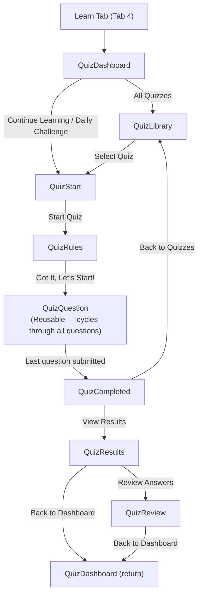
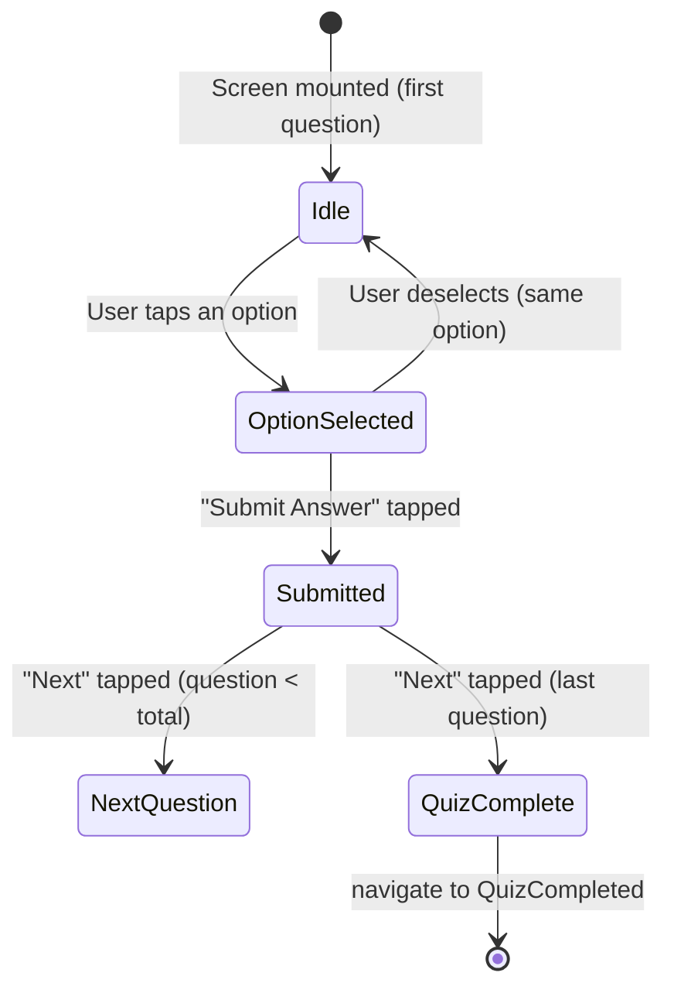
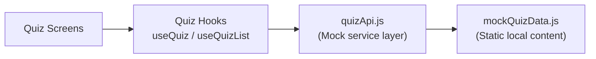
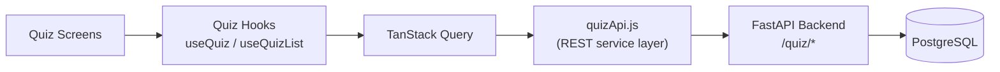
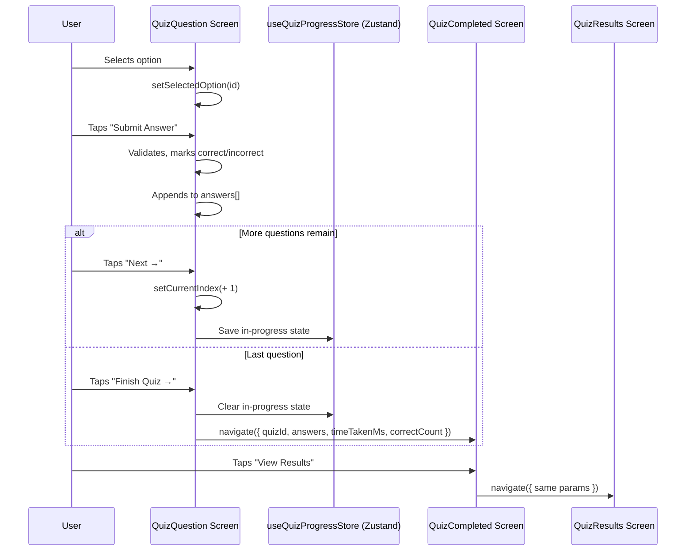

# RFC-005-F — Quiz, Learning & Cyber Awareness Frontend Architecture

**Status:** Proposed / Under Review
**Author:** Insightify Frontend Team
**Created:** 2026-08-30
**Scope:** Frontend (`src/features/quiz/`, `src/navigation/GamesStack.jsx`)
**Platform:** React Native CLI (JavaScript)
**Theme Support:** Light Mode (Dark Mode — structure ready, not implemented in this RFC)
**Visual References:**
1. Approved Quiz & Games Dashboard UI Reference
2. Approved All Quizzes / Quiz Library UI Reference
3. Approved Quiz Start UI Reference
4. Approved Quiz Rules UI Reference
5. Approved Question Screen UI Reference (reusable for all questions)
6. Approved Quiz Completed UI Reference
7. Approved Results Screen UI Reference
8. Approved Review Answers UI Reference

**Asset References:**
- `assets/quiz/quiz-start.png` (Quiz Start illustration)
- `assets/quiz/quiz-rules.png` (Quiz Rules illustration)
- `assets/quiz/quiz-completed.png` (Quiz Completed trophy illustration)
- `assets/images/Insightify_logo.png`

**Navigation Model:** `Home | Feed | Detect | Learn | Profile` (Learn is Tab 4; Quiz/Library/Question/Results are Stack Screens)

**Initial Data Scope:** Only `Phishing Basics` contains real static quiz data. All other quizzes are placeholder/locked states until the FastAPI backend is integrated.

---

## 1. Overview

This RFC defines the complete frontend architecture, visual design, component hierarchy, quiz interaction flow, state management, and future API dependencies for the **Insightify Quiz, Learning & Cyber Awareness** feature (`src/features/quiz/`).

The Quiz/Learning feature is Insightify's **cybersecurity education layer**. Rather than simply detecting threats after they occur, the Quiz feature builds the user's proactive recognition skills through gamified short-form multiple-choice quizzes.

### 8 Screens in Scope

1. **Quiz Dashboard (`QuizDashboardScreen.jsx`):** The Learn tab root — XP progress, stats, Continue Learning, Categories, Daily Challenge, and navigation to the quiz library.
2. **Quiz Library (`QuizLibraryScreen.jsx`):** Full list of all quizzes with difficulty filters, previous scores, locked/unlocked states.
3. **Quiz Start (`QuizStartScreen.jsx`):** Pre-quiz context card with illustration, metadata (questions, duration, XP), learning objectives, and Start Quiz CTA.
4. **Quiz Rules (`QuizRulesScreen.jsx`):** Rule instructions with illustration before starting the question flow. There is no per-question countdown timer in the initial implementation.
5. **Question Screen (`QuizQuestionScreen.jsx`):** **Single reusable screen** handling all questions of the selected quiz sequentially. Displays question number, progress, text, 4-option multiple-choice, and Submit/Next flow.
6. **Quiz Completed (`QuizCompletedScreen.jsx`):** Post-quiz celebration with trophy illustration, score, correct count, XP earned, time taken, View Results and Back to Quizzes (`QuizLibrary`) CTAs.
7. **Results Screen (`QuizResultsScreen.jsx`):** Quiz performance summary — percentage score, donut/gauge indicator, correct/incorrect/skipped counts, XP earned, Review Answers and Back to Dashboard (`QuizDashboard`) CTAs.
8. **Review Answers Screen (`QuizReviewScreen.jsx`):** Scrollable list of every question with the user's answer, the correct answer, and an explanation. Correct/incorrect visual states.

---

## 2. Problem Statement

Phishing, social engineering, and online scams increasingly succeed because users do not recognize the warning signs in the moment. Traditional security advice ("don't click suspicious links") is known but not internalized.

Users need:

1. **Bite-sized, mobile-first learning:** Short quizzes that can be completed in under 5 minutes, on any Android device.
2. **Immediate feedback:** Clear right/wrong states, explanations, and XP rewards that make learning feel rewarding rather than remedial.
3. **Structured progression:** Categories and difficulty levels that guide users from foundational phishing awareness toward advanced social engineering recognition.
4. **Motivational structure:** Streaks, XP, level progress, and daily challenges that bring users back regularly.
5. **Architecture readiness:** A quiz data layer that can seamlessly transition from local static content to a full FastAPI-backed quiz engine.

---

## 3. Goals & Non-Goals

### 3.1 Goals

- **Visual Match:** Implement all 8 screens matching the approved UI reference for Light Mode.
- **Single Reusable Question Screen:** One `QuizQuestionScreen.jsx` that iterates through all questions of the active quiz using local state — no separate screen per question.
- **Phishing Basics — Fully Populated:** One real, working static quiz with realistic phishing-awareness questions, answers, and explanations.
- **All Other Quizzes — Placeholder/Locked:** Remaining quiz cards and categories display locked or unavailable states until the backend is ready.
- **Isolated Mock Data:** All static quiz content lives in `src/features/quiz/data/mockQuizData.js` and is consumed through the service layer — not scattered across screens.
- **Future FastAPI Readiness:** The `quizApi.js` service layer is structured so real backend operations can replace mock calls without restructuring the feature.
- **XP/Level Integration — Current version:** Quiz completion updates XP locally/mock only via `useQuizProgressStore`. The Profile XP display reflects this local state.
- **XP/Level Integration — Future version:** After FastAPI integration, XP becomes backend/server-authoritative. The frontend will call the Submit Quiz Attempt backend operation and reflect the authoritative XP value returned by the server. Local XP state will be replaced or reconciled with the server response.
- **Responsive Layout:** All screens adapt correctly across small and large Android phones, aspect ratios, Safe Area, and bottom navigation configurations.
- **No Bottom-Navigation Change:** The Learn tab (Tab 4) is the entry point. No new bottom-navigation tabs are added.

### 3.2 Non-Goals

- Backend quiz engine, question authoring, or AI-generated questions (external FastAPI responsibility).
- Database persistence of quiz attempts (backend responsibility).
- Real-time multiplayer or competitive quiz modes (future RFC).
- Backend leaderboard for quiz scores (future RFC — currently displays local mock state).
- iOS-specific interactions beyond standard RN cross-platform behavior.
- Dark Mode implementation in this RFC (structure must be theme-token ready).

---

## 4. Navigation & Interaction Architecture

### 4.1 Route Structure & Stack Definition

`GamesStack` is registered as Tab 4 ("Learn") in `TabNavigator`. The existing `GamesStack.jsx` will be fully replaced to adopt the new quiz route structure:

```text
GamesStack (Native Stack Navigator)
├── QuizDashboard     → QuizDashboardScreen.jsx   (Tab 4 root)
├── QuizLibrary       → QuizLibraryScreen.jsx      (All Quizzes)
├── QuizStart         → QuizStartScreen.jsx         (Pre-quiz context)
├── QuizRules         → QuizRulesScreen.jsx         (Rules before starting)
├── QuizQuestion      → QuizQuestionScreen.jsx      (Reusable question flow)
├── QuizCompleted     → QuizCompletedScreen.jsx     (Post-quiz celebration)
├── QuizResults       → QuizResultsScreen.jsx       (Score summary)
└── QuizReview        → QuizReviewScreen.jsx        (Answer review)
```

### 4.2 Complete Navigation Flow



### 4.3 Question Screen State Machine

The Question Screen manages the entire quiz in a single component using local React state:



### 4.4 Continue Learning Flow

If the user has a partially completed quiz stored in local state (Zustand), tapping "Continue" on the Dashboard navigates directly to `QuizQuestion` at the last unanswered question index.

---

## 5. Screen Specifications

### 5.1 Quiz Dashboard (`QuizDashboardScreen.jsx`)

**Purpose:** Learn tab root. Motivate the user to engage with quiz content.

**Layout (top to bottom):**

```
Header Row
  ├── "Quiz & Games" title
  └── Streak badge (e.g. 🔥 3) — displays the user's current quiz streak.
      This is NOT the app notification badge. It is a quiz-specific streak indicator
      sourced from useQuizProgressStore, positioned top-right in the header.

XP Progress Card
  ├── Level label + "AI Awareness Champion" title
  ├── "820 / 1000 XP" progress bar
  └── Filled indigo LinearGradient bar

Statistics Row (3 columns)
  ├── Quizzes Played (e.g. 12)
  ├── Avg. Score (e.g. 85%)
  └── Day Streak (e.g. 3)

Continue Learning Section
  ├── Section title: "Continue Learning"
  ├── Quiz card (Phishing Basics — last played)
  │   ├── quiz icon / category color
  │   ├── quiz title
  │   ├── "5 Questions"
  │   ├── "Last played" timestamp
  │   └── "Continue" pill button
  └── (Empty if no in-progress quiz)

Categories Section
  ├── Section title: "Categories" + "See All" →
  └── 2×2 grid of category pills:
      ├── Phishing (10 Quizzes)
      ├── Scams (10 Quizzes)
      ├── Privacy (4 Quizzes)
      └── Malware (7 Quizzes)
      Each pill: category icon + name + count

Daily Challenge Section
  ├── Clock/timer indicator (e.g. ⏱ 07:45:32 remaining)
  ├── Challenge title: "Spot the Real Link"
  ├── Challenge subtitle: "Can you spot the real website?"
  ├── "+50 XP" reward badge
  └── "Play Now" pill CTA (navigates to QuizStart with daily challenge quiz)
```

**Data Sources:**
- User XP/level/streak: from `useProfile()` (Profile feature hook)
- "Continue Learning" quiz: from Zustand `useQuizProgressStore` (last in-progress quiz)
- Categories: static until backend provides dynamic category counts
- Daily Challenge: local mock until the Fetch Daily Challenge backend operation is available (TBD — backend contract verification required)

**Initial State (pre-backend):**
- XP Progress Card: uses mock profile data from `profileApi.js`
- Statistics: mock values (12 played, 85% avg, 3 streak)
- Continue Learning: displays the actual in-progress quiz from `useQuizProgressStore` when one exists. If no quiz is currently in progress, the section renders an appropriate empty/recommended state (e.g. "Start a quiz to continue learning here"). For the initial demo, `Phishing Basics` may be seeded as a mock in-progress quiz in `useQuizProgressStore` to populate this section during development — it must NOT be treated as permanently always-in-progress.
- Categories: static category list with placeholder counts
- Daily Challenge: static "Spot the Real Link" mock challenge

---

### 5.2 Quiz Library (`QuizLibraryScreen.jsx`)

**Purpose:** Browse all available quizzes. Tapping any available quiz navigates to `QuizStart`.

**Layout:**

```
Header Row
  ├── Back button (arrow-back, left)
  └── "All Quizzes" title + filter icon (right)

Difficulty Filter Pills
  ├── All (active by default)
  ├── Beginner
  ├── Intermediate
  └── Advanced

Quiz Card List (scrollable)
  Each card:
  ├── Category color bar (left edge)
  ├── Category icon (circular colored badge)
  ├── Quiz title
  ├── Subtitle: "{N} Questions · {Difficulty}"
  ├── Previous score badge (e.g. "85% Score") or lock icon
  └── Chevron-forward (tappable → QuizStart)
```

**Initial Populated Quizzes (from `MOCK_QUIZ_LIST`):**

| Quiz | Questions | Difficulty | State | Previous Score |
|---|---|---|---|---|
| Phishing Basics | 5 | Beginner | ✅ Available | Mock 85% |
| Fake Websites | 10 | Beginner | 🔒 Locked | — |
| Scam Messages | 8 | Intermediate | 🔒 Locked | — |
| Privacy Protection | 10 | Intermediate | 🔒 Locked | — |
| Malware Awareness | 7 | Advanced | 🔒 Locked | — |
| Social Engineering | 10 | Advanced | 🔒 Locked | — |

**Locked state behavior:** Locked cards are visually dimmed (opacity 0.5), the lock icon replaces the score badge, and `onPress` shows a toast/banner: `"Coming soon — more quizzes are on the way!"`.

---

### 5.3 Quiz Start (`QuizStartScreen.jsx`)

**Purpose:** Context screen before beginning a quiz.

**Layout:**

```
Back button (top-left)

Illustration
  └── assets/quiz/quiz-start.png (centered, responsive width)

Quiz Title (e.g. "Phishing Basics")
Difficulty Badge (e.g. "Beginner Level" — indigo pill)
Description text

Metadata Row (3 columns)
  ├── Questions: 5
  ├── Duration: 5 min
  └── Reward: 50 XP

You'll Learn Section
  ├── "You'll learn:" label
  ├── • How phishing works
  ├── • Common phishing signs
  └── • How to stay protected

"Start Quiz" gradient CTA button
```

**Route params received:** `{ quizId: string }`

The screen fetches quiz metadata from `quizApi.getQuizById(quizId)` (returns mock data from `mockQuizData.js` for `'phishing-basics'`; returns placeholder data for locked quizzes).

---

### 5.4 Quiz Rules (`QuizRulesScreen.jsx`)

**Purpose:** Rules/instructions before the question flow begins. Matching the approved UI reference.

**Layout:**

```
Back button (top-left)

"Before You Start" heading
"Please read the rules carefully." subtitle

Illustration
  └── assets/quiz/quiz-rules.png (centered)

Rules List (4 items):
  ├── ✅ Each question has one correct answer.
  ├── ✅ You can't go back to a previous question.
  ├── ✅ Answer all questions to see your results.
  └── ✅ Stay honest, you're learning for yourself!

"Got It, Let's Start!" gradient CTA button
```

**Route params received:** `{ quizId: string, quizTitle: string }`

Tapping the CTA navigates to `QuizQuestion` with `{ quizId, questionIndex: 0 }`.

---

### 5.5 Quiz Question Screen (`QuizQuestionScreen.jsx`)

**Purpose:** Single reusable screen that iterates through every question of the active quiz. No separate screen per question.

**Layout:**

```
Header Row
  ├── "Question {N} of {Total}"
  └── XP badge (e.g. 100 XP) — color: colors.xp
      Note: this is the quiz's total XP reward displayed as context.
      There is NO per-question countdown timer in the initial implementation.
      Quiz duration shown in QuizStart is metadata only.

Progress Dots/Bar
  └── N filled dots for completed questions, 1 active, remainder empty

Question Text
  └── Full question text (wraps to 2–3 lines as needed)

Answer Options (4 radio-style options)
  Each option:
  ├── Radio circle (unfilled → selected → correct/incorrect after submit)
  └── Option text

"Submit Answer" gradient CTA
  └── Disabled until an option is selected
  └── On tap: validates, reveals correct/incorrect state
  └── CTA changes to "Next →" after submission
  └── On last question: "Finish Quiz →"
```

**State managed locally (React state):**
- `currentIndex` — active question index (0-based)
- `selectedOption` — currently highlighted option ID
- `submittedOption` — option locked in after Submit
- `answers` — array of `{ questionId, selectedOption, isCorrect }` for all answered questions
- `quizStartTime` — `Date.now()` captured on mount for time calculation

**Answer option visual states:**
- **Unselected:** `colors.surface` background, `colors.border` border
- **Selected (pre-submit):** `colors.primary` border + `colors.primary` radio fill + `colors.primary` option text
- **Correct (post-submit):** `colors.correct` background tint + checkmark icon + `colors.correct` border
- **Incorrect (post-submit):** `colors.error` background tint + × icon + `colors.error` border; correct option simultaneously highlighted with `colors.correct`

**On last question submit:** Navigate to `QuizCompleted` with:
```js
{
  quizId,
  answers,        // full answers array
  timeTakenMs,    // Date.now() - quizStartTime
  totalQuestions,
  correctCount,
}
```

---

### 5.6 Quiz Completed (`QuizCompletedScreen.jsx`)

**Purpose:** Post-quiz celebration screen.

**Layout:**

```
Back button (top-left)
"Quiz Completed!" title

Trophy Illustration
  └── assets/quiz/quiz-completed.png (centered, responsive)

"Your Score" label
Score percentage (e.g. "80%") — large bold
"{correct} / {total} Correct" subtitle

XP Row
  ├── "+{xpEarned} XP" (uses colors.xp, bold)
  └── "Time Taken: {mm:ss}"

"View Results" gradient CTA  →  QuizResults
"Back to Quizzes" outline button  →  QuizLibrary (route name)
```

**XP Calculation:**
```text
baseXP        = quiz.xpReward (e.g. 50)
scoreMultiplier = correctCount / totalQuestions
earnedXP       = Math.round(baseXP * scoreMultiplier)
```

**Route params received:** `{ quizId, answers, timeTakenMs, totalQuestions, correctCount }`

---

### 5.7 Results Screen (`QuizResultsScreen.jsx`)

**Purpose:** Detailed performance summary after quiz completion.

**Layout:**

```
Back button (top-left, returns to QuizLibrary)
"Results" header

Quiz title card
  ├── Category icon (bug/phishing icon)
  └── Quiz title + Difficulty badge

Score Donut/Ring (circular progress gauge)
  ├── Score percentage (e.g. "80%") — center
  └── "Great Job!" label beneath ring

Performance Stats (3 rows)
  ├── ● Correct Answers: {N}  (color: colors.correct)
  ├── ● Wrong Answers: {N}   (color: colors.error)
  └── ● Skipped: {N}         (color: colors.textSecondary)

"Review Answers" outline CTA  →  QuizReview (route name)
"Back to Dashboard" gradient CTA  →  QuizDashboard (route name)
```

---

### 5.8 Review Answers Screen (`QuizReviewScreen.jsx`)

**Purpose:** Scrollable question-by-question review showing the user's answer and the correct answer.

**Layout:**

```
Back button (top-left)
"Review Answers" header

Scrollable question list:
  Each item:
  ├── Question number + full question text (bold)
  ├── "Your Answer:" label + answer text
  │   └── "Correct" badge (colors.correct) OR "Incorrect" badge (colors.error)
  ├── Correct Answer (shown only if user was incorrect)
  │   └── Highlighted text using colors.correct
  └── Optional explanation text (italic, colors.textSecondary)

Divider between items

"Back to Dashboard" gradient CTA (fixed bottom)  →  QuizDashboard (route name)
```

---

## 6. Component Architecture

### 6.1 Directory Structure

```text
src/features/quiz/
├── screens/
│   ├── QuizDashboardScreen.jsx
│   ├── QuizLibraryScreen.jsx
│   ├── QuizStartScreen.jsx
│   ├── QuizRulesScreen.jsx
│   ├── QuizQuestionScreen.jsx
│   ├── QuizCompletedScreen.jsx
│   ├── QuizResultsScreen.jsx
│   └── QuizReviewScreen.jsx
│
├── components/
│   ├── QuizCard.jsx               ← Reusable quiz list card (Library + Dashboard)
│   ├── QuizProgressDots.jsx       ← Question progress indicator
│   ├── QuizAnswerOption.jsx       ← Single answer choice row (radio + text)
│   ├── QuizResultDonut.jsx        ← Circular score gauge (Results Screen)
│   ├── QuizReviewItem.jsx         ← Single Q&A review row (Review Screen)
│   ├── QuizStatRow.jsx            ← Stats row (Correct/Wrong/Skipped)
│   ├── DifficultyBadge.jsx        ← "Beginner", "Intermediate", "Advanced" pill
│   ├── QuizMetaRow.jsx            ← Questions / Duration / XP 3-column row
│   ├── QuizXpProgressCard.jsx     ← Level + XP bar card (Dashboard)
│   ├── CategoryPill.jsx           ← Category grid item (Dashboard)
│   └── DailyChallengeCard.jsx     ← Daily Challenge card (Dashboard)
│
├── hooks/
│   ├── useQuiz.js                 ← Fetches quiz metadata (mock → API)
│   ├── useQuizList.js             ← Fetches quiz library list (mock → API)
│   └── useQuizSession.js          ← Manages active quiz session state (answers, index, timing)
│
├── services/
│   └── quizApi.js                 ← Service layer: mock functions → future REST calls
│
├── store/
│   └── useQuizProgressStore.js    ← Zustand: last quiz, streak, in-progress state
│
├── utils/
│   └── quizUtils.js               ← Score calculation, time formatting, XP calculation
│
└── data/
    └── mockQuizData.js            ← ONLY static data; isolated for future backend replacement
```

### 6.2 Component Responsibilities

#### `QuizCard.jsx`
- Accepts: `{ quiz, onPress, locked }`
- Renders: category color bar, icon badge, title, question count + difficulty, score badge or lock icon, chevron
- Used in: `QuizLibraryScreen`, `QuizDashboardScreen` (Continue Learning)

#### `QuizAnswerOption.jsx`
- Accepts: `{ option, selected, submitted, isCorrect, isUserAnswer, onPress }`
- Renders: radio circle + option text
- States: idle, selected, correct (post-submit), incorrect (post-submit)

#### `QuizProgressDots.jsx`
- Accepts: `{ total, current, answers }`
- Renders: horizontal dot row — filled/colored per correct/incorrect/current/unanswered

#### `QuizResultDonut.jsx`
- Accepts: `{ percentage, label }`
- Renders: circular SVG/ViewBox ring with percentage center text and a label below
- Uses theme tokens for stroke colors

#### `DifficultyBadge.jsx`
- Accepts: `{ difficulty: 'Beginner' | 'Intermediate' | 'Advanced' }`
- Renders: pill badge with appropriate color token

---

## 7. State Management

### 7.1 Local React State (Quiz Question Screen)

The active quiz session is managed entirely in local React state within `QuizQuestionScreen.jsx`:

```js
// QuizQuestionScreen local state
const [currentIndex, setCurrentIndex] = useState(0);
const [selectedOption, setSelectedOption] = useState(null);
const [submittedOption, setSubmittedOption] = useState(null);
const [answers, setAnswers] = useState([]);
const [quizStartTime] = useState(() => Date.now());
```

No global state is used for the active question flow. This keeps the quiz session isolated and prevents accidental state leakage.

### 7.2 Zustand — Quiz Progress Store (`useQuizProgressStore.js`)

Client-owned state only:

```js
{
  lastPlayedQuiz: { quizId, questionIndex, answers } | null,
  streak: number,
  completedQuizIds: string[],
}
```

Used for:
- "Continue Learning" card on the Dashboard
- Streak display
- Locking previously completed quizzes vs. showing scores

This store is **not** a cache of backend data — it is client-owned UI state.

### 7.3 TanStack Query — Future Server State

When the backend is connected, quiz list, quiz metadata, and results will be fetched via TanStack Query:

```js
// Future: useQuery(['quiz', quizId], () => quizApi.getQuizById(quizId))
// Future: useQuery(['quizList'], () => quizApi.getQuizList())
// Future: useMutation(() => quizApi.submitQuizResult(payload))
```

Current mock hooks (`useQuiz.js`, `useQuizList.js`) return the same shape of data as future API responses.

---

## 8. Static Mock Data (`mockQuizData.js`)

All static content for the initial version is isolated in one file.

### 8.1 Quiz Metadata Schema

```js
{
  id: 'phishing-basics',
  title: 'Phishing Basics',
  category: 'Phishing',
  // categoryColor: resolved at runtime from the theme's category color map — not hardcoded
  categoryIcon: 'fish-outline',
  difficulty: 'Beginner',
  questionCount: 5,
  durationMinutes: 5,
  xpReward: 50,
  description: 'Test your knowledge about phishing attacks and stay safe online.',
  learningObjectives: [
    'How phishing works',
    'Common phishing signs',
    'How to stay protected',
  ],
  available: true,
}
```

### 8.2 Phishing Basics — Questions

The following 5 questions are the **only real static quiz content** in the initial implementation. All are temporary local mock data, to be replaced by the Fetch Quiz Questions backend operation (TBD — backend contract verification required) when the backend is ready.

---

**Question 1 of 5**
> *Which of the following is an example of a phishing attempt?*

| # | Option | Correct |
|---|---|---|
| A | A friend sending you a birthday message | ❌ |
| B | An email from your bank asking you to verify your account | ✅ |
| C | A notification about a new app update | ❌ |
| D | A text from your mobile network provider | ❌ |

**Explanation:** Legitimate banks never ask you to verify account details via email links. This is the hallmark of a phishing attempt designed to steal credentials.

---

**Question 2 of 5**
> *What should you do if you receive a suspicious link?*

| # | Option | Correct |
|---|---|---|
| A | Click the link to check what it is | ❌ |
| B | Forward it to your friends | ❌ |
| C | Report it and avoid clicking on it | ✅ |
| D | Ignore it and move on | ❌ |

**Explanation:** Reporting suspicious links (to your email provider, Insightify, or the relevant platform) helps protect others. Never click links you didn't request.

---

**Question 3 of 5**
> *What is a common warning sign that an email may be a phishing attempt?*

| # | Option | Correct |
|---|---|---|
| A | The email has a company logo | ❌ |
| B | The email asks you to urgently click a link and enter your password | ✅ |
| C | The email was sent during business hours | ❌ |
| D | The email contains your first name | ❌ |

**Explanation:** Creating urgency and directing you to enter credentials via a link are the most reliable indicators of a phishing email. Branding, timing, and personalisation can all be easily faked by attackers.

---

**Question 4 of 5**
> *What is the main goal of a phishing attack?*

| # | Option | Correct |
|---|---|---|
| A | To improve your computer performance | ❌ |
| B | To steal your personal or financial information | ✅ |
| C | To update your software | ❌ |
| D | To increase your internet speed | ❌ |

**Explanation:** Phishing is purely a deception-based attack aimed at extracting credentials, financial information, or identity data from the victim.

---

**Question 5 of 5**
> *Which of these is a safe practice online?*

| # | Option | Correct |
|---|---|---|
| A | Sharing OTP with someone you trust | ❌ |
| B | Using strong, unique passwords | ✅ |
| C | Clicking on unknown links | ❌ |
| D | Downloading files from unknown sources | ❌ |

**Explanation:** A strong, unique password for each account is one of the most effective individual defenses against credential-based attacks. OTPs should never be shared with anyone.

---

### 8.3 Placeholder Quiz Schema (All Other Quizzes)

All other quizzes use this placeholder shape:

```js
{
  id: 'fake-websites',
  title: 'Fake Websites',
  category: 'Phishing',
  difficulty: 'Beginner',
  questionCount: 10,
  available: false,    // ← locked
  questions: [],       // ← empty until backend provides content
}
```

---

## 9. Service Layer (`quizApi.js`)

All quiz data access flows through `quizApi.js`. No screen or hook imports directly from `mockQuizData.js`.

```js
// Current mock implementations:
export async function getQuizList() { ... }
export async function getQuizById(id) { ... }
export async function getQuizQuestions(id) { ... }

// Future backend integration:
// export async function submitQuizResult(payload) { ... }
// export async function getQuizResults(attemptId) { ... }
// export async function getDailyChallenge() { ... }
// export async function getQuizProgress(userId) { ... }
```

### Future API Dependencies

> ⚠️ **All endpoint paths, request bodies, and response schemas are TBD — backend contract verification required.**

The following frontend operations will be required when the FastAPI backend is integrated. No endpoint paths are defined here.

| Operation | Notes |
|---|---|
| Fetch quiz list | With optional filters (category, difficulty) |
| Fetch quiz details | Returns quiz metadata only |
| Fetch quiz questions | Returns questions array for a given quiz |
| Submit quiz attempt | Sends answers and time taken |
| Fetch attempt results | Returns score, correct/wrong counts |
| Fetch answer review | Returns per-question result with explanations |
| Fetch daily challenge | Returns today's challenge quiz |
| Fetch user quiz progress | Returns streak, completed quizzes, XP |
| Fetch quiz leaderboard | Future scope |

All of the above are frontend operation expectations only. Actual endpoint paths, HTTP methods, request bodies, and response schemas must be defined and verified against the FastAPI backend contract before any integration work begins.

---

## 10. Quiz Score & XP Calculation (`quizUtils.js`)

```js
/**
 * Calculate score percentage.
 * @param {number} correct
 * @param {number} total
 * @returns {number} 0–100
 */
export function calculateScorePercent(correct, total) {
  if (total === 0) return 0;
  return Math.round((correct / total) * 100);
}

/**
 * Calculate XP earned for a quiz attempt.
 * @param {number} baseXp   - quiz.xpReward
 * @param {number} correct
 * @param {number} total
 * @returns {number}
 */
export function calculateXpEarned(baseXp, correct, total) {
  if (total === 0) return 0;
  return Math.round(baseXp * (correct / total));
}

/**
 * Format elapsed milliseconds as mm:ss.
 * @param {number} ms
 * @returns {string} e.g. "2:45"
 */
export function formatTimeTaken(ms) {
  const totalSeconds = Math.floor(ms / 1000);
  const minutes = Math.floor(totalSeconds / 60);
  const seconds = totalSeconds % 60;
  return `${minutes}:${seconds.toString().padStart(2, '0')}`;
}
```

---

## 11. Architecture Diagrams

### 11.1 Current Static Data Architecture



### 11.2 Future FastAPI Architecture



### 11.3 Quiz Session Data Flow



---

## 12. Responsive Design Specification

### 12.1 General Principles

All quiz screens must use:
- `useResponsive()` from `src/shared/utils/responsive.js` for `scaleFont()`, `moderateScale()`
- `useSafeAreaInsets()` for bottom padding (ensures content clears the floating tab bar)
- `ScreenContainer` shared component with `scrollable={true}` where content may exceed viewport height
- Fixed bottom CTAs use `insets.bottom + padding` to avoid bottom navigation overlap

### 12.2 Screen-Specific Considerations

| Screen | Behavior |
|---|---|
| QuizDashboard | Scrollable; statistics row stays compact on small screens |
| QuizLibrary | FlatList for quiz cards; filter pills scroll horizontally if needed |
| QuizStart | Illustration scales by `Dimensions.get('window').width * 0.55` |
| QuizRules | Short screen; non-scrollable on standard phones; scrollable on very small devices |
| QuizQuestion | `ScrollView` wrapping options to handle long question text; progress dots adapt to question count |
| QuizCompleted | Trophy illustration scales by window width; non-scrollable on standard phones |
| QuizResults | Donut chart scales by `window.width * 0.45`; stats row wraps correctly |
| QuizReview | Long scrollable list; "Back to Dashboard" is fixed at bottom |

### 12.3 Preventing Bottom Navigation Overlap

All screens that have a fixed bottom CTA use:

```js
const insets = useSafeAreaInsets();
const bottomPadding = (insets.bottom || 0) + 80; // clearance for floating tab bar
```

Scroll content containers include `paddingBottom: bottomPadding`.
Fixed CTAs use `paddingBottom: (insets.bottom || 0) + 12`.

---

## 13. Theme & Visual Language

### 13.1 Insightify Design Tokens (Quiz Usage)

All quiz screens source colors exclusively from `useTheme()`. No hex values are hardcoded in screen or component files.

| Token | Quiz Usage |
|---|---|
| `colors.primary` | Active filter pill, answer selection border, CTA gradient |
| `colors.surface` | Quiz card background, answer option background |
| `colors.background` | Screen background |
| `colors.border` | Unselected answer option border |
| `colors.textPrimary` | Question text, quiz title, score text |
| `colors.textSecondary` | Description, subtitle, explanation text |
| `colors.correct` | Correct answer highlight, correct count in results |
| `colors.error` | Incorrect answer highlight, wrong count in results |
| `colors.xp` | XP badge color |
| `radii.large` | Answer option cards, quiz cards, CTA buttons |
| `radii.pill` | Difficulty badges, filter pills |
| `typography.h1`, `.h2`, `.h3`, `.body`, `.caption` | Standard text hierarchy throughout |

> If `colors.correct`, `colors.error`, and `colors.xp` are not yet present in the centralized theme, they must be added to the theme system before implementation — not defined locally in quiz files.

### 13.2 Gradient CTA Pattern

Primary action buttons use the existing app-wide gradient token (`gradients.primary`). The gradient value is defined once in the centralized theme and referenced by name — no raw color arrays are written into quiz components.

### 13.3 Dark Mode Readiness

All quiz screens must:
- Consume colors exclusively from `useTheme()` — no hardcoded hex outside of semantic constants
- Never hardcode `backgroundColor: '#FFFFFF'` directly in components
- Use `isDark` conditional only for values not covered by the token system

When Dark Mode is centrally enabled in the theme, quiz screens must not require individual rewrites.

---

## 14. GamesStack Navigation Update

The existing `GamesStack.jsx` (which currently imports legacy screens from `src/screens/Games/`) must be replaced:

**New `GamesStack.jsx`:**

```jsx
import QuizDashboardScreen from '../features/quiz/screens/QuizDashboardScreen';
import QuizLibraryScreen from '../features/quiz/screens/QuizLibraryScreen';
import QuizStartScreen from '../features/quiz/screens/QuizStartScreen';
import QuizRulesScreen from '../features/quiz/screens/QuizRulesScreen';
import QuizQuestionScreen from '../features/quiz/screens/QuizQuestionScreen';
import QuizCompletedScreen from '../features/quiz/screens/QuizCompletedScreen';
import QuizResultsScreen from '../features/quiz/screens/QuizResultsScreen';
import QuizReviewScreen from '../features/quiz/screens/QuizReviewScreen';

// Routes:
// QuizDashboard  (initial)
// QuizLibrary
// QuizStart
// QuizRules
// QuizQuestion
// QuizCompleted
// QuizResults
// QuizReview
```

The legacy `QuizHomeScreen`, `QuizPlayScreen`, `QuizResultScreen`, and `RewardsScreen` in `src/screens/Games/` are superseded by the new feature-based architecture and may be removed once the new implementation is verified.

---

## 15. Acceptance Criteria

### Navigation & Flow
- [ ] Tapping "Learn" tab opens `QuizDashboardScreen`
- [ ] "All Quizzes" navigates to `QuizLibraryScreen`
- [ ] Selecting "Phishing Basics" navigates to `QuizStartScreen` with correct metadata
- [ ] "Start Quiz" navigates to `QuizRulesScreen`
- [ ] "Got It, Let's Start!" navigates to `QuizQuestionScreen` at `questionIndex: 0`
- [ ] Answering all 5 questions navigates to `QuizCompletedScreen` automatically
- [ ] "View Results" navigates to `QuizResultsScreen`
- [ ] "Review Answers" navigates to `QuizReviewScreen`
- [ ] "Back to Dashboard" returns to `QuizDashboardScreen` from Results and Review

### Question Screen
- [ ] One `QuizQuestionScreen` handles all 5 Phishing Basics questions
- [ ] No `Question1Screen`, `Question2Screen`, etc. exist
- [ ] Progress dots update as questions are answered
- [ ] Submit Answer is disabled until an option is selected
- [ ] Correct option shown in green after submission
- [ ] Incorrect user selection shown in red after submission
- [ ] CTA changes from "Submit Answer" → "Next →" → "Finish Quiz →" (last question)

### Quiz Library
- [ ] "Phishing Basics" is the only tappable, unlocked quiz
- [ ] All other quizzes show locked/unavailable state
- [ ] Tapping a locked quiz shows a "Coming soon" message — no crash
- [ ] Difficulty filter pills filter the list (UI only; no backend filter call yet)

### Score & XP
- [ ] Score percentage is correctly calculated (correctCount / totalQuestions × 100)
- [ ] XP earned is correctly calculated (xpReward × correctCount / totalQuestions)
- [ ] Time taken is displayed correctly in mm:ss format
- [ ] Results screen shows correct/wrong/skipped counts matching the actual answers

### Data Isolation
- [ ] All Phishing Basics content comes from `mockQuizData.js` only
- [ ] No quiz question data is hardcoded directly in any screen file
- [ ] Removing `mockQuizData.js` and replacing with API calls requires no screen restructuring

### Responsive & Safe Area
- [ ] All screens are usable on 360dp and 480dp width devices
- [ ] No content is hidden behind the floating bottom tab bar
- [ ] Trophy/illustration images do not overflow on small screens
- [ ] Answer option text wraps correctly on narrow screens without clipping

### Visual
- [ ] All screens match the approved UI reference in layout, spacing, and color
- [ ] Difficulty badges use correct colors per level (green/Beginner, amber/Intermediate, red/Advanced)
- [ ] CTA buttons use the existing blue-to-purple gradient
- [ ] Light Mode is consistent throughout

### Theme Readiness
- [ ] No hardcoded colors that bypass the theme system
- [ ] Dark Mode can be enabled centrally without modifying quiz screens individually

---

## 16. Open Questions

> The following items require clarification before or during implementation.

1. **Daily Challenge source:** Should the Daily Challenge always use a static local quiz in the initial version? If so, which quiz (e.g. Phishing Basics) should serve as the daily challenge until the backend Fetch Daily Challenge operation is available?

2. **Quiz progress persistence:** Should in-progress quiz state survive app restarts? If so, `useQuizProgressStore` must use `AsyncStorage`-backed Zustand persistence (`zustand/middleware/persist`). Confirm whether this is in scope for the initial implementation or deferred.

3. **Donut chart implementation:** `QuizResultDonut` requires a circular progress ring. Confirm whether `react-native-svg` is available in the project, or whether a `View`-based arc approximation should be used instead to avoid adding a new dependency.

4. **Legacy `src/screens/Games/` removal:** Confirm whether the four legacy screens (`QuizHomeScreen`, `QuizPlayScreen`, `QuizResultScreen`, `RewardsScreen`) should be deleted as part of this RFC's implementation, or preserved until the new implementation is verified.

5. **Theme token gaps:** `colors.correct`, `colors.error`, and `colors.xp` are referenced throughout this RFC. Confirm whether these tokens already exist in the centralized theme or need to be added before quiz implementation begins.

---

*End of RFC-005-F — Quiz, Learning & Cyber Awareness Frontend Architecture*
